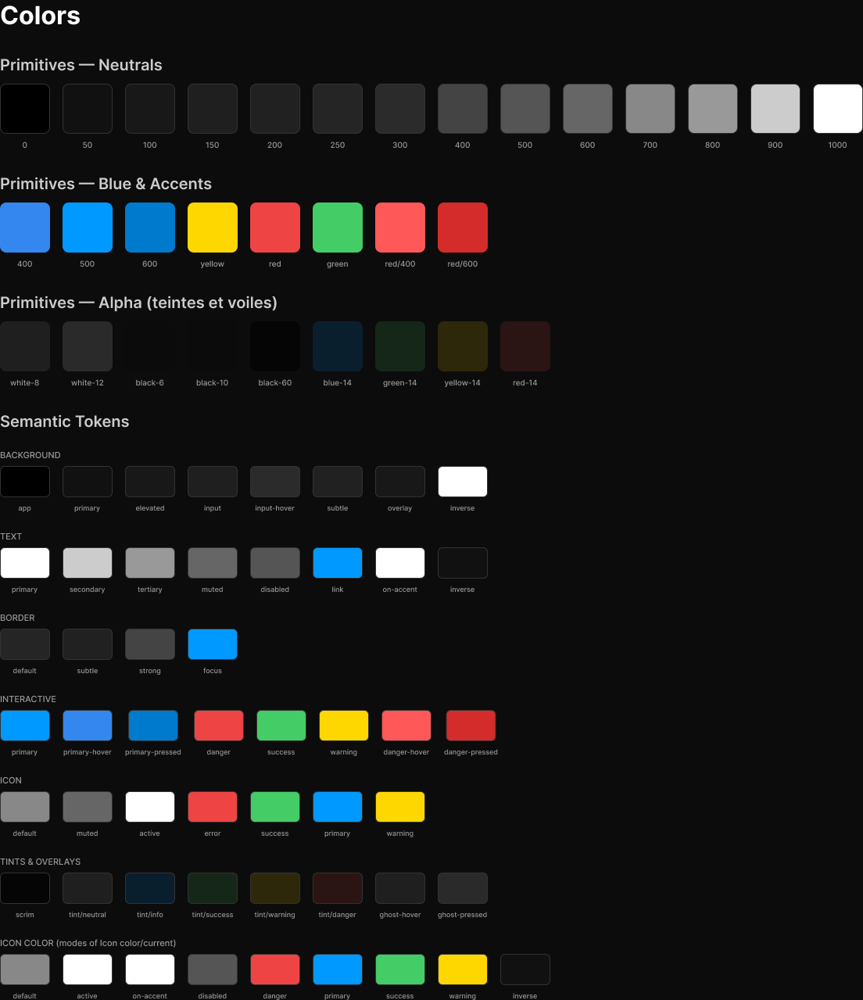
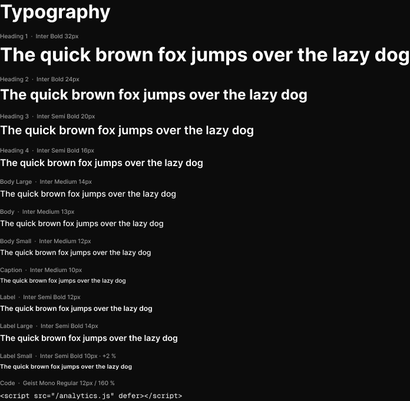
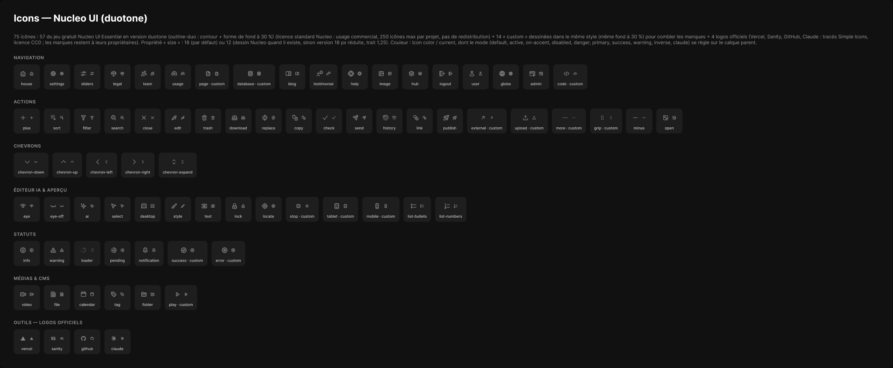

# Kuartz Admin — Design System (extraction Figma)

Source : fichier Figma **« Kuartz — Carte système »** (`wvr98llwHnMufQ88qUp4Ih`), page **« 🎨 Design System »** (`111:65`).
Extraction en lecture seule (Plugin API via `use_figma`, captures via `get_screenshot`) le 27/09/2026.
Ce dossier suffit pour coder le kit UI (CSS Modules + custom properties, React 19, Next 16) sans rouvrir Figma.

## Contenu du dossier

| Fichier | Contenu |
|---|---|
| `tokens.json` | Toutes les variables (Primitives, Semantic Dark/Light, Icon color ×10 modes) : id, type, scopes, alias et valeurs résolues ; styles de texte ; styles d'effet (ombres complètes). |
| `tokens.css` | Custom properties prêtes à copier (`--k-*`), Dark par défaut, Light sous `[data-theme="light"]`, modes d'icône sous `[data-icon-color]`. Règle de nommage en en-tête. |
| `components/README.md` | Index des composants par famille (Actions, Feedback, Forms, Data display, Navigation, Overlays, AI editor) + légende de lecture des fiches. |
| `components/<Nom>.md` + `.png` | Une fiche par composant : rôle, propriétés, variantes/états, anatomie mesurée avec variables liées, différences par variante, tokens utilisés, capture. |
| `icons/<nom>.svg`, `icons/12/<nom>.svg` | Les 75 icônes `Icon/*` exportées telles quelles (18 px et 12 px). `icons/README.md` explique la couleur duotone et la conversion en composants React. |
| `colors.png`, `typography.png`, `icons.png` | Captures des planches Colors (`134:21`), Typography (`134:81`) et Icons (`307:73`, réduite à 2048 px de large). |

## Texte du cadre « Read me » (`343:1458`), recopié intégralement

### Kuartz Admin — Design System

Base pour designer l'admin de chaque site client (Sanity + Vercel) et le hub Kuartz, à partir du wireframe validé. Thème sombre par défaut ; mode clair disponible sur la collection Semantic.

#### Organisation de la page

• À gauche : Colors, Typography, puis Icons (75). À droite, une colonne par famille de composants : Actions, Forms, Navigation, Feedback, Overlays, Data display, AI editor, Kuartz hub.

• Chaque composant a un titre et une description en français ; la description du composant (panneau de droite) résume ses propriétés.

#### Couleurs

• Utiliser les tokens Semantic : bg/\*, text/\*, border/\*, interactive/\*, icon/\*, code/\* (coloration du code) et brand/claude (logo Claude). Les Primitives sont masquées des sélecteurs : ne pas les utiliser directement.

• Teintes transparentes : bg/tint/\* (tags, notes, sélection), bg/ghost-hover et bg/ghost-pressed (survol des boutons discrets), bg/scrim (voile derrière une Modal ou un Drawer).

• Code couleur des rôles, repris du wireframe : bleu = Kuartz (tag info, avatar bleu), vert = client (tag success, avatar vert).

#### Icônes

• 75 icônes : Nucleo UI Essential en duotone (gratuites, licence standard ; contour + fond à 30 %) + 14 dessinées dans le même style, marquées « custom » + 4 logos officiels (Vercel, Sanity, GitHub, Claude ; tracés Simple Icons CC0). Taille 18 px par défaut, 12 px pour les petits contextes.

• La couleur d'une icône suit son contexte : ses tracés sont liés à « Icon color / current », qui a 10 modes (default, active, on-accent, disabled, danger, primary, success, warning, inverse, claude). Pour recolorer, appliquer le mode voulu sur le calque parent. Les composants le font déjà selon leur état.

#### Composants

• Les réglages courants sont des propriétés : Label, Show icon, Icon, Show helper… Les instances imbriquées utiles sont exposées (tag d’un Nav item, onglets d’un Tabs, Switch d’un Setting row).

• Contenu libre dans une Modal : échanger le calque « slot » (composant .Slot) contre le contenu voulu. Textes propres à une variante (messages, étapes) : modifier directement le calque texte.

• Les écrans du wireframe s’assemblent avec ces composants : Sidebar + Top bar + Page header, puis le contenu de chaque écran.

#### Styles et tokens

• Texte : Heading 1–4, Body Large, Body, Body Small, Caption, Label Large, Label, Label Small, Code (Geist Mono).

• Ombres : Elevation/Popover (menus, info-bulles, barres flottantes) et Elevation/Modal (Modal, Drawer). Espacements space/2 à space/64 (+ 6 et 10), rayons radius/sm à radius/full.

#### Inventaire

• Actions (3) : Button (primary, secondary, subtle, ghost, danger), Icon button, Chip

• Forms (14) : Input, Textarea, Select, Search field, Checkbox, Radio, Switch, Setting row, Image upload, Rich text field, Code block, Favicon preview, Image preview, Remove badge

• Navigation (12) : Nav item, Nav section, Tab, Segment, Menu item, Sidebar, Top bar, Page header, Section header, Tabs, Segmented control, Menu

• Feedback (8) : Tag, Kbd, Tooltip, Progress bar, Callout, Toast, Empty state, Publish button

• Overlays (8) : .Slot, Modal, Scrim, Drawer, Filter popover, Usage tooltip, Selection bar, Script dialog

• Data display (15) : Avatar, List item, Table cell, Media card, Version item, Detail row, Stat card, AI usage, Search preview, Social preview, Heading row, Lock badge, Status select, CMS cell, Row open

• AI editor (12) : Model usage, Editor header, Element chip, Claude header, Message, Step, Answer option, Review card, Composer, Canvas selection, Editor toolbar, Ask AI panel

• Kuartz hub (4) : Project card, Tool links, Tool link, Checklist item

> Hors périmètre de cette extraction : la famille **Kuartz hub** (`340:1587`). Écart relevé : la colonne Forms du canevas contient aussi **Variable chip** et **Variable input**, absents de l'inventaire ci-dessus (16 composants au total dans le cadre Forms) — ils sont documentés dans `components/`.

## Polices

| Famille | Styles / graisses utilisés | Où |
|---|---|---|
| **Inter** | Medium (500), Semi Bold (600), Bold (700) | Tous les styles de texte sauf Code : Body Large/Body/Body Small/Caption en 500 ; Label Large/Label/Label Small, Heading 3–4 en 600 ; Heading 1–2 en 700. |
| **Geist Mono** | Regular (400) | Style Code (12 px, interligne 160 %). |

Interligne « Auto » (tous les styles Inter) = `line-height: normal` avec Inter chargée (≈ 1,21 : 12 px → 15 px, 13 px → 16 px, 14 px → 17 px, 16 px → 19 px). Label Small a un espacement de 2 % (`0.02em`). Aucune casse forcée (textCase ORIGINAL partout). Les éventuels textes hors style (police « inline ») sont signalés dans les fiches composants par `style: inline …` — voir ci-dessous.

### Polices hors styles

Relevé sur les 74 composants : un seul texte n'utilise pas de style de texte — l'éditeur de code de **Script dialog** (`Geist Mono Regular 12 px / interligne 18 px`, soit le style Code avec un interligne fixe de 18 px au lieu de 160 %). Deux textes de **Script dialog** mélangent des styles (Body Small + Code pour le code inline `{{…}}`, `<script>`). Aucune autre famille ni graisse n'est nécessaire.

## Captures des planches

- Couleurs : 
- Typographie : 
- Icônes : 

## Images d'exemple « Conduit » (`410:1521`) — non téléchargées

Cadre « Sample images (Conduit) » (2912 × 759). Sa description : « Images d'exemple du site Conduit, exportées en PNG et utilisées comme remplissage (favicon clair et sombre, image sociale 1200 × 630). Pour les changer : modifier ces cadres, les réexporter et remplacer l'image dans les composants. »

| Cadre | Nœud | Taille | Contenu |
|---|---|---|---|
| `favicon-light (64×64)` | `410:1525` | 64 × 64 | Rectangle + lettre « C » |
| `favicon-dark (64×64)` | `410:1528` | 64 × 64 | Rectangle + lettre « C » |
| `og-conduit (1200×630)` | `410:1531` | 1200 × 630 | « Dock scheduling, solved. » / « Book, confirm and track every truck. » + logo « Conduit » |
| `cover-carrier-portals (1200×630)` | `446:1875` | 1200 × 630 | « CONDUIT BLOG · GUIDES » / « Carrier portals: a checklist » / « 7 points to check with your transport team » / « Conduit » |
| `cover-carrier-portals (image)` | `447:8918` | 240 × 126 | Remplissage IMAGE (FILL) de la couverture ci-dessus |

Ces images servent de contenu de démonstration (remplissages IMAGE) dans les composants d'aperçu (Favicon preview, Image preview, Social preview, Media card, Image upload…). Dans le code, les remplacer par les vraies images du site client ; les fiches composants indiquent `fond: IMAGE FILL|FIT|CROP` à l'endroit où elles sont posées.
