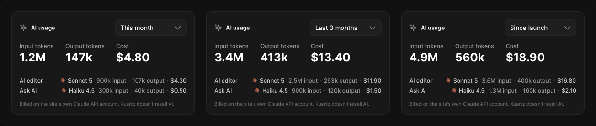

# AI usage

> Figma « Kuartz — Carte système » (`wvr98llwHnMufQ88qUp4Ih`) › 🎨 Design System › Components — Data display — nœud `352:1557` (COMPONENT_SET, 3 variantes, cadre 1248×265)

## Rôle

Consommation IA du compte Claude du site, par période : tokens input, tokens output, coût, puis le détail par fonctionnalité avec le modèle (Model usage). Pas de crédits, pas de plafond.

## Propriétés

| Propriété | Type | Défaut | Valeurs / préférences |
|---|---|---|---|
| `period` | VARIANT | `month` | `month`, `3-months`, `all-time` |

## Variantes et états

- `period` : month, 3-months, all-time (défaut : month)

Variantes présentes (3) : `period=month` · `period=3-months` · `period=all-time`

## Anatomie — variante par défaut `period=month`

- **COMPONENT** `period=month` — taille: 384×217 · dim: W fixed / H hug · layout: V gap 14 pad 16{space/16} align min/min strokes-in-layout · rayon: 12{radius/lg} · fond: #181818 {bg/elevated} · contour: #252525 {border/default} · 1px inside · clip: oui · modes: Icon color=default
  - **FRAME** `header` — taille: 350×34 · dim: W fill / H hug · layout: H gap 8{space/8} pad 0 align min/center strokes-in-layout · clip: oui
    - **INSTANCE** `icon` — taille: 16×16 · dim: W fixed / H fixed · instance: Icon/ai {size=18}
    - **TEXT** `title` — taille: 168×15 · dim: W fill / H hug · fond: #ffffff {text/primary} · texte: "AI usage" · style: Label · textopt: resize height
    - **INSTANCE** `period` — taille: 150×34 · dim: W fixed / H hug · layout: V gap 6{space/6} pad 0 align min/min strokes-in-layout · clip: oui · instance: Select {state=filled, layout=stacked} · props: Label="Label", Show helper=false, Placeholder="Select…", Helper="Shown in browser tabs and search results.", Value="This month", Show label=false · textes: "This month" · modes: Icon color=default
  - **FRAME** `totals` — taille: 273×46 · dim: W hug / H hug · layout: H gap 24{space/24} pad 0 align min/min strokes-in-layout · clip: oui
    - **FRAME** `total` — taille: 72×46 · dim: W hug / H hug · layout: V gap 2{space/2} pad 0 align min/min strokes-in-layout · clip: oui
      - **TEXT** `label` — taille: 72×15 · dim: W hug / H hug · fond: #999999 {text/tertiary} · texte: "Input tokens" · style: Body Small · textopt: resize width_and_height
      - **TEXT** `value` — taille: 56×29 · dim: W hug / H hug · fond: #ffffff {text/primary} · texte: "1.2M" · style: Heading 2 · textopt: resize width_and_height
    - **FRAME** `total` — taille: 82×46 · dim: W hug / H hug · layout: V gap 2{space/2} pad 0 align min/min strokes-in-layout · clip: oui
      - **TEXT** `label` — taille: 82×15 · dim: W hug / H hug · fond: #999999 {text/tertiary} · texte: "Output tokens" · style: Body Small · textopt: resize width_and_height
      - **TEXT** `value` — taille: 57×29 · dim: W hug / H hug · fond: #ffffff {text/primary} · texte: "147k" · style: Heading 2 · textopt: resize width_and_height
    - **FRAME** `total` — taille: 71×46 · dim: W hug / H hug · layout: V gap 2{space/2} pad 0 align min/min strokes-in-layout · clip: oui
      - **TEXT** `label` — taille: 27×15 · dim: W hug / H hug · fond: #999999 {text/tertiary} · texte: "Cost" · style: Body Small · textopt: resize width_and_height
      - **TEXT** `value` — taille: 71×29 · dim: W hug / H hug · fond: #ffffff {text/primary} · texte: "$4.80" · style: Heading 2 · textopt: resize width_and_height
  - **FRAME** `by-feature` — taille: 350×49 · dim: W fill / H hug · layout: V gap 6{space/6} pad 12{space/12} 0 0 0 align min/min strokes-in-layout · contour: #212121 {border/subtle} · 1/0/0/0px inside · clip: oui
    - **FRAME** `row` — taille: 350×15 · dim: W fill / H hug · layout: H gap auto pad 0 align space_between/center strokes-in-layout · clip: oui
      - **TEXT** `feature` — taille: 49×15 · dim: W hug / H hug · fond: #cccccc {text/secondary} · texte: "AI editor" · style: Body Small · textopt: resize width_and_height
      - **INSTANCE** `usage` — taille: 265×15 · dim: W hug / H hug · layout: H gap 8{space/8} pad 0 align min/center strokes-in-layout · instance: Model usage {size=default} · props: Show model=true, Show usage=true, Cost="$4.30", Output="107k output", Input="900k input", Model="Sonnet 5" · textes: "Sonnet 5" "900k input" "·" "107k output" · modes: Icon color=claude
    - **FRAME** `row` — taille: 350×15 · dim: W fill / H hug · layout: H gap auto pad 0 align space_between/center strokes-in-layout · clip: oui
      - **TEXT** `feature` — taille: 37×15 · dim: W hug / H hug · fond: #cccccc {text/secondary} · texte: "Ask AI" · style: Body Small · textopt: resize width_and_height
      - **INSTANCE** `usage` — taille: 263×15 · dim: W hug / H hug · layout: H gap 8{space/8} pad 0 align min/center strokes-in-layout · instance: Model usage {size=default} · props: Show model=true, Show usage=true, Cost="$0.50", Output="40k output", Input="300k input", Model="Haiku 4.5" · textes: "Haiku 4.5" "300k input" "·" "40k output" · modes: Icon color=claude
  - **TEXT** `note` — taille: 350×12 · dim: W fill / H hug · fond: #666666 {text/muted} · texte: "Billed on the site's own Claude API account. Kuartz doesn't resell AI." · style: Caption · textopt: resize height

## Différences des autres variantes

Chaque variante est comparée à une variante de référence (la variante par défaut, ou la même combinaison avec une seule propriété ramenée à sa valeur par défaut — de préférence l'état). Clé = chemin du calque depuis la racine ; seules les propriétés qui changent sont listées (`+` calque ajouté, `−` calque absent).

### `period=3-months`

- ~ `/header/period` — props: Label="Label", Show helper=false, Placeholder="Select…", Helper="Shown in browser tabs and search results.", Value="Last 3 months", Show label=false · textes: "Last 3 months"
- ~ `/totals` — taille: 285×46
- ~ `/totals/total[1]/value` — taille: 61×29 · texte: "3.4M"
- ~ `/totals/total[2]/value` — taille: 58×29 · texte: "413k"
- ~ `/totals/total[3]` — taille: 83×46
- ~ `/totals/total[3]/value` — taille: 83×29 · texte: "$13.40"
- ~ `/by-feature/row[1]/usage` — taille: 271×15 · props: Show model=true, Show usage=true, Cost="$11.90", Output="293k output", Input="2.5M input", Model="Sonnet 5" · textes: "Sonnet 5" "2.5M input" "·" "293k output"
- ~ `/by-feature/row[2]/usage` — taille: 266×15 · props: Show model=true, Show usage=true, Cost="$1.50", Output="120k output", Input="900k input", Model="Haiku 4.5" · textes: "Haiku 4.5" "900k input" "·" "120k output"

### `period=all-time`

- ~ `/header/period` — props: Label="Label", Show helper=false, Placeholder="Select…", Helper="Shown in browser tabs and search results.", Value="Since launch", Show label=false · textes: "Since launch"
- ~ `/totals` — taille: 285×46
- ~ `/totals/total[1]/value` — taille: 61×29 · texte: "4.9M"
- ~ `/totals/total[2]/value` — taille: 62×29 · texte: "560k"
- ~ `/totals/total[3]` — taille: 83×46
- ~ `/totals/total[3]/value` — taille: 83×29 · texte: "$18.90"
- ~ `/by-feature/row[1]/usage` — taille: 274×15 · props: Show model=true, Show usage=true, Cost="$16.80", Output="400k output", Input="3.6M input", Model="Sonnet 5" · textes: "Sonnet 5" "3.6M input" "·" "400k output"
- ~ `/by-feature/row[2]/usage` — taille: 262×15 · props: Show model=true, Show usage=true, Cost="$2.10", Output="160k output", Input="1.3M input", Model="Haiku 4.5" · textes: "Haiku 4.5" "1.3M input" "·" "160k output"

## Tokens et ressources utilisés

- Variables : `bg/elevated`, `border/default`, `border/subtle`, `radius/lg`, `space/12`, `space/16`, `space/2`, `space/24`, `space/6`, `space/8`, `text/muted`, `text/primary`, `text/secondary`, `text/tertiary`
- Styles de texte : Label, Body Small, Heading 2, Caption
- Effets : —
- Icônes : Icon/ai
- Composants imbriqués : Model usage, Select

## Capture

