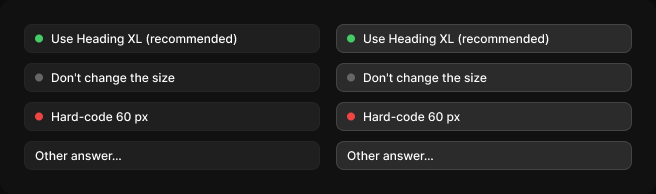

# Answer option

> Figma « Kuartz — Carte système » (`wvr98llwHnMufQ88qUp4Ih`) › 🎨 Design System › Components — AI editor — nœud `339:1410` (COMPONENT_SET, 8 variantes, cadre 656×194)

## Rôle

Option de réponse. Modifier le libellé directement.

## Propriétés

| Propriété | Type | Défaut | Valeurs / préférences |
|---|---|---|---|
| `kind` | VARIANT | `recommended` | `recommended`, `neutral`, `risky`, `other` |
| `state` | VARIANT | `default` | `default`, `hover` |

## Variantes et états

- `kind` : recommended, neutral, risky, other (défaut : recommended)
- `state` : default, hover (défaut : default)

Variantes présentes (8) : `kind=recommended, state=default` · `kind=recommended, state=hover` · `kind=neutral, state=default` · `kind=neutral, state=hover` · `kind=risky, state=default` · `kind=risky, state=hover` · `kind=other, state=default` · `kind=other, state=hover`

## Anatomie — variante par défaut `kind=recommended, state=default`

- **COMPONENT** `kind=recommended, state=default` — taille: 296×29 · dim: W fixed / H hug · layout: H gap 8{space/8} pad 6{space/6} 10{space/10} align min/center strokes-in-layout · rayon: 8{radius/md} · fond: #1f1f1f {bg/input} · contour: #252525 {border/default} · 1px inside · clip: oui
  - **ELLIPSE** `dot` — taille: 8×8 · dim: W fixed / H fixed · fond: #44cc66 {interactive/success}
  - **TEXT** `label` — taille: 258×15 · dim: W fill / H hug · fond: #ffffff {text/primary} · texte: "Use Heading XL (recommended)" · style: Body Small · textopt: resize height

## Différences des autres variantes

Chaque variante est comparée à une variante de référence (la variante par défaut, ou la même combinaison avec une seule propriété ramenée à sa valeur par défaut — de préférence l'état). Clé = chemin du calque depuis la racine ; seules les propriétés qui changent sont listées (`+` calque ajouté, `−` calque absent).

### `kind=recommended, state=hover`

- ~ `(racine)` — fond: #2b2b2b {bg/input-hover} · contour: #444444 {border/strong} · 1px inside

### `kind=neutral, state=default`

- ~ `/dot` — fond: #666666 {text/muted}
- ~ `/label` — texte: "Don't change the size"

### `kind=neutral, state=hover` — réf. `kind=neutral, state=default`

- ~ `(racine)` — fond: #2b2b2b {bg/input-hover} · contour: #444444 {border/strong} · 1px inside

### `kind=risky, state=default`

- ~ `/dot` — fond: #ee4444 {interactive/danger}
- ~ `/label` — texte: "Hard-code 60 px"

### `kind=risky, state=hover` — réf. `kind=risky, state=default`

- ~ `(racine)` — fond: #2b2b2b {bg/input-hover} · contour: #444444 {border/strong} · 1px inside

### `kind=other, state=default`

- ~ `/label` — taille: 274×15 · texte: "Other answer…"
- − `/dot` absent

### `kind=other, state=hover` — réf. `kind=other, state=default`

- ~ `(racine)` — fond: #2b2b2b {bg/input-hover} · contour: #444444 {border/strong} · 1px inside

## Tokens et ressources utilisés

- Variables : `bg/input`, `bg/input-hover`, `border/default`, `border/strong`, `interactive/danger`, `interactive/success`, `radius/md`, `space/10`, `space/6`, `space/8`, `text/muted`, `text/primary`
- Styles de texte : Body Small
- Effets : —
- Icônes : —
- Composants imbriqués : —

## Capture

