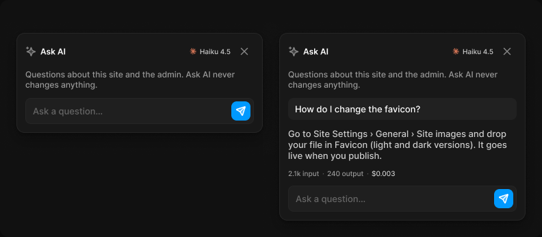

# Ask AI panel

> Figma « Kuartz — Carte système » (`wvr98llwHnMufQ88qUp4Ih`) › 🎨 Design System › Components — AI editor — nœud `340:1586` (COMPONENT_SET, 2 variantes, cadre 792×346)

## Rôle

Fenêtre Ask AI (360 px, ombre Elevation/Popover). state : empty, answered. En-tête : modèle utilisé (Model usage). Sous chaque réponse : tokens input / output et coût.

## Propriétés

| Propriété | Type | Défaut | Valeurs / préférences |
|---|---|---|---|
| `state` | VARIANT | `empty` | `empty`, `answered` |

## Variantes et états

- `state` : empty, answered (défaut : empty)

Variantes présentes (2) : `state=empty` · `state=answered`

## Anatomie — variante par défaut `state=empty`

- **COMPONENT** `state=empty` — taille: 360×146 · dim: W fixed / H hug · layout: V gap 12{space/12} pad 12{space/12} align min/min strokes-in-layout · rayon: 12{radius/lg} · fond: #181818 {bg/elevated} · contour: #252525 {border/default} · 1px inside · effet: style Elevation/Popover · clip: oui · modes: Icon color=default
  - **FRAME** `header` — taille: 334×28 · dim: W fill / H hug · layout: H gap 6{space/6} pad 0 align min/center strokes-in-layout · clip: oui
    - **INSTANCE** `icon` — taille: 16×16 · dim: W fixed / H fixed · instance: Icon/ai {size=18}
    - **TEXT** `title` — taille: 211×15 · dim: W fill / H hug · fond: #ffffff {text/primary} · texte: "Ask AI" · style: Label · textopt: resize height
    - **INSTANCE** `model` — taille: 61×12 · dim: W hug / H hug · layout: H gap 8{space/8} pad 0 align min/center strokes-in-layout · instance: Model usage {size=small} · props: Cost="$0.07", Output="1.1k output", Input="18.2k input", Show usage=false, Show model=true, Model="Haiku 4.5" · textes: "Haiku 4.5" · modes: Icon color=claude
    - **INSTANCE** `icon-button` — taille: 28×28 · dim: W fixed / H fixed · layout: H gap 0 pad 0 align center/center strokes-in-layout · rayon: 8{radius/md} · clip: oui · instance: Icon button {style=ghost, state=default, size=small} · props: Icon="Icon/close" · modes: Icon color=default
  - **TEXT** `help` — taille: 334×30 · dim: W fill / H hug · fond: #999999 {text/tertiary} · texte: "Questions about this site and the admin. Ask AI never changes anything." · style: Body Small · textopt: resize height
  - **FRAME** `input` — taille: 334×38 · dim: W fill / H hug · layout: H gap 6{space/6} pad 4{space/4} 4{space/4} 4{space/4} 10{space/10} align min/center strokes-in-layout · rayon: 8{radius/md} · fond: #1f1f1f {bg/input} · contour: #252525 {border/default} · 1px inside · clip: oui
    - **TEXT** `placeholder` — taille: 284×16 · dim: W fill / H hug · fond: #666666 {text/muted} · texte: "Ask a question…" · style: Body · textopt: resize height
    - **INSTANCE** `icon-button` — taille: 28×28 · dim: W fixed / H fixed · layout: H gap 0 pad 0 align center/center strokes-in-layout · rayon: 8{radius/md} · fond: #0099ff {interactive/primary} · clip: oui · instance: Icon button {style=primary, state=default, size=small} · props: Icon="Icon/send" · modes: Icon color=on-accent

## Différences des autres variantes

Chaque variante est comparée à une variante de référence (la variante par défaut, ou la même combinaison avec une seule propriété ramenée à sa valeur par défaut — de préférence l'état). Clé = chemin du calque depuis la racine ; seules les propriétés qui changent sont listées (`+` calque ajouté, `−` calque absent).

### `state=answered`

- ~ `(racine)` — taille: 360×274
- + `/question` (**INSTANCE**) — taille: 334×32 · dim: W fill / H hug · layout: V gap 6{space/6} pad 8{space/8} 10{space/10} align min/min strokes-in-layout · rayon: 8{radius/md} · fond: #212121 {bg/subtle} · clip: oui · instance: Message {type=adjustment} · textes: "How do I change the favicon?"
- + `/answer` (**TEXT**) — taille: 334×48 · dim: W fill / H hug · fond: #cccccc {text/secondary} · texte: "Go to Site Settings › General › Site images and drop your file in Favicon (light and dark …" · style: Body · textopt: resize height
- + `/cost` (**INSTANCE**) — taille: 157×12 · dim: W hug / H hug · layout: H gap 8{space/8} pad 0 align min/center strokes-in-layout · instance: Model usage {size=small} · props: Model="Sonnet 5", Show usage=true, Show model=false, Cost="$0.003", Output="240 output", Input="2.1k input" · textes: "2.1k input" "·" "240 output" "·" · modes: Icon color=claude

## Tokens et ressources utilisés

- Variables : `bg/elevated`, `bg/input`, `bg/subtle`, `border/default`, `interactive/primary`, `radius/lg`, `radius/md`, `space/10`, `space/12`, `space/4`, `space/6`, `space/8`, `text/muted`, `text/primary`, `text/secondary`, `text/tertiary`
- Styles de texte : Label, Body Small, Body
- Effets : Elevation/Popover
- Icônes : Icon/ai, Icon/close, Icon/send
- Composants imbriqués : Icon button, Message, Model usage

## Capture

