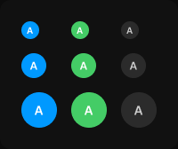

# Avatar

> Figma « Kuartz — Carte système » (`wvr98llwHnMufQ88qUp4Ih`) › 🎨 Design System › Components — Data display — nœud `332:340` (COMPONENT_SET, 9 variantes, cadre 200×168)

## Rôle

Avatar rond avec initiales. Pour une photo, remplir le cercle avec l’image. Propriété : Initials.

## Propriétés

| Propriété | Type | Défaut | Valeurs / préférences |
|---|---|---|---|
| `Initials` | TEXT | `A` |  |
| `size` | VARIANT | `20` | `20`, `28`, `40` |
| `tone` | VARIANT | `blue` | `blue`, `green`, `neutral` |

## Variantes et états

- `size` : 20, 28, 40 (défaut : 20)
- `tone` : blue, green, neutral (défaut : blue)

Variantes présentes (9) : `size=20, tone=blue` · `size=20, tone=green` · `size=20, tone=neutral` · `size=28, tone=blue` · `size=28, tone=green` · `size=28, tone=neutral` · `size=40, tone=blue` · `size=40, tone=green` · `size=40, tone=neutral`

## Anatomie — variante par défaut `size=20, tone=blue`

- **COMPONENT** `size=20, tone=blue` — taille: 20×20 · dim: W fixed / H fixed · layout: H gap 0 pad 0 align center/center strokes-in-layout · rayon: 999{radius/full} · fond: #0099ff {interactive/primary} · clip: oui
  - **TEXT** `initials` — taille: 8×12 · dim: W hug / H hug · fond: #ffffff {text/on-accent} · texte: "A" · style: Label Small · textopt: resize width_and_height · refs: characters←Initials

## Différences des autres variantes

Chaque variante est comparée à une variante de référence (la variante par défaut, ou la même combinaison avec une seule propriété ramenée à sa valeur par défaut — de préférence l'état). Clé = chemin du calque depuis la racine ; seules les propriétés qui changent sont listées (`+` calque ajouté, `−` calque absent).

### `size=20, tone=green`

- ~ `(racine)` — fond: #44cc66 {interactive/success}

### `size=20, tone=neutral`

- ~ `(racine)` — fond: #2b2b2b {bg/input-hover}
- ~ `/initials` — fond: #cccccc {text/secondary}

### `size=28, tone=blue`

- ~ `(racine)` — taille: 28×28
- ~ `/initials` — taille: 9×15 · style: Label

### `size=28, tone=green` — réf. `size=20, tone=green`

- ~ `(racine)` — taille: 28×28
- ~ `/initials` — taille: 9×15 · style: Label

### `size=28, tone=neutral` — réf. `size=20, tone=neutral`

- ~ `(racine)` — taille: 28×28
- ~ `/initials` — taille: 9×15 · style: Label

### `size=40, tone=blue`

- ~ `(racine)` — taille: 40×40
- ~ `/initials` — taille: 11×17 · style: Label Large

### `size=40, tone=green` — réf. `size=20, tone=green`

- ~ `(racine)` — taille: 40×40
- ~ `/initials` — taille: 11×17 · style: Label Large

### `size=40, tone=neutral` — réf. `size=20, tone=neutral`

- ~ `(racine)` — taille: 40×40
- ~ `/initials` — taille: 11×17 · style: Label Large

## Tokens et ressources utilisés

- Variables : `bg/input-hover`, `interactive/primary`, `interactive/success`, `radius/full`, `text/on-accent`, `text/secondary`
- Styles de texte : Label Small, Label, Label Large
- Effets : —
- Icônes : —
- Composants imbriqués : —

## Capture

