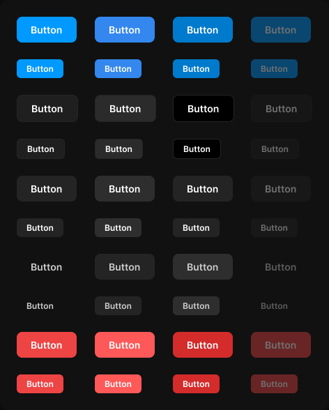

# Button

> Figma « Kuartz — Carte système » (`wvr98llwHnMufQ88qUp4Ih`) › 🎨 Design System › Components — Actions — nœud `111:286` (COMPONENT_SET, 40 variantes, cadre 472×588)

## Rôle

Bouton d'action. primary = action principale (Publish, Apply) ; secondary = action courante ; ghost = action discrète ; danger = suppression. Icône gauche/droite optionnelle (16 px en medium, 12 px en small) : sa couleur suit le style via la collection « Icon color ». variant=subtle : fond blanc 8 % sans contour, une marche plus clair que la surface (Cancel d'une modale, Upload), comme dans le draft.

## Propriétés

| Propriété | Type | Défaut | Valeurs / préférences |
|---|---|---|---|
| `Label` | TEXT | `Button` |  |
| `Show icon left` | BOOLEAN | `false` |  |
| `Icon left` | INSTANCE_SWAP | `Icon/plus` | préférées : toutes les icônes Icon/* (73/75) sauf Icon/open, Icon/claude |
| `Show icon right` | BOOLEAN | `false` |  |
| `Icon right` | INSTANCE_SWAP | `Icon/chevron-down` | préférées : toutes les icônes Icon/* (73/75) sauf Icon/open, Icon/claude |
| `variant` | VARIANT | `primary` | `primary`, `secondary`, `ghost`, `danger`, `subtle` |
| `state` | VARIANT | `default` | `default`, `hover`, `pressed`, `disabled` |
| `size` | VARIANT | `medium` | `medium`, `small` |

## Variantes et états

- `variant` : primary, secondary, ghost, danger, subtle (défaut : primary)
- `state` : default, hover, pressed, disabled (défaut : default)
- `size` : medium, small (défaut : medium)

Variantes présentes (40) : `variant=primary, state=default, size=medium` · `variant=primary, state=hover, size=medium` · `variant=primary, state=pressed, size=medium` · `variant=primary, state=disabled, size=medium` · `variant=secondary, state=default, size=medium` · `variant=secondary, state=hover, size=medium` · `variant=secondary, state=pressed, size=medium` · `variant=secondary, state=disabled, size=medium` · `variant=ghost, state=default, size=medium` · `variant=ghost, state=hover, size=medium` · `variant=ghost, state=pressed, size=medium` · `variant=ghost, state=disabled, size=medium` · `variant=danger, state=default, size=medium` · `variant=danger, state=hover, size=medium` · `variant=danger, state=pressed, size=medium` · `variant=danger, state=disabled, size=medium` · `variant=primary, state=default, size=small` · `variant=primary, state=hover, size=small` · `variant=primary, state=pressed, size=small` · `variant=primary, state=disabled, size=small` · `variant=secondary, state=default, size=small` · `variant=secondary, state=hover, size=small` · `variant=secondary, state=pressed, size=small` · `variant=secondary, state=disabled, size=small` · `variant=ghost, state=default, size=small` · `variant=ghost, state=hover, size=small` · `variant=ghost, state=pressed, size=small` · `variant=ghost, state=disabled, size=small` · `variant=danger, state=default, size=small` · `variant=danger, state=hover, size=small` · `variant=danger, state=pressed, size=small` · `variant=danger, state=disabled, size=small` · `variant=subtle, state=default, size=medium` · `variant=subtle, state=hover, size=medium` · `variant=subtle, state=pressed, size=medium` · `variant=subtle, state=disabled, size=medium` · `variant=subtle, state=default, size=small` · `variant=subtle, state=hover, size=small` · `variant=subtle, state=pressed, size=small` · `variant=subtle, state=disabled, size=small`

## Anatomie — variante par défaut `variant=primary, state=default, size=medium`

- **COMPONENT** `variant=primary, state=default, size=medium` — taille: 86×37 · dim: W hug / H hug · layout: H gap 8{space/8} pad 10{space/10} 20{space/20} align center/center strokes-in-layout · rayon: 8{radius/md} · fond: #0099ff {interactive/primary} · modes: Icon color=on-accent
  - **INSTANCE** `icon-left` — taille: 16×16 · visible: masqué · dim: W fixed / H fixed · instance: Icon/plus {size=18} · refs: visible←Show icon left, mainComponent←Icon left
  - **TEXT** `label` — taille: 46×17 · dim: W hug / H hug · fond: #ffffff {text/on-accent} · texte: "Button" · style: Label Large · textopt: resize width_and_height · refs: characters←Label
  - **INSTANCE** `icon-right` — taille: 16×16 · visible: masqué · dim: W fixed / H fixed · instance: Icon/chevron-down {size=18} · refs: visible←Show icon right, mainComponent←Icon right

## Différences des autres variantes

Chaque variante est comparée à une variante de référence (la variante par défaut, ou la même combinaison avec une seule propriété ramenée à sa valeur par défaut — de préférence l'état). Clé = chemin du calque depuis la racine ; seules les propriétés qui changent sont listées (`+` calque ajouté, `−` calque absent).

### `variant=primary, state=hover, size=medium`

- ~ `(racine)` — fond: #3387ee {interactive/primary-hover}

### `variant=primary, state=pressed, size=medium`

- ~ `(racine)` — fond: #007acc {interactive/primary-pressed}

### `variant=primary, state=disabled, size=medium`

- ~ `(racine)` — opacite: 0.4

### `variant=secondary, state=default, size=medium`

- ~ `(racine)` — taille: 88×39 · fond: #1f1f1f {bg/input} · modes: Icon color=active · contour: #252525 {border/default} · 1px inside
- ~ `/label` — fond: #ffffff {text/primary}

### `variant=secondary, state=hover, size=medium` — réf. `variant=secondary, state=default, size=medium`

- ~ `(racine)` — fond: #2b2b2b {bg/input-hover}

### `variant=secondary, state=pressed, size=medium` — réf. `variant=secondary, state=default, size=medium`

- ~ `(racine)` — fond: #000000 {bg/app}

### `variant=secondary, state=disabled, size=medium` — réf. `variant=secondary, state=default, size=medium`

- ~ `(racine)` — opacite: 0.4

### `variant=ghost, state=default, size=medium`

- ~ `(racine)` — fond: (aucun) · modes: Icon color=default
- ~ `/label` — fond: #cccccc {text/secondary}

### `variant=ghost, state=hover, size=medium` — réf. `variant=ghost, state=default, size=medium`

- ~ `(racine)` — fond: #ffffff 8% {bg/ghost-hover}

### `variant=ghost, state=pressed, size=medium` — réf. `variant=ghost, state=default, size=medium`

- ~ `(racine)` — fond: #ffffff 12% {bg/ghost-pressed}

### `variant=ghost, state=disabled, size=medium` — réf. `variant=ghost, state=default, size=medium`

- ~ `(racine)` — opacite: 0.4

### `variant=danger, state=default, size=medium`

- ~ `(racine)` — fond: #ee4444 {interactive/danger}

### `variant=danger, state=hover, size=medium` — réf. `variant=danger, state=default, size=medium`

- ~ `(racine)` — fond: #ff5858 {interactive/danger-hover}

### `variant=danger, state=pressed, size=medium` — réf. `variant=danger, state=default, size=medium`

- ~ `(racine)` — fond: #d42b2b {interactive/danger-pressed}

### `variant=danger, state=disabled, size=medium` — réf. `variant=danger, state=default, size=medium`

- ~ `(racine)` — opacite: 0.4

### `variant=primary, state=default, size=small`

- ~ `(racine)` — taille: 67×27 · layout: H gap 6{space/6} pad 6{space/6} 14 align center/center strokes-in-layout · rayon: 6
- ~ `/icon-left` — taille: 12×12
- ~ `/label` — taille: 39×15 · style: Label
- ~ `/icon-right` — taille: 12×12

### `variant=primary, state=hover, size=small` — réf. `variant=primary, state=default, size=small`

- ~ `(racine)` — fond: #3387ee {interactive/primary-hover}

### `variant=primary, state=pressed, size=small` — réf. `variant=primary, state=default, size=small`

- ~ `(racine)` — fond: #007acc {interactive/primary-pressed}

### `variant=primary, state=disabled, size=small` — réf. `variant=primary, state=default, size=small`

- ~ `(racine)` — opacite: 0.4

### `variant=secondary, state=default, size=small` — réf. `variant=primary, state=default, size=small`

- ~ `(racine)` — taille: 69×29 · fond: #1f1f1f {bg/input} · modes: Icon color=active · contour: #252525 {border/default} · 1px inside
- ~ `/label` — fond: #ffffff {text/primary}

### `variant=secondary, state=hover, size=small` — réf. `variant=secondary, state=default, size=small`

- ~ `(racine)` — fond: #2b2b2b {bg/input-hover}

### `variant=secondary, state=pressed, size=small` — réf. `variant=secondary, state=default, size=small`

- ~ `(racine)` — fond: #000000 {bg/app}

### `variant=secondary, state=disabled, size=small` — réf. `variant=secondary, state=default, size=small`

- ~ `(racine)` — opacite: 0.4

### `variant=ghost, state=default, size=small` — réf. `variant=primary, state=default, size=small`

- ~ `(racine)` — fond: (aucun) · modes: Icon color=default
- ~ `/label` — fond: #cccccc {text/secondary}

### `variant=ghost, state=hover, size=small` — réf. `variant=ghost, state=default, size=small`

- ~ `(racine)` — fond: #ffffff 8% {bg/ghost-hover}

### `variant=ghost, state=pressed, size=small` — réf. `variant=ghost, state=default, size=small`

- ~ `(racine)` — fond: #ffffff 12% {bg/ghost-pressed}

### `variant=ghost, state=disabled, size=small` — réf. `variant=ghost, state=default, size=small`

- ~ `(racine)` — opacite: 0.4

### `variant=danger, state=default, size=small` — réf. `variant=primary, state=default, size=small`

- ~ `(racine)` — fond: #ee4444 {interactive/danger}

### `variant=danger, state=hover, size=small` — réf. `variant=danger, state=default, size=small`

- ~ `(racine)` — fond: #ff5858 {interactive/danger-hover}

### `variant=danger, state=pressed, size=small` — réf. `variant=danger, state=default, size=small`

- ~ `(racine)` — fond: #d42b2b {interactive/danger-pressed}

### `variant=danger, state=disabled, size=small` — réf. `variant=danger, state=default, size=small`

- ~ `(racine)` — opacite: 0.4

### `variant=subtle, state=default, size=medium`

- ~ `(racine)` — fond: #ffffff 8% {bg/tint/neutral} · modes: Icon color=active
- ~ `/label` — fond: #ffffff {text/primary}

### `variant=subtle, state=hover, size=medium` — réf. `variant=subtle, state=default, size=medium`

- ~ `(racine)` — fond: #ffffff 12% {bg/ghost-pressed}

### `variant=subtle, state=pressed, size=medium` — réf. `variant=subtle, state=default, size=medium`

- (identique à la référence hors valeurs de variante)

### `variant=subtle, state=disabled, size=medium` — réf. `variant=subtle, state=default, size=medium`

- ~ `(racine)` — opacite: 0.4

### `variant=subtle, state=default, size=small` — réf. `variant=primary, state=default, size=small`

- ~ `(racine)` — fond: #ffffff 8% {bg/tint/neutral} · modes: Icon color=active
- ~ `/label` — fond: #ffffff {text/primary}

### `variant=subtle, state=hover, size=small` — réf. `variant=subtle, state=default, size=small`

- ~ `(racine)` — fond: #ffffff 12% {bg/ghost-pressed}

### `variant=subtle, state=pressed, size=small` — réf. `variant=subtle, state=default, size=small`

- (identique à la référence hors valeurs de variante)

### `variant=subtle, state=disabled, size=small` — réf. `variant=subtle, state=default, size=small`

- ~ `(racine)` — opacite: 0.4

## Tokens et ressources utilisés

- Variables : `bg/app`, `bg/ghost-hover`, `bg/ghost-pressed`, `bg/input`, `bg/input-hover`, `bg/tint/neutral`, `border/default`, `interactive/danger`, `interactive/danger-hover`, `interactive/danger-pressed`, `interactive/primary`, `interactive/primary-hover`, `interactive/primary-pressed`, `radius/md`, `space/10`, `space/20`, `space/6`, `space/8`, `text/on-accent`, `text/primary`, `text/secondary`
- Styles de texte : Label Large, Label
- Effets : —
- Icônes : Icon/chevron-down, Icon/plus
- Composants imbriqués : —

## Capture

