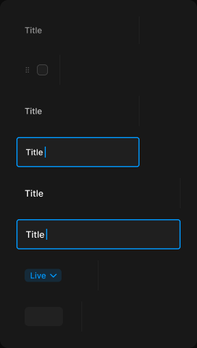

# CMS cell

> Figma « Kuartz — Carte système » (`wvr98llwHnMufQ88qUp4Ih`) › 🎨 Design System › Components — Data display — nœud `468:2013` (COMPONENT_SET, 8 variantes, cadre 288×508)

## Rôle

Cellule du tableau CMS (tableur) : largeur fixe par colonne (texte 180, titre 240, statut 120, vignette 96, poignée 64), trait droit border/subtle. state=editing : édition dans la cellule (contour interactive/primary, curseur). Ligne : trait bas border/subtle ; survol bg/ghost-hover + Row open à droite.

## Propriétés

| Propriété | Type | Défaut | Valeurs / préférences |
|---|---|---|---|
| `Label` | TEXT | `Title` |  |
| `type` | VARIANT | `header` | `header`, `handle`, `text`, `title`, `status`, `image` |
| `state` | VARIANT | `default` | `default`, `editing` |

## Variantes et états

- `type` : header, handle, text, title, status, image (défaut : header)
- `state` : default, editing (défaut : default)

Variantes présentes (8) : `type=header, state=default` · `type=handle, state=default` · `type=text, state=default` · `type=text, state=editing` · `type=title, state=default` · `type=title, state=editing` · `type=status, state=default` · `type=image, state=default`

## Anatomie — variante par défaut `type=header, state=default`

- **COMPONENT** `type=header, state=default` — taille: 180×40 · dim: W fixed / H fixed · layout: H gap 2 pad 0 12 align min/center strokes-in-layout · contour: #212121 {border/subtle} · 0/1/0/0px inside · clip: oui
  - **TEXT** `label` — taille: 155×15 · dim: W fill / H hug · fond: #999999 {text/tertiary} · texte: "Title" · style: Body Small · textopt: resize height, ellipsis max 1 lignes · refs: characters←Label

## Différences des autres variantes

Chaque variante est comparée à une variante de référence (la variante par défaut, ou la même combinaison avec une seule propriété ramenée à sa valeur par défaut — de préférence l'état). Clé = chemin du calque depuis la racine ; seules les propriétés qui changent sont listées (`+` calque ajouté, `−` calque absent).

### `type=handle, state=default`

- ~ `(racine)` — taille: 64×44 · layout: H gap 8 pad 0 10 align min/center strokes-in-layout · modes: Icon color=disabled
- + `/grip` (**INSTANCE**) — taille: 12×12 · dim: W fixed / H fixed · instance: Icon/grip {size=12}
- + `/checkbox` (**INSTANCE**) — taille: 16×16 · dim: W hug / H hug · layout: H gap 8{space/8} pad 0 align min/center strokes-in-layout · clip: oui · instance: Checkbox {state=unchecked} · props: Show label=false, Label="Checkbox label"
- − `/label` absent

### `type=text, state=default`

- ~ `(racine)` — taille: 180×44
- ~ `/label` — fond: #cccccc {text/secondary}

### `type=text, state=editing` — réf. `type=text, state=default`

- ~ `(racine)` — contour: #0099ff {interactive/primary} · 1.5px inside · rayon: 4 · fond: #1f1f1f {bg/input}
- ~ `/label` — taille: 26×15 · dim: W hug / H hug · fond: #ffffff {text/primary} · textopt: resize width_and_height
- + `/caret` (**RECTANGLE**) — taille: 1.5×16 · dim: W fixed / H fixed · fond: #0099ff {interactive/primary}

### `type=title, state=default`

- ~ `(racine)` — taille: 240×44
- ~ `/label` — taille: 215×16 · fond: #ffffff {text/primary} · style: Body

### `type=title, state=editing` — réf. `type=title, state=default`

- ~ `(racine)` — contour: #0099ff {interactive/primary} · 1.5px inside · rayon: 4 · fond: #1f1f1f {bg/input}
- ~ `/label` — taille: 28×16 · dim: W hug / H hug · textopt: resize width_and_height
- + `/caret` (**RECTANGLE**) — taille: 1.5×16 · dim: W fixed / H fixed · fond: #0099ff {interactive/primary}

### `type=status, state=default`

- ~ `(racine)` — taille: 120×44
- + `/status` (**INSTANCE**) — taille: 54×19 · dim: W hug / H hug · layout: H gap 4 pad 2 6 2 8 align min/center strokes-in-layout · rayon: 5 · fond: #0099ff 14% {bg/tint/info} · instance: Status select {tone=live} · textes: "Live" · modes: Icon color=primary
- − `/label` absent

### `type=image, state=default`

- ~ `(racine)` — taille: 96×44
- + `/thumb` (**FRAME**) — taille: 56×28 · dim: W fixed / H fixed · rayon: 6 · fond: #212121 {bg/subtle} · clip: oui
- − `/label` absent

## Tokens et ressources utilisés

- Variables : `bg/input`, `bg/subtle`, `bg/tint/info`, `border/subtle`, `interactive/primary`, `space/8`, `text/primary`, `text/secondary`, `text/tertiary`
- Styles de texte : Body Small, Body
- Effets : —
- Icônes : Icon/grip
- Composants imbriqués : Checkbox, Status select

## Capture

