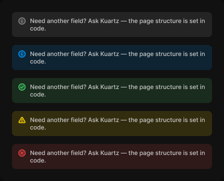

# Callout

> Figma « Kuartz — Carte système » (`wvr98llwHnMufQ88qUp4Ih`) › 🎨 Design System › Components — Feedback — nœud `323:316` (COMPONENT_SET, 5 variantes, cadre 448×362)

## Rôle

Note contextuelle. Propriétés : Text, Show action (bouton ghost).

## Propriétés

| Propriété | Type | Défaut | Valeurs / préférences |
|---|---|---|---|
| `Text` | TEXT | `Need another field? Ask Kuartz — the page structure is set in code.` |  |
| `Show action` | BOOLEAN | `false` |  |
| `tone` | VARIANT | `neutral` | `neutral`, `info`, `success`, `warning`, `error` |

## Variantes et états

- `tone` : neutral, info, success, warning, error (défaut : neutral)

Variantes présentes (5) : `tone=neutral` · `tone=info` · `tone=success` · `tone=warning` · `tone=error`

## Anatomie — variante par défaut `tone=neutral`

- **COMPONENT** `tone=neutral` — taille: 400×50 · dim: W fixed / H hug · layout: H gap 8{space/8} pad 10{space/10} 12{space/12} align min/min strokes-in-layout · rayon: 8{radius/md} · fond: #ffffff 8% {bg/tint/neutral} · clip: oui · modes: Icon color=default
  - **INSTANCE** `icon` — taille: 16×16 · dim: W fixed / H fixed · instance: Icon/info {size=18}
  - **FRAME** `body` — taille: 352×30 · dim: W fill / H hug · layout: V gap 6{space/6} pad 0 align min/min strokes-in-layout · clip: oui
    - **TEXT** `text` — taille: 352×30 · dim: W fill / H hug · fond: #cccccc {text/secondary} · texte: "Need another field? Ask Kuartz — the page structure is set in code." · style: Body Small · textopt: resize height · refs: characters←Text
    - **INSTANCE** `action` — taille: 116×27 · visible: masqué · dim: W hug / H hug · layout: H gap 6{space/6} pad 6{space/6} 14 align center/center strokes-in-layout · rayon: 6 · instance: Button {variant=ghost, state=default, size=small} · props: Show icon right=false, Icon left="Icon/plus", Icon right="Icon/chevron-down", Show icon left=false, Label="Contact Kuartz" · modes: Icon color=default · refs: visible←Show action

## Différences des autres variantes

Chaque variante est comparée à une variante de référence (la variante par défaut, ou la même combinaison avec une seule propriété ramenée à sa valeur par défaut — de préférence l'état). Clé = chemin du calque depuis la racine ; seules les propriétés qui changent sont listées (`+` calque ajouté, `−` calque absent).

### `tone=info`

- ~ `(racine)` — fond: #0099ff 14% {bg/tint/info} · modes: Icon color=primary

### `tone=success`

- ~ `(racine)` — fond: #44cc66 14% {bg/tint/success} · modes: Icon color=success
- ~ `/icon` — instance: Icon/success {size=18}

### `tone=warning`

- ~ `(racine)` — fond: #ffd700 14% {bg/tint/warning} · modes: Icon color=warning
- ~ `/icon` — instance: Icon/warning {size=18}

### `tone=error`

- ~ `(racine)` — fond: #ee4444 14% {bg/tint/danger} · modes: Icon color=danger
- ~ `/icon` — instance: Icon/error {size=18}

## Tokens et ressources utilisés

- Variables : `bg/tint/danger`, `bg/tint/info`, `bg/tint/neutral`, `bg/tint/success`, `bg/tint/warning`, `radius/md`, `space/10`, `space/12`, `space/6`, `space/8`, `text/secondary`
- Styles de texte : Body Small
- Effets : —
- Icônes : Icon/chevron-down, Icon/error, Icon/info, Icon/plus, Icon/success, Icon/warning
- Composants imbriqués : Button

## Capture

