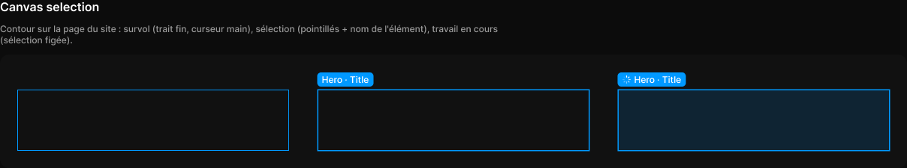

# Canvas selection

> Figma « Kuartz — Carte système » (`wvr98llwHnMufQ88qUp4Ih`) › 🎨 Design System › Components — AI editor — nœud `340:1452` (COMPONENT_SET, 3 variantes, cadre 1208×152)

## Rôle

Contour d'élément (360 × 80, redimensionner à l'élément). Le nom s'affiche au-dessus. Propriété : Name.

## Propriétés

| Propriété | Type | Défaut | Valeurs / préférences |
|---|---|---|---|
| `Name` | TEXT | `Hero · Title` |  |
| `state` | VARIANT | `hover` | `hover`, `selected`, `working` |

## Variantes et états

- `state` : hover, selected, working (défaut : hover)

Variantes présentes (3) : `state=hover` · `state=selected` · `state=working`

## Anatomie — variante par défaut `state=hover`

- **COMPONENT** `state=hover` — taille: 360×80 · contour: #0099ff {interactive/primary} · 1px outside

## Différences des autres variantes

Chaque variante est comparée à une variante de référence (la variante par défaut, ou la même combinaison avec une seule propriété ramenée à sa valeur par défaut — de préférence l'état). Clé = chemin du calque depuis la racine ; seules les propriétés qui changent sont listées (`+` calque ajouté, `−` calque absent).

### `state=selected`

- ~ `(racine)` — contour: #0099ff {interactive/primary} · 1.5px outside
- + `/label` (**FRAME**) — taille: 75×19 · dim: W hug / H hug · pos: x -1.5 y -24 (min/min) · layout: H gap 4{space/4} pad 2{space/2} 6{space/6} align min/center strokes-in-layout · rayon: 5{radius/sm} · fond: #0099ff {interactive/primary} · clip: oui · modes: Icon color=on-accent
- + `/label/name` (**TEXT**) — taille: 63×15 · dim: W hug / H hug · fond: #ffffff {text/on-accent} · texte: "Hero · Title" · style: Body Small · textopt: resize width_and_height · refs: characters←Name

### `state=working`

- ~ `(racine)` — contour: #0099ff {interactive/primary} · 1.5px outside · fond: #0099ff 14% {bg/tint/info}
- + `/label` (**FRAME**) — taille: 91×19 · dim: W hug / H hug · pos: x -1.5 y -24 (min/min) · layout: H gap 4{space/4} pad 2{space/2} 6{space/6} align min/center strokes-in-layout · rayon: 5{radius/sm} · fond: #0099ff {interactive/primary} · clip: oui · modes: Icon color=on-accent
- + `/label/icon` (**INSTANCE**) — taille: 12×12 · dim: W fixed / H fixed · instance: Icon/loader {size=12}
- + `/label/name` (**TEXT**) — taille: 63×15 · dim: W hug / H hug · fond: #ffffff {text/on-accent} · texte: "Hero · Title" · style: Body Small · textopt: resize width_and_height · refs: characters←Name

## Tokens et ressources utilisés

- Variables : `bg/tint/info`, `interactive/primary`, `radius/sm`, `space/2`, `space/4`, `space/6`, `text/on-accent`
- Styles de texte : Body Small
- Effets : —
- Icônes : Icon/loader
- Composants imbriqués : —

## Capture

_Capture du cadre de documentation `group/Canvas selection` (`340:1430`, 1208×225 px : titre, description et composant entier). La capture du composant seul (1208×152 px) pesait 2930 octets (< 5 Ko), rendu 1× identique._
