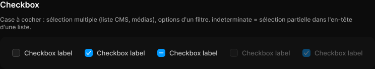

# Checkbox

> Figma « Kuartz — Carte système » (`wvr98llwHnMufQ88qUp4Ih`) › 🎨 Design System › Components — Forms — nœud `330:283` (COMPONENT_SET, 5 variantes, cadre 744×64)

## Rôle

Case à cocher 16 px. Propriétés : Label, Show label.

## Propriétés

| Propriété | Type | Défaut | Valeurs / préférences |
|---|---|---|---|
| `Label` | TEXT | `Checkbox label` |  |
| `Show label` | BOOLEAN | `true` |  |
| `state` | VARIANT | `unchecked` | `unchecked`, `checked`, `indeterminate`, `disabled-unchecked`, `disabled-checked` |

## Variantes et états

- `state` : unchecked, checked, indeterminate, disabled-unchecked, disabled-checked (défaut : unchecked)

Variantes présentes (5) : `state=unchecked` · `state=checked` · `state=indeterminate` · `state=disabled-unchecked` · `state=disabled-checked`

## Anatomie — variante par défaut `state=unchecked`

- **COMPONENT** `state=unchecked` — taille: 120×16 · dim: W hug / H hug · layout: H gap 8{space/8} pad 0 align min/center strokes-in-layout · clip: oui
  - **FRAME** `box` — taille: 16×16 · dim: W fixed / H fixed · layout: H gap 0 pad 0 align center/center strokes-in-layout · rayon: 5{radius/sm} · fond: #1f1f1f {bg/input} · contour: #444444 {border/strong} · 1px inside · clip: oui
  - **TEXT** `label` — taille: 96×16 · dim: W hug / H hug · fond: #cccccc {text/secondary} · texte: "Checkbox label" · style: Body · textopt: resize width_and_height · refs: visible←Show label, characters←Label

## Différences des autres variantes

Chaque variante est comparée à une variante de référence (la variante par défaut, ou la même combinaison avec une seule propriété ramenée à sa valeur par défaut — de préférence l'état). Clé = chemin du calque depuis la racine ; seules les propriétés qui changent sont listées (`+` calque ajouté, `−` calque absent).

### `state=checked`

- ~ `/box` — fond: #0099ff {interactive/primary} · contour: (aucun) · modes: Icon color=on-accent
- + `/box/mark` (**INSTANCE**) — taille: 12×12 · dim: W fixed / H fixed · instance: Icon/check {size=12}

### `state=indeterminate`

- ~ `/box` — fond: #0099ff {interactive/primary} · contour: (aucun) · modes: Icon color=on-accent
- + `/box/mark` (**INSTANCE**) — taille: 12×12 · dim: W fixed / H fixed · instance: Icon/minus {size=12}

### `state=disabled-unchecked`

- ~ `(racine)` — opacite: 0.4

### `state=disabled-checked`

- ~ `(racine)` — opacite: 0.4
- ~ `/box` — fond: #0099ff {interactive/primary} · contour: (aucun) · modes: Icon color=on-accent
- + `/box/mark` (**INSTANCE**) — taille: 12×12 · dim: W fixed / H fixed · instance: Icon/check {size=12}

## Tokens et ressources utilisés

- Variables : `bg/input`, `border/strong`, `interactive/primary`, `radius/sm`, `space/8`, `text/secondary`
- Styles de texte : Body
- Effets : —
- Icônes : Icon/check, Icon/minus
- Composants imbriqués : —

## Capture

_Capture du cadre de documentation `group/Checkbox` (`330:254`, 744×137 px : titre, description et composant entier). La capture du composant seul (744×64 px) pesait 4274 octets (< 5 Ko), rendu 1× identique._
