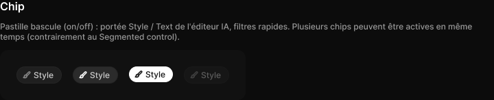

# Chip

> Figma « Kuartz — Carte système » (`wvr98llwHnMufQ88qUp4Ih`) › 🎨 Design System › Components — Actions — nœud `321:421` (COMPONENT_SET, 4 variantes, cadre 358×73)

## Rôle

Pastille bascule. Propriétés : Label, Show icon, Icon (12 px).

## Propriétés

| Propriété | Type | Défaut | Valeurs / préférences |
|---|---|---|---|
| `Label` | TEXT | `Style` |  |
| `Show icon` | BOOLEAN | `true` |  |
| `Icon` | INSTANCE_SWAP | `Icon/style` | préférées : toutes les icônes Icon/* (73/75) sauf Icon/open, Icon/claude |
| `state` | VARIANT | `off` | `off`, `hover`, `on`, `disabled` |

## Variantes et états

- `state` : off, hover, on, disabled (défaut : off)

Variantes présentes (4) : `state=off` · `state=hover` · `state=on` · `state=disabled`

## Anatomie — variante par défaut `state=off`

- **COMPONENT** `state=off` — taille: 66×25 · dim: W hug / H hug · layout: H gap 4{space/4} pad 4{space/4} 10{space/10} 4{space/4} 8{space/8} align min/center strokes-in-layout · rayon: 999{radius/full} · fond: #1f1f1f {bg/input} · contour: #252525 {border/default} · 1px inside · clip: oui · modes: Icon color=default
  - **INSTANCE** `icon` — taille: 12×12 · dim: W fixed / H fixed · instance: Icon/style {size=18} · refs: visible←Show icon, mainComponent←Icon
  - **TEXT** `label` — taille: 30×15 · dim: W hug / H hug · fond: #cccccc {text/secondary} · texte: "Style" · style: Body Small · textopt: resize width_and_height · refs: characters←Label

## Différences des autres variantes

Chaque variante est comparée à une variante de référence (la variante par défaut, ou la même combinaison avec une seule propriété ramenée à sa valeur par défaut — de préférence l'état). Clé = chemin du calque depuis la racine ; seules les propriétés qui changent sont listées (`+` calque ajouté, `−` calque absent).

### `state=hover`

- ~ `(racine)` — fond: #2b2b2b {bg/input-hover} · modes: Icon color=active

### `state=on`

- ~ `(racine)` — taille: 64×23 · fond: #ffffff {bg/inverse} · contour: (aucun) · modes: Icon color=inverse
- ~ `/label` — fond: #111111 {text/inverse}

### `state=disabled`

- ~ `(racine)` — opacite: 0.4

## Tokens et ressources utilisés

- Variables : `bg/input`, `bg/input-hover`, `bg/inverse`, `border/default`, `radius/full`, `space/10`, `space/4`, `space/8`, `text/inverse`, `text/secondary`
- Styles de texte : Body Small
- Effets : —
- Icônes : Icon/style
- Composants imbriqués : —

## Capture

_Capture du cadre de documentation `group/Chip` (`321:394`, 720×146 px : titre, description et composant entier). La capture du composant seul (358×73 px) pesait 4242 octets (< 5 Ko), rendu 1× identique._
