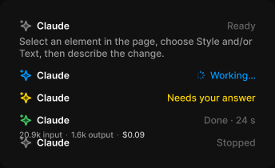

# Claude header

> Figma « Kuartz — Carte système » (`wvr98llwHnMufQ88qUp4Ih`) › 🎨 Design System › Components — AI editor — nœud `339:1323` (COMPONENT_SET, 5 variantes, cadre 344×210)

## Rôle

En-tête du fil de Claude. Modifier la durée et les crédits directement dans le texte d'état.

## Propriétés

| Propriété | Type | Défaut | Valeurs / préférences |
|---|---|---|---|
| `state` | VARIANT | `ready` | `ready`, `working`, `asking`, `done`, `stopped` |

## Variantes et états

- `state` : ready, working, asking, done, stopped (défaut : ready)

Variantes présentes (5) : `state=ready` · `state=working` · `state=asking` · `state=done` · `state=stopped`

## Anatomie — variante par défaut `state=ready`

- **COMPONENT** `state=ready` — taille: 296×50 · dim: W fixed / H hug · layout: V gap 4{space/4} pad 0 align min/min strokes-in-layout · clip: oui · modes: Icon color=default
  - **FRAME** `row` — taille: 296×16 · dim: W fill / H hug · layout: H gap 6{space/6} pad 0 align min/center strokes-in-layout · clip: oui
    - **INSTANCE** `icon` — taille: 16×16 · dim: W fixed / H fixed · instance: Icon/ai {size=18}
    - **TEXT** `name` — taille: 232×15 · dim: W fill / H hug · fond: #ffffff {text/primary} · texte: "Claude" · style: Label · textopt: resize height
    - **TEXT** `status` — taille: 36×15 · dim: W hug / H hug · fond: #666666 {text/muted} · texte: "Ready" · style: Body Small · textopt: resize width_and_height
  - **TEXT** `help` — taille: 296×30 · dim: W fill / H hug · fond: #999999 {text/tertiary} · texte: "Select an element in the page, choose Style and/or Text, then describe the change." · style: Body Small · textopt: resize height

## Différences des autres variantes

Chaque variante est comparée à une variante de référence (la variante par défaut, ou la même combinaison avec une seule propriété ramenée à sa valeur par défaut — de préférence l'état). Clé = chemin du calque depuis la racine ; seules les propriétés qui changent sont listées (`+` calque ajouté, `−` calque absent).

### `state=working`

- ~ `(racine)` — taille: 296×16 · modes: Icon color=primary
- ~ `/row/name` — taille: 193×15
- + `/row/spinner` (**INSTANCE**) — taille: 12×12 · dim: W fixed / H fixed · instance: Icon/loader {size=12}
- ~ `/row/status` — taille: 57×15 · fond: #0099ff {text/link} · texte: "Working…"
- − `/help` absent

### `state=asking`

- ~ `(racine)` — taille: 296×16 · modes: Icon color=warning
- ~ `/row/name` — taille: 157×15
- ~ `/row/status` — taille: 111×15 · fond: #ffd700 {interactive/warning} · texte: "Needs your answer"
- − `/help` absent

### `state=done`

- ~ `(racine)` — taille: 296×32 · modes: Icon color=success
- ~ `/row/name` — taille: 203×15
- ~ `/row/status` — taille: 65×15 · texte: "Done · 24 s"
- + `/usage` (**INSTANCE**) — taille: 158×12 · dim: W hug / H hug · layout: H gap 8{space/8} pad 0 align min/center strokes-in-layout · instance: Model usage {size=small} · props: Model="Sonnet 5", Show usage=true, Show model=false, Cost="$0.09", Output="1.6k output", Input="20.9k input" · textes: "20.9k input" "·" "1.6k output" "·" · modes: Icon color=claude
- − `/help` absent

### `state=stopped`

- ~ `(racine)` — taille: 296×16
- ~ `/row/name` — taille: 219×15
- ~ `/row/status` — taille: 49×15 · texte: "Stopped"
- − `/help` absent

## Tokens et ressources utilisés

- Variables : `interactive/warning`, `space/4`, `space/6`, `space/8`, `text/link`, `text/muted`, `text/primary`, `text/tertiary`
- Styles de texte : Label, Body Small
- Effets : —
- Icônes : Icon/ai, Icon/loader
- Composants imbriqués : Model usage

## Capture

