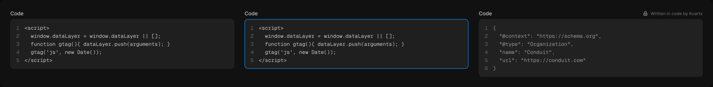

# Code block

> Figma « Kuartz — Carte système » (`wvr98llwHnMufQ88qUp4Ih`) › 🎨 Design System › Components — Forms — nœud `330:520` (COMPONENT_SET, 3 variantes, cadre 1656×205)

## Rôle

Bloc de code (Geist Mono 12, style Code). read-only : JSON-LD affiché au client, non modifiable (cadenas). Modifier le code directement dans le calque « code ». Propriété : Label.

## Propriétés

| Propriété | Type | Défaut | Valeurs / préférences |
|---|---|---|---|
| `Label` | TEXT | `Code` |  |
| `state` | VARIANT | `editable` | `editable`, `focused`, `read-only` |

## Variantes et états

- `state` : editable, focused, read-only (défaut : editable)

Variantes présentes (3) : `state=editable` · `state=focused` · `state=read-only`

## Anatomie — variante par défaut `state=editable`

- **COMPONENT** `state=editable` — taille: 520×138 · dim: W fixed / H hug · layout: V gap 6{space/6} pad 0 align min/min strokes-in-layout · clip: oui · modes: Icon color=default
  - **FRAME** `header` — taille: 520×15 · dim: W fill / H hug · layout: H gap 6{space/6} pad 0 align min/center strokes-in-layout · clip: oui
    - **TEXT** `label` — taille: 520×15 · dim: W fill / H hug · fond: #cccccc {text/secondary} · texte: "Code" · style: Body Small · textopt: resize height · refs: characters←Label
  - **FRAME** `editor` — taille: 520×117 · dim: W fill / H hug · layout: H gap 12{space/12} pad 10{space/10} 12{space/12} align min/min strokes-in-layout · rayon: 8{radius/md} · fond: #1f1f1f {bg/input} · contour: #252525 {border/default} · 1px inside · clip: oui
    - **TEXT** `line-numbers` — taille: 8×95 · dim: W hug / H hug · fond: #666666 {text/muted} · texte: "1\n2\n3\n4\n5" · style: Code · textopt: right, resize width_and_height
    - **TEXT** `code` — taille: 474×95 · dim: W fill / H hug · fond: #cccccc {text/secondary} · texte: "<script>\n  window.dataLayer = window.dataLayer || [];\n  function gtag(){ dataLayer.push(ar…" · style: Code · textopt: resize height

## Différences des autres variantes

Chaque variante est comparée à une variante de référence (la variante par défaut, ou la même combinaison avec une seule propriété ramenée à sa valeur par défaut — de préférence l'état). Clé = chemin du calque depuis la racine ; seules les propriétés qui changent sont listées (`+` calque ajouté, `−` calque absent).

### `state=focused`

- ~ `/editor` — contour: #0099ff {border/focus} · 1px inside

### `state=read-only`

- ~ `(racine)` — taille: 520×157
- ~ `/header/label` — taille: 375×15
- + `/header/lock` (**INSTANCE**) — taille: 12×12 · dim: W fixed / H fixed · instance: Icon/lock {size=12}
- + `/header/note` (**TEXT**) — taille: 121×12 · dim: W hug / H hug · fond: #666666 {text/muted} · texte: "Written in code by Kuartz" · style: Caption · textopt: resize width_and_height
- ~ `/editor` — taille: 520×136 · fond: #212121 {bg/subtle}
- ~ `/editor/line-numbers` — taille: 8×114 · texte: "1\n2\n3\n4\n5\n6"
- ~ `/editor/code` — taille: 474×114 · fond: #999999 {text/tertiary} · texte: "{\n  \"@context\": \"https://schema.org\",\n  \"@type\": \"Organization\",\n  \"name\": \"Conduit\",\n  \"u…"

## Tokens et ressources utilisés

- Variables : `bg/input`, `bg/subtle`, `border/default`, `radius/md`, `space/10`, `space/12`, `space/6`, `text/muted`, `text/secondary`, `text/tertiary`
- Styles de texte : Body Small, Code, Caption
- Effets : —
- Icônes : Icon/lock
- Composants imbriqués : —

## Capture

