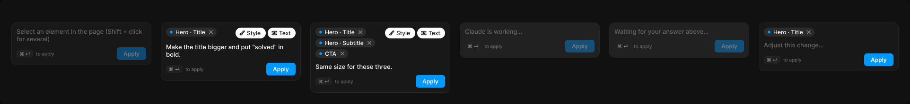

# Composer

> Figma « Kuartz — Carte système » (`wvr98llwHnMufQ88qUp4Ih`) › 🎨 Design System › Components — AI editor — nœud `340:1429` (COMPONENT_SET, 6 variantes, cadre 1924×222)

## Rôle

Champ de l'éditeur IA. state : empty, ready, multi (Maj + clic), working, waiting (Claude a posé une question), adjust (avant validation).

## Propriétés

| Propriété | Type | Défaut | Valeurs / préférences |
|---|---|---|---|
| `state` | VARIANT | `empty` | `empty`, `ready`, `multi`, `working`, `waiting`, `adjust` |

## Variantes et états

- `state` : empty, ready, multi, working, waiting, adjust (défaut : empty)

Variantes présentes (6) : `state=empty` · `state=ready` · `state=multi` · `state=working` · `state=waiting` · `state=adjust`

## Anatomie — variante par défaut `state=empty`

- **COMPONENT** `state=empty` — taille: 296×91 · dim: W fixed / H hug · layout: V gap 10{space/10} pad 10{space/10} align min/min strokes-in-layout · rayon: 12{radius/lg} · fond: #181818 {bg/elevated} · contour: #252525 {border/default} · 1px inside · clip: oui
  - **TEXT** `text` — taille: 274×32 · dim: W fill / H hug · fond: #666666 {text/muted} · texte: "Select an element in the page (Shift + click for several)" · style: Body · textopt: resize height
  - **FRAME** `footer` — taille: 274×27 · dim: W fill / H hug · layout: H gap 6{space/6} pad 0 align min/center strokes-in-layout · clip: oui
    - **INSTANCE** `shortcut` — taille: 35×16 · dim: W hug / H hug · layout: H gap 0 pad 1 5 align center/center strokes-in-layout · minmax: minWidth 18 · rayon: 5{radius/sm} · fond: #212121 {bg/subtle} · contour: #252525 {border/default} · 1px inside · clip: oui · instance: Kbd · props: Label="⌘ ↵" · textes: "⌘ ↵"
    - **TEXT** `hint` — taille: 165×12 · dim: W fill / H hug · fond: #666666 {text/muted} · texte: "to apply" · style: Caption · textopt: resize height
    - **INSTANCE** `apply` — taille: 62×27 · dim: W hug / H hug · layout: H gap 6{space/6} pad 6{space/6} 14 align center/center strokes-in-layout · rayon: 6 · fond: #0099ff {interactive/primary} · opacite: 0.4 · instance: Button {variant=primary, state=disabled, size=small} · props: Icon right="Icon/chevron-down", Icon left="Icon/plus", Show icon right=false, Show icon left=false, Label="Apply" · textes: "Apply" · modes: Icon color=on-accent

## Différences des autres variantes

Chaque variante est comparée à une variante de référence (la variante par défaut, ou la même combinaison avec une seule propriété ramenée à sa valeur par défaut — de préférence l'état). Clé = chemin du calque depuis la racine ; seules les propriétés qui changent sont listées (`+` calque ajouté, `−` calque absent).

### `state=ready`

- ~ `(racine)` — taille: 296×124
- + `/selection` (**FRAME**) — taille: 274×23 · dim: W fill / H hug · layout: H gap 6{space/6} pad 0 align min/min strokes-in-layout · clip: oui
- + `/selection/elements` (**FRAME**) — taille: 141×19 · dim: W fill / H hug · layout: H gap 4{space/4} pad 0 align min/min wrap row-gap 4 strokes-in-layout · clip: oui
- + `/selection/elements/element` (**INSTANCE**) — taille: 107×19 · dim: W hug / H hug · layout: H gap 6{space/6} pad 2{space/2} 6{space/6} 2{space/2} 8{space/8} align min/center strokes-in-layout · rayon: 999{radius/full} · fond: #2b2b2b {bg/input-hover} · clip: oui · instance: Element chip · props: Show remove=true, Label="Hero · Title" · textes: "Hero · Title" · modes: Icon color=default
- + `/selection/scope` (**FRAME**) — taille: 127×23 · dim: W hug / H hug · layout: H gap 4{space/4} pad 0 align min/center strokes-in-layout · clip: oui
- + `/selection/scope/scope/Style` (**INSTANCE**) — taille: 64×23 · dim: W hug / H hug · layout: H gap 4{space/4} pad 4{space/4} 10{space/10} 4{space/4} 8{space/8} align min/center strokes-in-layout · rayon: 999{radius/full} · fond: #ffffff {bg/inverse} · clip: oui · instance: Chip {state=on} · props: Icon="Icon/style", Show icon=true, Label="Style" · textes: "Style" · modes: Icon color=inverse
- + `/selection/scope/scope/Text` (**INSTANCE**) — taille: 59×23 · dim: W hug / H hug · layout: H gap 4{space/4} pad 4{space/4} 10{space/10} 4{space/4} 8{space/8} align min/center strokes-in-layout · rayon: 999{radius/full} · fond: #ffffff {bg/inverse} · clip: oui · instance: Chip {state=on} · props: Icon="Icon/text", Show icon=true, Label="Text" · textes: "Text" · modes: Icon color=inverse
- ~ `/text` — fond: #ffffff {text/primary} · texte: "Make the title bigger and put \"solved\" in bold."
- ~ `/footer/apply` — opacite: (aucun) · instance: Button {variant=primary, state=default, size=small} · props: Icon left="Icon/plus", Icon right="Icon/chevron-down", Show icon right=false, Show icon left=false, Label="Apply"

### `state=multi`

- ~ `(racine)` — taille: 296×150
- + `/selection` (**FRAME**) — taille: 274×65 · dim: W fill / H hug · layout: H gap 6{space/6} pad 0 align min/min strokes-in-layout · clip: oui
- + `/selection/elements` (**FRAME**) — taille: 141×65 · dim: W fill / H hug · layout: H gap 4{space/4} pad 0 align min/min wrap row-gap 4 strokes-in-layout · clip: oui
- + `/selection/elements/element[1]` (**INSTANCE**) — taille: 107×19 · dim: W hug / H hug · layout: H gap 6{space/6} pad 2{space/2} 6{space/6} 2{space/2} 8{space/8} align min/center strokes-in-layout · rayon: 999{radius/full} · fond: #2b2b2b {bg/input-hover} · clip: oui · instance: Element chip · props: Show remove=true, Label="Hero · Title" · textes: "Hero · Title" · modes: Icon color=default
- + `/selection/elements/element[2]` (**INSTANCE**) — taille: 126×19 · dim: W hug / H hug · layout: H gap 6{space/6} pad 2{space/2} 6{space/6} 2{space/2} 8{space/8} align min/center strokes-in-layout · rayon: 999{radius/full} · fond: #2b2b2b {bg/input-hover} · clip: oui · instance: Element chip · props: Show remove=true, Label="Hero · Subtitle" · textes: "Hero · Subtitle" · modes: Icon color=default
- + `/selection/elements/element[3]` (**INSTANCE**) — taille: 69×19 · dim: W hug / H hug · layout: H gap 6{space/6} pad 2{space/2} 6{space/6} 2{space/2} 8{space/8} align min/center strokes-in-layout · rayon: 999{radius/full} · fond: #2b2b2b {bg/input-hover} · clip: oui · instance: Element chip · props: Show remove=true, Label="CTA" · textes: "CTA" · modes: Icon color=default
- + `/selection/scope` (**FRAME**) — taille: 127×23 · dim: W hug / H hug · layout: H gap 4{space/4} pad 0 align min/center strokes-in-layout · clip: oui
- + `/selection/scope/scope/Style` (**INSTANCE**) — taille: 64×23 · dim: W hug / H hug · layout: H gap 4{space/4} pad 4{space/4} 10{space/10} 4{space/4} 8{space/8} align min/center strokes-in-layout · rayon: 999{radius/full} · fond: #ffffff {bg/inverse} · clip: oui · instance: Chip {state=on} · props: Icon="Icon/style", Show icon=true, Label="Style" · textes: "Style" · modes: Icon color=inverse
- + `/selection/scope/scope/Text` (**INSTANCE**) — taille: 59×23 · dim: W hug / H hug · layout: H gap 4{space/4} pad 4{space/4} 10{space/10} 4{space/4} 8{space/8} align min/center strokes-in-layout · rayon: 999{radius/full} · fond: #ffffff {bg/inverse} · clip: oui · instance: Chip {state=on} · props: Icon="Icon/text", Show icon=true, Label="Text" · textes: "Text" · modes: Icon color=inverse
- ~ `/text` — taille: 274×16 · fond: #ffffff {text/primary} · texte: "Same size for these three."
- ~ `/footer/apply` — opacite: (aucun) · instance: Button {variant=primary, state=default, size=small} · props: Icon left="Icon/plus", Icon right="Icon/chevron-down", Show icon right=false, Show icon left=false, Label="Apply"

### `state=working`

- ~ `(racine)` — taille: 296×75 · fond: #212121 {bg/subtle}
- ~ `/text` — taille: 274×16 · texte: "Claude is working…"

### `state=waiting`

- ~ `(racine)` — taille: 296×75 · fond: #212121 {bg/subtle}
- ~ `/text` — taille: 274×16 · texte: "Waiting for your answer above…"

### `state=adjust`

- ~ `(racine)` — taille: 296×104
- + `/selection` (**FRAME**) — taille: 274×19 · dim: W fill / H hug · layout: H gap 6{space/6} pad 0 align min/min strokes-in-layout · clip: oui
- + `/selection/elements` (**FRAME**) — taille: 274×19 · dim: W fill / H hug · layout: H gap 4{space/4} pad 0 align min/min wrap row-gap 4 strokes-in-layout · clip: oui
- + `/selection/elements/element` (**INSTANCE**) — taille: 107×19 · dim: W hug / H hug · layout: H gap 6{space/6} pad 2{space/2} 6{space/6} 2{space/2} 8{space/8} align min/center strokes-in-layout · rayon: 999{radius/full} · fond: #2b2b2b {bg/input-hover} · clip: oui · instance: Element chip · props: Show remove=true, Label="Hero · Title" · textes: "Hero · Title" · modes: Icon color=default
- ~ `/text` — taille: 274×16 · texte: "Adjust this change…"
- ~ `/footer/apply` — opacite: (aucun) · instance: Button {variant=primary, state=default, size=small} · props: Icon left="Icon/plus", Icon right="Icon/chevron-down", Show icon right=false, Show icon left=false, Label="Apply"

## Tokens et ressources utilisés

- Variables : `bg/elevated`, `bg/input-hover`, `bg/inverse`, `bg/subtle`, `border/default`, `interactive/primary`, `radius/full`, `radius/lg`, `radius/sm`, `space/10`, `space/2`, `space/4`, `space/6`, `space/8`, `text/muted`, `text/primary`
- Styles de texte : Body, Caption
- Effets : —
- Icônes : Icon/chevron-down, Icon/plus, Icon/style, Icon/text
- Composants imbriqués : Button, Chip, Element chip, Kbd

## Capture

