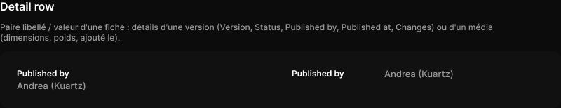

# Detail row

> Figma « Kuartz — Carte système » (`wvr98llwHnMufQ88qUp4Ih`) › 🎨 Design System › Components — Data display — nœud `337:1498` (COMPONENT_SET, 2 variantes, cadre 800×81)

## Rôle

Libellé / valeur. Propriétés : Label, Value.

## Propriétés

| Propriété | Type | Défaut | Valeurs / préférences |
|---|---|---|---|
| `Label` | TEXT | `Published by` |  |
| `Value` | TEXT | `Andrea (Kuartz)` |  |
| `layout` | VARIANT | `stacked` | `stacked`, `inline` |

## Variantes et états

- `layout` : stacked, inline (défaut : stacked)

Variantes présentes (2) : `layout=stacked` · `layout=inline`

## Anatomie — variante par défaut `layout=stacked`

- **COMPONENT** `layout=stacked` — taille: 360×33 · dim: W fixed / H hug · layout: V gap 2{space/2} pad 0 align min/min strokes-in-layout · clip: oui
  - **TEXT** `label` — taille: 75×15 · dim: W hug / H hug · fond: #ffffff {text/primary} · texte: "Published by" · style: Label · textopt: resize width_and_height · refs: characters←Label
  - **TEXT** `value` — taille: 360×16 · dim: W fill / H hug · fond: #999999 {text/tertiary} · texte: "Andrea (Kuartz)" · style: Body · textopt: resize height · refs: characters←Value

## Différences des autres variantes

Chaque variante est comparée à une variante de référence (la variante par défaut, ou la même combinaison avec une seule propriété ramenée à sa valeur par défaut — de préférence l'état). Clé = chemin du calque depuis la racine ; seules les propriétés qui changent sont listées (`+` calque ajouté, `−` calque absent).

### `layout=inline`

- ~ `(racine)` — taille: 360×16 · layout: H gap 12{space/12} pad 0 align min/min strokes-in-layout
- ~ `/label` — taille: 120×15 · dim: W fixed / H hug · textopt: resize height
- ~ `/value` — taille: 228×16

## Tokens et ressources utilisés

- Variables : `space/12`, `space/2`, `text/primary`, `text/tertiary`
- Styles de texte : Label, Body
- Effets : —
- Icônes : —
- Composants imbriqués : —

## Capture

_Capture du cadre de documentation `group/Detail row` (`337:1487`, 800×154 px : titre, description et composant entier). La capture du composant seul (800×81 px) pesait 4121 octets (< 5 Ko), rendu 1× identique._
