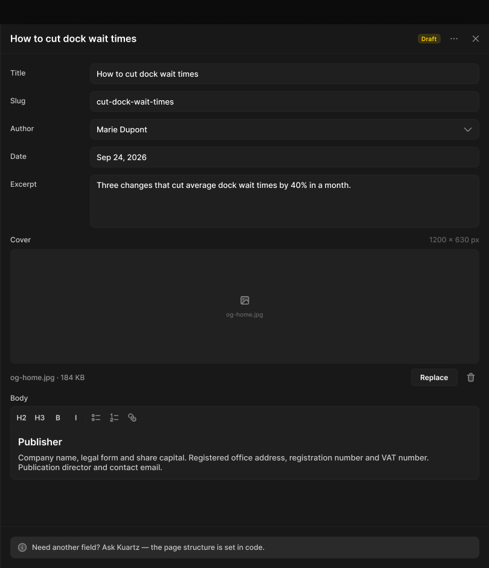

# Drawer

> Figma « Kuartz — Carte système » (`wvr98llwHnMufQ88qUp4Ih`) › 🎨 Design System › Components — Overlays — nœud `336:970` (COMPONENT, cadre 810×900)

## Rôle

Panneau latéral 440 × 900 (ombre Elevation/Modal) posé sur un Scrim, par-dessus la liste. Pas de bouton Save : enregistrement automatique en brouillon. Propriétés : Title, Show status.

## Propriétés

| Propriété | Type | Défaut | Valeurs / préférences |
|---|---|---|---|
| `Title` | TEXT | `How to cut dock wait times` |  |
| `Show status` | BOOLEAN | `true` |  |

## Anatomie — composant

- **COMPONENT** `Drawer` — taille: 810×900 · dim: W fixed / H fixed · layout: V gap 0 pad 0 align min/min strokes-in-layout · fond: #181818 {bg/elevated} · contour: #252525 {border/default} · 0/0/0/1px inside · effet: style Elevation/Modal · clip: oui · modes: Icon color=default
  - **FRAME** `header` — taille: 809×49 · dim: W fill / H hug · layout: H gap 8{space/8} pad 10{space/10} 8{space/8} 10{space/10} 16{space/16} align min/center strokes-in-layout · contour: #212121 {border/subtle} · 0/0/1/0px inside · clip: oui
    - **TEXT** `title` — taille: 667×19 · dim: W fill / H hug · fond: #ffffff {text/primary} · texte: "How to cut dock wait times" · style: Heading 4 · textopt: resize height · refs: characters←Title
    - **INSTANCE** `status` — taille: 38×16 · dim: W hug / H hug · layout: H gap 4{space/4} pad 2{space/2} 6{space/6} align min/center strokes-in-layout · rayon: 5{radius/sm} · fond: #ffd700 14% {bg/tint/warning} · instance: Tag {tone=warning} · props: Icon="Icon/close", Show icon=false, Show dot=false, Label="Draft" · textes: "Draft" · modes: Icon color=warning · refs: visible←Show status
    - **INSTANCE** `icon-button` — taille: 28×28 · dim: W fixed / H fixed · layout: H gap 0 pad 0 align center/center strokes-in-layout · rayon: 8{radius/md} · clip: oui · instance: Icon button {style=ghost, state=default, size=small} · props: Icon="Icon/more" · modes: Icon color=default
    - **INSTANCE** `close` — taille: 28×28 · dim: W fixed / H fixed · layout: H gap 0 pad 0 align center/center strokes-in-layout · rayon: 8{radius/md} · clip: oui · instance: Icon button {style=ghost, state=default, size=small} · props: Icon="Icon/close" · modes: Icon color=default
  - **FRAME** `body` — taille: 809×782 · dim: W fill / H fill · layout: V gap 12{space/12} pad 16{space/16} align min/min strokes-in-layout · clip: oui
    - **INSTANCE** `Input` — taille: 777×34 · dim: W fill / H hug · layout: H gap 12{space/12} pad 0 align min/min strokes-in-layout · clip: oui · instance: Input {state=filled, layout=inline} · props: Icon="Icon/search", Show icon=false, Placeholder="Placeholder", Helper="Shown in browser tabs and search results.", Label="Title", Show label=true, Show helper=false, Value="How to cut dock wait times" · textes: "Title" "How to cut dock wait times" · modes: Icon color=default
    - **INSTANCE** `Input` — taille: 777×34 · dim: W fill / H hug · layout: H gap 12{space/12} pad 0 align min/min strokes-in-layout · clip: oui · instance: Input {state=filled, layout=inline} · props: Icon="Icon/search", Show icon=false, Placeholder="Placeholder", Helper="Shown in browser tabs and search results.", Label="Slug", Show label=true, Show helper=false, Value="cut-dock-wait-times" · textes: "Slug" "cut-dock-wait-times" · modes: Icon color=default
    - **INSTANCE** `Select` — taille: 777×34 · dim: W fill / H hug · layout: H gap 12{space/12} pad 0 align min/min strokes-in-layout · clip: oui · instance: Select {state=filled, layout=inline} · props: Placeholder="Select…", Value="Marie Dupont", Show helper=false, Show label=true, Helper="Shown in browser tabs and search results.", Label="Author" · textes: "Author" "Marie Dupont" · modes: Icon color=default
    - **INSTANCE** `Input` — taille: 777×34 · dim: W fill / H hug · layout: H gap 12{space/12} pad 0 align min/min strokes-in-layout · clip: oui · instance: Input {state=filled, layout=inline} · props: Icon="Icon/search", Show icon=false, Placeholder="Placeholder", Helper="Shown in browser tabs and search results.", Label="Date", Show label=true, Show helper=false, Value="Sep 24, 2026" · textes: "Date" "Sep 24, 2026" · modes: Icon color=default
    - **INSTANCE** `Textarea` — taille: 777×88 · dim: W fill / H hug · layout: H gap 12{space/12} pad 0 align min/min strokes-in-layout · clip: oui · instance: Textarea {state=filled, layout=inline} · props: Placeholder="Describe this page in one or two sentences…", Show helper=false, Value="Three changes that cut average dock wait times by 40% in a month.", Show label=true, Helper="112 / 160", Label="Excerpt" · textes: "Excerpt" "Three changes that cut average dock wait" · modes: Icon color=default
    - **INSTANCE** `Image upload` — taille: 777×250 · dim: W fill / H hug · layout: V gap 8{space/8} pad 0 align min/min strokes-in-layout · clip: oui · instance: Image upload {state=filled} · props: Show label=true, Hint="1200 × 630 px", Label="Cover" · textes: "Cover" "1200 × 630 px" "og-home.jpg" "og-home.jpg · 184 KB" · modes: Icon color=default
    - **INSTANCE** `Rich text field` — taille: 777×143 · dim: W fill / H hug · layout: V gap 6{space/6} pad 0 align min/min strokes-in-layout · clip: oui · instance: Rich text field {state=default} · props: Label="Body" · textes: "Body" "H2" "H3" "B"
  - **FRAME** `footer` — taille: 809×69 · dim: W fill / H hug · layout: V gap 0 pad 16{space/16} align min/min strokes-in-layout · contour: #212121 {border/subtle} · 1/0/0/0px inside · clip: oui
    - **INSTANCE** `callout` — taille: 777×36 · dim: W fill / H hug · layout: H gap 8{space/8} pad 10{space/10} 12{space/12} align min/min strokes-in-layout · rayon: 8{radius/md} · fond: #ffffff 8% {bg/tint/neutral} · clip: oui · instance: Callout {tone=neutral} · props: Show action=false, Text="Need another field? Ask Kuartz — the page structure is set in code." · textes: "Need another field? Ask Kuartz — the pag" · modes: Icon color=default

## Tokens et ressources utilisés

- Variables : `bg/elevated`, `bg/tint/neutral`, `bg/tint/warning`, `border/default`, `border/subtle`, `radius/md`, `radius/sm`, `space/10`, `space/12`, `space/16`, `space/2`, `space/4`, `space/6`, `space/8`, `text/primary`
- Styles de texte : Heading 4
- Effets : Elevation/Modal
- Icônes : Icon/close, Icon/more, Icon/search
- Composants imbriqués : Callout, Icon button, Image upload, Input, Rich text field, Select, Tag, Textarea

## Capture

