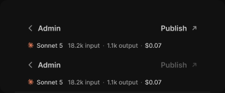

# Editor header

> Figma « Kuartz — Carte système » (`wvr98llwHnMufQ88qUp4Ih`) › 🎨 Design System › Components — AI editor — nœud `339:1259` (COMPONENT_SET, 2 variantes, cadre 368×152)

## Rôle

En-tête de la sidebar Claude sur deux lignes : ← Admin et Publish ↗, puis la consommation de la conversation en cours (Model usage : modèle, tokens input / output, coût). state=locked : Publish désactivé pendant que Claude travaille.

## Propriétés

| Propriété | Type | Défaut | Valeurs / préférences |
|---|---|---|---|
| `state` | VARIANT | `default` | `default`, `locked` |

## Variantes et états

- `state` : default, locked (défaut : default)

Variantes présentes (2) : `state=default` · `state=locked`

## Anatomie — variante par défaut `state=default`

- **COMPONENT** `state=default` — taille: 320×67 · dim: W fixed / H hug · layout: V gap 0 pad 0 align min/min strokes-in-layout · fond: #111111 {bg/primary} · contour: #212121 {border/subtle} · 0/0/1/0px inside · clip: oui · modes: Icon color=default
  - **FRAME** `top` — taille: 320×44 · dim: W fill / H fixed · layout: H gap 6{space/6} pad 0 6 align min/center strokes-in-layout
    - **INSTANCE** `back` — taille: 84×27 · dim: W hug / H hug · layout: H gap 6{space/6} pad 6{space/6} 14 align center/center strokes-in-layout · rayon: 6 · instance: Button {variant=ghost, state=default, size=small} · props: Show icon right=false, Icon left="Icon/chevron-left", Icon right="Icon/chevron-down", Show icon left=true, Label="Admin" · textes: "Admin" · modes: Icon color=default
    - **FRAME** `spacer` — taille: 123×1 · dim: W fill / H fixed · clip: oui
    - **INSTANCE** `publish` — taille: 89×27 · dim: W hug / H hug · layout: H gap 6{space/6} pad 6{space/6} 14 align center/center strokes-in-layout · rayon: 6 · instance: Button {variant=ghost, state=default, size=small} · props: Icon left="Icon/plus", Show icon right=true, Icon right="Icon/external", Show icon left=false, Label="Publish" · textes: "Publish" · modes: Icon color=default
  - **FRAME** `usage-row` — taille: 320×22 · dim: W fill / H hug · layout: H gap 0 pad 0 12 10 20 align min/center strokes-in-layout
    - **INSTANCE** `usage` — taille: 221×12 · dim: W hug / H hug · layout: H gap 8{space/8} pad 0 align min/center strokes-in-layout · instance: Model usage {size=small} · props: Show usage=true, Cost="$0.07", Output="1.1k output", Input="18.2k input", Show model=true, Model="Sonnet 5" · textes: "Sonnet 5" "18.2k input" "·" "1.1k output" · modes: Icon color=claude

## Différences des autres variantes

Chaque variante est comparée à une variante de référence (la variante par défaut, ou la même combinaison avec une seule propriété ramenée à sa valeur par défaut — de préférence l'état). Clé = chemin du calque depuis la racine ; seules les propriétés qui changent sont listées (`+` calque ajouté, `−` calque absent).

### `state=locked`

- ~ `/top/publish` — instance: Button {variant=ghost, state=disabled, size=small} · opacite: 0.4

## Tokens et ressources utilisés

- Variables : `bg/primary`, `border/subtle`, `space/6`, `space/8`
- Styles de texte : —
- Effets : —
- Icônes : Icon/chevron-down, Icon/chevron-left, Icon/external, Icon/plus
- Composants imbriqués : Button, Model usage

## Capture

