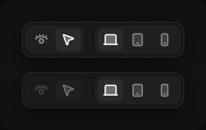

# Editor toolbar

> Figma « Kuartz — Carte système » (`wvr98llwHnMufQ88qUp4Ih`) › 🎨 Design System › Components — AI editor — nœud `340:1486` (COMPONENT_SET, 2 variantes, cadre 229×144)

## Rôle

Barre d'outils flottante (ombre Elevation/Popover), en icônes : œil = View (naviguer), curseur = Select (sélectionner) ; écran, tablette, mobile. Infobulle au survol de chaque icône. locked : seuls les formats d'écran restent actifs pendant que Claude travaille.

## Propriétés

| Propriété | Type | Défaut | Valeurs / préférences |
|---|---|---|---|
| `state` | VARIANT | `default` | `default`, `locked` |

## Variantes et états

- `state` : default, locked (défaut : default)

Variantes présentes (2) : `state=default` · `state=locked`

## Anatomie — variante par défaut `state=default`

- **COMPONENT** `state=default` — taille: 181×40 · dim: W hug / H hug · layout: H gap 6{space/6} pad 4{space/4} align min/center strokes-in-layout · rayon: 12{radius/lg} · fond: #181818 {bg/elevated} · contour: #252525 {border/default} · 1px inside · effet: style Elevation/Popover · clip: oui
  - **INSTANCE** `mode` — taille: 64×30 · dim: W hug / H hug · layout: H gap 2{space/2} pad 2{space/2} align min/center strokes-in-layout · rayon: 8{radius/md} · fond: #1f1f1f {bg/input} · contour: #252525 {border/default} · 1px inside · clip: oui · instance: Segmented control {count=2, content=icon}
  - **RECTANGLE** `divider` — taille: 1×20 · dim: W fixed / H fixed · fond: #252525 {border/default}
  - **INSTANCE** `device` — taille: 94×30 · dim: W hug / H hug · layout: H gap 2{space/2} pad 2{space/2} align min/center strokes-in-layout · rayon: 8{radius/md} · fond: #1f1f1f {bg/input} · contour: #252525 {border/default} · 1px inside · clip: oui · instance: Segmented control {count=3, content=icon}

## Différences des autres variantes

Chaque variante est comparée à une variante de référence (la variante par défaut, ou la même combinaison avec une seule propriété ramenée à sa valeur par défaut — de préférence l'état). Clé = chemin du calque depuis la racine ; seules les propriétés qui changent sont listées (`+` calque ajouté, `−` calque absent).

### `state=locked`

- ~ `/mode` — opacite: 0.4

## Tokens et ressources utilisés

- Variables : `bg/elevated`, `bg/input`, `border/default`, `radius/lg`, `radius/md`, `space/2`, `space/4`, `space/6`
- Styles de texte : —
- Effets : Elevation/Popover
- Icônes : —
- Composants imbriqués : Segmented control

## Capture

