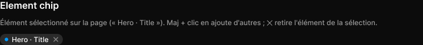

# Element chip

> Figma « Kuartz — Carte système » (`wvr98llwHnMufQ88qUp4Ih`) › 🎨 Design System › Components — AI editor — nœud `339:1269` (COMPONENT, cadre 107×19)

## Rôle

Élément sélectionné. Propriétés : Label, Show remove.

## Propriétés

| Propriété | Type | Défaut | Valeurs / préférences |
|---|---|---|---|
| `Label` | TEXT | `Hero · Title` |  |
| `Show remove` | BOOLEAN | `true` |  |

## Anatomie — composant

- **COMPONENT** `Element chip` — taille: 107×19 · dim: W hug / H hug · layout: H gap 6{space/6} pad 2{space/2} 6{space/6} 2{space/2} 8{space/8} align min/center strokes-in-layout · rayon: 999{radius/full} · fond: #2b2b2b {bg/input-hover} · clip: oui · modes: Icon color=default
  - **ELLIPSE** `dot` — taille: 6×6 · dim: W fixed / H fixed · fond: #0099ff {interactive/primary}
  - **TEXT** `label` — taille: 63×15 · dim: W hug / H hug · fond: #ffffff {text/primary} · texte: "Hero · Title" · style: Body Small · textopt: resize width_and_height · refs: characters←Label
  - **INSTANCE** `remove` — taille: 12×12 · dim: W fixed / H fixed · instance: Icon/close {size=12} · refs: visible←Show remove

## Tokens et ressources utilisés

- Variables : `bg/input-hover`, `interactive/primary`, `radius/full`, `space/2`, `space/6`, `space/8`, `text/primary`
- Styles de texte : Body Small
- Effets : —
- Icônes : Icon/close
- Composants imbriqués : —

## Capture

_Capture du cadre de documentation `group/Element chip` (`339:1260`, 720×77 px : titre, description et composant entier). La capture du composant seul (107×19 px) pesait 1278 octets (< 5 Ko), rendu 1× identique._
