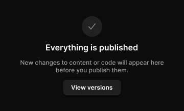

# Empty state

> Figma « Kuartz — Carte système » (`wvr98llwHnMufQ88qUp4Ih`) › 🎨 Design System › Components — Feedback — nœud `323:432` (COMPONENT, cadre 360×218)

## Rôle

État vide. Propriétés : Title, Description, Show action, Icon.

## Propriétés

| Propriété | Type | Défaut | Valeurs / préférences |
|---|---|---|---|
| `Title` | TEXT | `Everything is published` |  |
| `Description` | TEXT | `New changes to content or code will appear here before you publish them.` |  |
| `Show action` | BOOLEAN | `true` |  |
| `Icon` | INSTANCE_SWAP | `Icon/check` | préférées : toutes les icônes Icon/* (73/75) sauf Icon/open, Icon/claude |

## Anatomie — composant

- **COMPONENT** `Empty state` — taille: 360×218 · dim: W fixed / H hug · layout: V gap 12{space/12} pad 32{space/32} 24{space/24} align min/center strokes-in-layout · clip: oui · modes: Icon color=default
  - **FRAME** `icon-wrap` — taille: 40×40 · dim: W fixed / H fixed · layout: H gap 0 pad 0 align center/center strokes-in-layout · rayon: 999{radius/full} · fond: #212121 {bg/subtle} · clip: oui
    - **INSTANCE** `icon` — taille: 18×18 · dim: W fixed / H fixed · instance: Icon/check {size=18} · refs: mainComponent←Icon
  - **TEXT** `title` — taille: 182×19 · dim: W hug / H hug · fond: #ffffff {text/primary} · texte: "Everything is published" · style: Heading 4 · textopt: resize width_and_height · refs: characters←Title
  - **TEXT** `description` — taille: 312×30 · dim: W fill / H hug · fond: #999999 {text/tertiary} · texte: "New changes to content or code will appear here before you publish them." · style: Body Small · textopt: center, resize height · refs: characters←Description
  - **INSTANCE** `action` — taille: 112×29 · dim: W hug / H hug · layout: H gap 6{space/6} pad 6{space/6} 14 align center/center strokes-in-layout · rayon: 6 · fond: #1f1f1f {bg/input} · contour: #252525 {border/default} · 1px inside · instance: Button {variant=secondary, state=default, size=small} · props: Icon left="Icon/plus", Show icon left=false, Icon right="Icon/chevron-down", Show icon right=false, Label="View versions" · textes: "View versions" · modes: Icon color=active · refs: visible←Show action

## Tokens et ressources utilisés

- Variables : `bg/input`, `bg/subtle`, `border/default`, `radius/full`, `space/12`, `space/24`, `space/32`, `space/6`, `text/primary`, `text/tertiary`
- Styles de texte : Heading 4, Body Small
- Effets : —
- Icônes : Icon/check, Icon/chevron-down, Icon/plus
- Composants imbriqués : Button

## Capture

