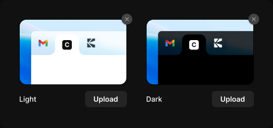

# Favicon preview

> Figma « Kuartz — Carte système » (`wvr98llwHnMufQ88qUp4Ih`) › 🎨 Design System › Components — Forms — nœud `410:1592` (COMPONENT_SET, 2 variantes, cadre 456×214)

## Rôle

Favicon dans un onglet de navigateur (theme=light|dark), 180 px de large. Calque « favicon » : l'image du site (16 × 16). Pastille Remove badge en haut à droite, bouton Upload (Button secondary small).

## Propriétés

| Propriété | Type | Défaut | Valeurs / préférences |
|---|---|---|---|
| `Show remove` | BOOLEAN | `true` |  |
| `theme` | VARIANT | `light` | `light`, `dark` |

## Variantes et états

- `theme` : light, dark (défaut : light)

Variantes présentes (2) : `theme=light` · `theme=dark`

## Anatomie — variante par défaut `theme=light`

- **COMPONENT** `theme=light` — taille: 180×147 · dim: W fixed / H hug · layout: V gap 10{space/10} pad 0 align min/min strokes-in-layout
  - **FRAME** `preview` — taille: 180×110 · dim: W fill / H fixed
    - **FRAME** `frame` — taille: 180×110 · pos: x 0 y 0 (stretch/stretch) · rayon: 12{radius/lg} · fond: #1f1f1f {bg/input} · clip: oui
      - **FRAME** `browser` — taille: 180×110 · pos: x 0 y 0 (stretch/stretch) · fond: IMAGE FILL · clip: oui
      - **FRAME** `favicon` — taille: 16×16 · pos: x 72 y 35 (min/min) · fond: IMAGE FILL · clip: oui
      - **FRAME** `edge` — taille: 180×110 · pos: x 0 y 0 (stretch/stretch) · rayon: 12{radius/lg} · contour: #000000 {border/edge} · 0.91px inside · clip: oui
    - **INSTANCE** `remove` — taille: 18×18 · pos: x 171 y -9 (max/min) · rayon: 999{radius/full} · fond: #444444 {bg/strong} · effet: drop_shadow 0 0.5 0 0 #0000001a + drop_shadow 0 1 3 0 #00000033 · instance: Remove badge · refs: visible←Show remove
  - **FRAME** `footer` — taille: 180×27 · dim: W fill / H hug · layout: H gap auto pad 0 align space_between/center strokes-in-layout · clip: oui
    - **TEXT** `label` — taille: 29×15 · dim: W hug / H hug · fond: #ffffff {text/primary} · texte: "Light" · style: Body Small · textopt: resize width_and_height
    - **INSTANCE** `upload` — taille: 70×27 · dim: W hug / H hug · layout: H gap 6{space/6} pad 6{space/6} 14 align center/center strokes-in-layout · rayon: 6 · fond: #ffffff 8% {bg/tint/neutral} · instance: Button {variant=subtle, state=default, size=small} · props: Icon left="Icon/plus", Show icon right=false, Icon right="Icon/chevron-down", Show icon left=false, Label="Upload" · textes: "Upload" · modes: Icon color=active

## Différences des autres variantes

Chaque variante est comparée à une variante de référence (la variante par défaut, ou la même combinaison avec une seule propriété ramenée à sa valeur par défaut — de préférence l'état). Clé = chemin du calque depuis la racine ; seules les propriétés qui changent sont listées (`+` calque ajouté, `−` calque absent).

### `theme=dark`

- ~ `/footer/label` — taille: 27×15 · texte: "Dark"

## Tokens et ressources utilisés

- Variables : `bg/input`, `bg/strong`, `bg/tint/neutral`, `border/edge`, `radius/full`, `radius/lg`, `space/10`, `space/6`, `text/primary`
- Styles de texte : Body Small
- Effets : —
- Icônes : Icon/chevron-down, Icon/plus
- Composants imbriqués : Button, Remove badge

## Capture

