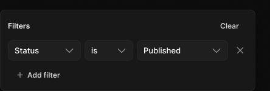

# Filter popover

> Figma « Kuartz — Carte système » (`wvr98llwHnMufQ88qUp4Ih`) › 🎨 Design System › Components — Overlays — nœud `336:1030` (COMPONENT, cadre 420×134)

## Rôle

Fenêtre de filtres (ombre Elevation/Popover). Dupliquer la ligne « condition » dans une copie détachée si besoin de plusieurs conditions.

## Propriétés

_Aucune propriété._

## Anatomie — composant

- **COMPONENT** `Filter popover` — taille: 420×134 · dim: W fixed / H hug · layout: V gap 10{space/10} pad 12{space/12} align min/min strokes-in-layout · rayon: 8{radius/md} · fond: #181818 {bg/elevated} · contour: #252525 {border/default} · 1px inside · effet: style Elevation/Popover · clip: oui · modes: Icon color=default
  - **FRAME** `header` — taille: 394×27 · dim: W fill / H hug · layout: H gap 8{space/8} pad 0 align min/center strokes-in-layout · clip: oui
    - **TEXT** `title` — taille: 327×15 · dim: W fill / H hug · fond: #ffffff {text/primary} · texte: "Filters" · style: Label · textopt: resize height
    - **INSTANCE** `clear` — taille: 59×27 · dim: W hug / H hug · layout: H gap 6{space/6} pad 6{space/6} 14 align center/center strokes-in-layout · rayon: 6 · instance: Button {variant=ghost, state=default, size=small} · props: Icon left="Icon/plus", Show icon right=false, Icon right="Icon/chevron-down", Show icon left=false, Label="Clear" · textes: "Clear" · modes: Icon color=default
  - **FRAME** `condition` — taille: 394×34 · dim: W fill / H hug · layout: H gap 6{space/6} pad 0 align min/center strokes-in-layout · clip: oui
    - **INSTANCE** `Select` — taille: 120×34 · dim: W fixed / H hug · layout: V gap 6{space/6} pad 0 align min/min strokes-in-layout · clip: oui · instance: Select {state=filled, layout=stacked} · props: Label="Label", Show helper=false, Placeholder="Select…", Helper="Shown in browser tabs and search results.", Value="Status", Show label=false · textes: "Status" · modes: Icon color=default
    - **INSTANCE** `Select` — taille: 80×34 · dim: W fixed / H hug · layout: V gap 6{space/6} pad 0 align min/min strokes-in-layout · clip: oui · instance: Select {state=filled, layout=stacked} · props: Label="Label", Show helper=false, Placeholder="Select…", Helper="Shown in browser tabs and search results.", Value="is", Show label=false · textes: "is" · modes: Icon color=default
    - **INSTANCE** `Select` — taille: 150×34 · dim: W fixed / H hug · layout: V gap 6{space/6} pad 0 align min/min strokes-in-layout · clip: oui · instance: Select {state=filled, layout=stacked} · props: Label="Label", Show helper=false, Placeholder="Select…", Helper="Shown in browser tabs and search results.", Value="Published", Show label=false · textes: "Published" · modes: Icon color=default
    - **INSTANCE** `icon-button` — taille: 28×28 · dim: W fixed / H fixed · layout: H gap 0 pad 0 align center/center strokes-in-layout · rayon: 8{radius/md} · clip: oui · instance: Icon button {style=ghost, state=default, size=small} · props: Icon="Icon/close" · modes: Icon color=default
  - **INSTANCE** `add` — taille: 100×27 · dim: W hug / H hug · layout: H gap 6{space/6} pad 6{space/6} 14 align center/center strokes-in-layout · rayon: 6 · instance: Button {variant=ghost, state=default, size=small} · props: Show icon right=false, Icon left="Icon/plus", Icon right="Icon/chevron-down", Show icon left=true, Label="Add filter" · textes: "Add filter" · modes: Icon color=default

## Tokens et ressources utilisés

- Variables : `bg/elevated`, `border/default`, `radius/md`, `space/10`, `space/12`, `space/6`, `space/8`, `text/primary`
- Styles de texte : Label
- Effets : Elevation/Popover
- Icônes : Icon/chevron-down, Icon/close, Icon/plus
- Composants imbriqués : Button, Icon button, Select

## Capture

