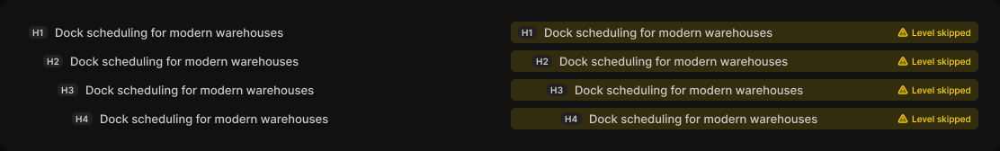

# Heading row

> Figma « Kuartz — Carte système » (`wvr98llwHnMufQ88qUp4Ih`) › 🎨 Design System › Components — Data display — nœud `338:1337` (COMPONENT_SET, 8 variantes, cadre 1112×168)

## Rôle

Ligne de l'arbre des titres (retrait selon le niveau). Propriétés : Text, Note (message d'alerte).

## Propriétés

| Propriété | Type | Défaut | Valeurs / préférences |
|---|---|---|---|
| `Text` | TEXT | `Dock scheduling for modern warehouses` |  |
| `Note` | TEXT | `Level skipped` |  |
| `level` | VARIANT | `h1` | `h1`, `h2`, `h3`, `h4` |
| `status` | VARIANT | `ok` | `ok`, `warning` |

## Variantes et états

- `level` : h1, h2, h3, h4 (défaut : h1)
- `status` : ok, warning (défaut : ok)

Variantes présentes (8) : `level=h1, status=ok` · `level=h1, status=warning` · `level=h2, status=ok` · `level=h2, status=warning` · `level=h3, status=ok` · `level=h3, status=warning` · `level=h4, status=ok` · `level=h4, status=warning`

## Anatomie — variante par défaut `level=h1, status=ok`

- **COMPONENT** `level=h1, status=ok` — taille: 520×24 · dim: W fixed / H hug · layout: H gap 8{space/8} pad 4{space/4} 8{space/8} align min/center strokes-in-layout · rayon: 5{radius/sm} · clip: oui · modes: Icon color=default
  - **FRAME** `level` — taille: 21×14 · dim: W hug / H hug · layout: H gap 0 pad 1 4{space/4} align center/center strokes-in-layout · rayon: 5{radius/sm} · fond: #212121 {bg/subtle} · clip: oui
    - **TEXT** `level-label` — taille: 13×12 · dim: W hug / H hug · fond: #cccccc {text/secondary} · texte: "H1" · style: Label Small · textopt: resize width_and_height
  - **TEXT** `text` — taille: 475×16 · dim: W fill / H hug · fond: #cccccc {text/secondary} · texte: "Dock scheduling for modern warehouses" · style: Body · textopt: resize height · refs: characters←Text
  - **FRAME** `warning` — taille: 82×12 · visible: masqué · dim: W hug / H hug · layout: H gap 4{space/4} pad 0 align min/center strokes-in-layout · clip: oui
    - **INSTANCE** `icon` — taille: 12×12 · dim: W fixed / H fixed · instance: Icon/warning {size=12}
    - **TEXT** `note` — taille: 66×12 · dim: W hug / H hug · fond: #ffd700 {interactive/warning} · texte: "Level skipped" · style: Caption · textopt: resize width_and_height · refs: characters←Note

## Différences des autres variantes

Chaque variante est comparée à une variante de référence (la variante par défaut, ou la même combinaison avec une seule propriété ramenée à sa valeur par défaut — de préférence l'état). Clé = chemin du calque depuis la racine ; seules les propriétés qui changent sont listées (`+` calque ajouté, `−` calque absent).

### `level=h1, status=warning`

- ~ `(racine)` — modes: Icon color=warning · fond: #ffd700 14% {bg/tint/warning}
- ~ `/text` — taille: 385×16
- ~ `/warning` — visible: (aucun)

### `level=h2, status=ok`

- ~ `(racine)` — layout: H gap 8{space/8} pad 4{space/4} 8{space/8} 4{space/4} 24{space/24} align min/center strokes-in-layout
- ~ `/level` — taille: 22×14
- ~ `/level/level-label` — taille: 14×12 · texte: "H2"
- ~ `/text` — taille: 458×16

### `level=h2, status=warning` — réf. `level=h2, status=ok`

- ~ `(racine)` — modes: Icon color=warning · fond: #ffd700 14% {bg/tint/warning}
- ~ `/text` — taille: 368×16
- ~ `/warning` — visible: (aucun)

### `level=h3, status=ok`

- ~ `(racine)` — layout: H gap 8{space/8} pad 4{space/4} 8{space/8} 4{space/4} 40{space/40} align min/center strokes-in-layout
- ~ `/level` — taille: 23×14
- ~ `/level/level-label` — taille: 15×12 · texte: "H3"
- ~ `/text` — taille: 441×16

### `level=h3, status=warning` — réf. `level=h3, status=ok`

- ~ `(racine)` — modes: Icon color=warning · fond: #ffd700 14% {bg/tint/warning}
- ~ `/text` — taille: 351×16
- ~ `/warning` — visible: (aucun)

### `level=h4, status=ok`

- ~ `(racine)` — layout: H gap 8{space/8} pad 4{space/4} 8{space/8} 4{space/4} 56 align min/center strokes-in-layout
- ~ `/level` — taille: 23×14
- ~ `/level/level-label` — taille: 15×12 · texte: "H4"
- ~ `/text` — taille: 425×16

### `level=h4, status=warning` — réf. `level=h4, status=ok`

- ~ `(racine)` — modes: Icon color=warning · fond: #ffd700 14% {bg/tint/warning}
- ~ `/text` — taille: 335×16
- ~ `/warning` — visible: (aucun)

## Tokens et ressources utilisés

- Variables : `bg/subtle`, `bg/tint/warning`, `interactive/warning`, `radius/sm`, `space/24`, `space/4`, `space/40`, `space/8`, `text/secondary`
- Styles de texte : Label Small, Body, Caption
- Effets : —
- Icônes : Icon/warning
- Composants imbriqués : —

## Capture

