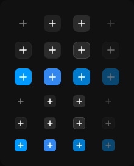

# Icon button

> Figma « Kuartz — Carte système » (`wvr98llwHnMufQ88qUp4Ih`) › 🎨 Design System › Components — Actions — nœud `321:393` (COMPONENT_SET, 24 variantes, cadre 220×272)

## Rôle

Bouton à icône seule. Icône interchangeable (propriété Icon) ; la couleur suit le style et l'état. Donner un libellé d'infobulle (Tooltip) à chaque usage.

## Propriétés

| Propriété | Type | Défaut | Valeurs / préférences |
|---|---|---|---|
| `Icon` | INSTANCE_SWAP | `Icon/plus` | préférées : toutes les icônes Icon/* (73/75) sauf Icon/open, Icon/claude |
| `style` | VARIANT | `ghost` | `ghost`, `secondary`, `primary` |
| `state` | VARIANT | `default` | `default`, `hover`, `active`, `disabled` |
| `size` | VARIANT | `small` | `small`, `xsmall` |

## Variantes et états

- `style` : ghost, secondary, primary (défaut : ghost)
- `state` : default, hover, active, disabled (défaut : default)
- `size` : small, xsmall (défaut : small)

Variantes présentes (24) : `style=ghost, state=default, size=small` · `style=ghost, state=hover, size=small` · `style=ghost, state=active, size=small` · `style=ghost, state=disabled, size=small` · `style=secondary, state=default, size=small` · `style=secondary, state=hover, size=small` · `style=secondary, state=active, size=small` · `style=secondary, state=disabled, size=small` · `style=primary, state=default, size=small` · `style=primary, state=hover, size=small` · `style=primary, state=active, size=small` · `style=primary, state=disabled, size=small` · `style=ghost, state=default, size=xsmall` · `style=ghost, state=hover, size=xsmall` · `style=ghost, state=active, size=xsmall` · `style=ghost, state=disabled, size=xsmall` · `style=secondary, state=default, size=xsmall` · `style=secondary, state=hover, size=xsmall` · `style=secondary, state=active, size=xsmall` · `style=secondary, state=disabled, size=xsmall` · `style=primary, state=default, size=xsmall` · `style=primary, state=hover, size=xsmall` · `style=primary, state=active, size=xsmall` · `style=primary, state=disabled, size=xsmall`

## Anatomie — variante par défaut `style=ghost, state=default, size=small`

- **COMPONENT** `style=ghost, state=default, size=small` — taille: 28×28 · dim: W fixed / H fixed · layout: H gap 0 pad 0 align center/center strokes-in-layout · rayon: 8{radius/md} · clip: oui · modes: Icon color=default
  - **INSTANCE** `icon` — taille: 16×16 · dim: W fixed / H fixed · instance: Icon/plus {size=18} · refs: mainComponent←Icon

## Différences des autres variantes

Chaque variante est comparée à une variante de référence (la variante par défaut, ou la même combinaison avec une seule propriété ramenée à sa valeur par défaut — de préférence l'état). Clé = chemin du calque depuis la racine ; seules les propriétés qui changent sont listées (`+` calque ajouté, `−` calque absent).

### `style=ghost, state=hover, size=small`

- ~ `(racine)` — modes: Icon color=active · fond: #212121 {bg/subtle}

### `style=ghost, state=active, size=small`

- ~ `(racine)` — modes: Icon color=active · fond: #2b2b2b {bg/input-hover}

### `style=ghost, state=disabled, size=small`

- ~ `(racine)` — opacite: 0.4

### `style=secondary, state=default, size=small`

- ~ `(racine)` — modes: Icon color=active · fond: #1f1f1f {bg/input} · contour: #252525 {border/default} · 1px inside

### `style=secondary, state=hover, size=small` — réf. `style=secondary, state=default, size=small`

- ~ `(racine)` — fond: #2b2b2b {bg/input-hover}

### `style=secondary, state=active, size=small` — réf. `style=secondary, state=default, size=small`

- ~ `(racine)` — fond: #2b2b2b {bg/input-hover} · contour: #444444 {border/strong} · 1px inside

### `style=secondary, state=disabled, size=small` — réf. `style=secondary, state=default, size=small`

- ~ `(racine)` — opacite: 0.4

### `style=primary, state=default, size=small`

- ~ `(racine)` — modes: Icon color=on-accent · fond: #0099ff {interactive/primary}

### `style=primary, state=hover, size=small` — réf. `style=primary, state=default, size=small`

- ~ `(racine)` — fond: #3387ee {interactive/primary-hover}

### `style=primary, state=active, size=small` — réf. `style=primary, state=default, size=small`

- ~ `(racine)` — fond: #007acc {interactive/primary-pressed}

### `style=primary, state=disabled, size=small` — réf. `style=primary, state=default, size=small`

- ~ `(racine)` — opacite: 0.4

### `style=ghost, state=default, size=xsmall`

- ~ `(racine)` — taille: 20×20 · rayon: 5{radius/sm}
- ~ `/icon` — taille: 12×12

### `style=ghost, state=hover, size=xsmall` — réf. `style=ghost, state=default, size=xsmall`

- ~ `(racine)` — modes: Icon color=active · fond: #212121 {bg/subtle}

### `style=ghost, state=active, size=xsmall` — réf. `style=ghost, state=default, size=xsmall`

- ~ `(racine)` — modes: Icon color=active · fond: #2b2b2b {bg/input-hover}

### `style=ghost, state=disabled, size=xsmall` — réf. `style=ghost, state=default, size=xsmall`

- ~ `(racine)` — opacite: 0.4

### `style=secondary, state=default, size=xsmall` — réf. `style=ghost, state=default, size=xsmall`

- ~ `(racine)` — modes: Icon color=active · fond: #1f1f1f {bg/input} · contour: #252525 {border/default} · 1px inside

### `style=secondary, state=hover, size=xsmall` — réf. `style=secondary, state=default, size=xsmall`

- ~ `(racine)` — fond: #2b2b2b {bg/input-hover}

### `style=secondary, state=active, size=xsmall` — réf. `style=secondary, state=default, size=xsmall`

- ~ `(racine)` — fond: #2b2b2b {bg/input-hover} · contour: #444444 {border/strong} · 1px inside

### `style=secondary, state=disabled, size=xsmall` — réf. `style=secondary, state=default, size=xsmall`

- ~ `(racine)` — opacite: 0.4

### `style=primary, state=default, size=xsmall` — réf. `style=ghost, state=default, size=xsmall`

- ~ `(racine)` — modes: Icon color=on-accent · fond: #0099ff {interactive/primary}

### `style=primary, state=hover, size=xsmall` — réf. `style=primary, state=default, size=xsmall`

- ~ `(racine)` — fond: #3387ee {interactive/primary-hover}

### `style=primary, state=active, size=xsmall` — réf. `style=primary, state=default, size=xsmall`

- ~ `(racine)` — fond: #007acc {interactive/primary-pressed}

### `style=primary, state=disabled, size=xsmall` — réf. `style=primary, state=default, size=xsmall`

- ~ `(racine)` — opacite: 0.4

## Tokens et ressources utilisés

- Variables : `bg/input`, `bg/input-hover`, `bg/subtle`, `border/default`, `border/strong`, `interactive/primary`, `interactive/primary-hover`, `interactive/primary-pressed`, `radius/md`, `radius/sm`
- Styles de texte : —
- Effets : —
- Icônes : Icon/plus
- Composants imbriqués : —

## Capture

