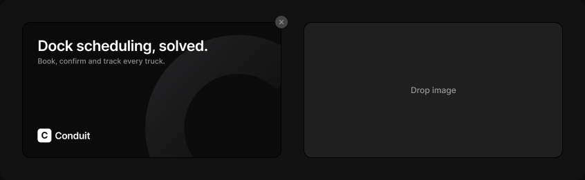

# Image preview

> Figma « Kuartz — Carte système » (`wvr98llwHnMufQ88qUp4Ih`) › 🎨 Design System › Components — Forms — nœud `410:1609` (COMPONENT_SET, 2 variantes, cadre 846×261)

## Rôle

Image au ratio 1200 × 630 (1,91 : 1), 375 × 197 par défaut. filled : calque « image » (remplacer l'image) + Remove badge ; empty : « Drop image ». Garder le ratio en redimensionnant (hauteur = largeur ÷ 1,905).

## Propriétés

| Propriété | Type | Défaut | Valeurs / préférences |
|---|---|---|---|
| `state` | VARIANT | `filled` | `filled`, `empty` |

## Variantes et états

- `state` : filled, empty (défaut : filled)

Variantes présentes (2) : `state=filled` · `state=empty`

## Anatomie — variante par défaut `state=filled`

- **COMPONENT** `state=filled` — taille: 375×197
  - **FRAME** `frame` — taille: 375×197 · pos: x 0 y 0 (stretch/stretch) · rayon: 12{radius/lg} · fond: #1f1f1f {bg/input} · clip: oui
    - **FRAME** `image` — taille: 375×197 · pos: x 0 y 0 (stretch/stretch) · fond: IMAGE FILL · clip: oui
    - **FRAME** `edge` — taille: 375×197 · pos: x 0 y 0 (stretch/stretch) · rayon: 12{radius/lg} · contour: #000000 {border/edge} · 0.91px inside · clip: oui
  - **INSTANCE** `remove` — taille: 18×18 · pos: x 366 y -9 (max/min) · rayon: 999{radius/full} · fond: #444444 {bg/strong} · effet: drop_shadow 0 0.5 0 0 #0000001a + drop_shadow 0 1 3 0 #00000033 · instance: Remove badge

## Différences des autres variantes

Chaque variante est comparée à une variante de référence (la variante par défaut, ou la même combinaison avec une seule propriété ramenée à sa valeur par défaut — de préférence l'état). Clé = chemin du calque depuis la racine ; seules les propriétés qui changent sont listées (`+` calque ajouté, `−` calque absent).

### `state=empty`

- + `/frame/label` (**TEXT**) — taille: 66×15 · pos: x 155 y 91 (center/center) · fond: #999999 {text/tertiary} · texte: "Drop image" · style: Body Small · textopt: resize width_and_height
- − `/frame/image` absent
- − `/remove` absent

## Tokens et ressources utilisés

- Variables : `bg/input`, `bg/strong`, `border/edge`, `radius/full`, `radius/lg`, `text/tertiary`
- Styles de texte : Body Small
- Effets : —
- Icônes : —
- Composants imbriqués : Remove badge

## Capture

