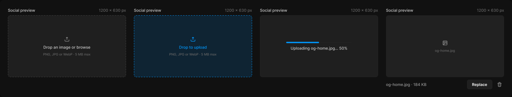

# Image upload

> Figma « Kuartz — Carte système » (`wvr98llwHnMufQ88qUp4Ih`) › 🎨 Design System › Components — Forms — nœud `330:408` (COMPONENT_SET, 4 variantes, cadre 1560×298)

## Rôle

Envoi d'image. Remplacer l'aperçu (état filled) par l'image réelle. Propriétés : Label, Hint, Show label.

## Propriétés

| Propriété | Type | Défaut | Valeurs / préférences |
|---|---|---|---|
| `Label` | TEXT | `Social preview` |  |
| `Hint` | TEXT | `1200 × 630 px` |  |
| `Show label` | BOOLEAN | `true` |  |
| `state` | VARIANT | `empty` | `empty`, `dragover`, `uploading`, `filled` |

## Variantes et états

- `state` : empty, dragover, uploading, filled (défaut : empty)

Variantes présentes (4) : `state=empty` · `state=dragover` · `state=uploading` · `state=filled`

## Anatomie — variante par défaut `state=empty`

- **COMPONENT** `state=empty` — taille: 360×213 · dim: W fixed / H hug · layout: V gap 8{space/8} pad 0 align min/min strokes-in-layout · clip: oui · modes: Icon color=default
  - **FRAME** `label-row` — taille: 360×15 · dim: W fill / H hug · layout: H gap 8{space/8} pad 0 align min/center strokes-in-layout · clip: oui · refs: visible←Show label
    - **TEXT** `label` — taille: 269×15 · dim: W fill / H hug · fond: #cccccc {text/secondary} · texte: "Social preview" · style: Body Small · textopt: resize height · refs: characters←Label
    - **TEXT** `hint` — taille: 83×15 · dim: W hug / H hug · fond: #666666 {text/muted} · texte: "1200 × 630 px" · style: Body Small · textopt: resize width_and_height · refs: characters←Hint
  - **FRAME** `dropzone` — taille: 360×190 · dim: W fill / H fixed · layout: V gap 8{space/8} pad 0 align center/center strokes-in-layout · rayon: 8{radius/md} · fond: #1f1f1f {bg/input} · contour: #444444 {border/strong} · 1px inside dash 4,4 · clip: oui
    - **INSTANCE** `icon` — taille: 18×18 · dim: W fixed / H fixed · instance: Icon/upload {size=18}
    - **TEXT** `message` — taille: 144×15 · dim: W hug / H hug · fond: #cccccc {text/secondary} · texte: "Drop an image or browse" · style: Body Small · textopt: resize width_and_height
    - **TEXT** `formats` — taille: 145×12 · dim: W hug / H hug · fond: #666666 {text/muted} · texte: "PNG, JPG or WebP · 5 MB max" · style: Caption · textopt: resize width_and_height

## Différences des autres variantes

Chaque variante est comparée à une variante de référence (la variante par défaut, ou la même combinaison avec une seule propriété ramenée à sa valeur par défaut — de préférence l'état). Clé = chemin du calque depuis la racine ; seules les propriétés qui changent sont listées (`+` calque ajouté, `−` calque absent).

### `state=dragover`

- ~ `(racine)` — modes: Icon color=primary
- ~ `/dropzone` — fond: #0099ff 14% {bg/tint/info} · contour: #0099ff {border/focus} · 1px inside dash 4,4
- ~ `/dropzone/message` — taille: 85×15 · fond: #0099ff {text/link} · texte: "Drop to upload"

### `state=uploading`

- ~ `/dropzone` — contour: #252525 {border/default} · 1px inside
- + `/dropzone/progress` (**INSTANCE**) — taille: 200×4 · dim: W fixed / H fixed · rayon: 999{radius/full} · fond: #212121 {bg/subtle} · clip: oui · instance: Progress bar {tone=primary, value=50}
- ~ `/dropzone/message` — taille: 173×15 · texte: "Uploading og-home.jpg… 50%"
- − `/dropzone/icon` absent
- − `/dropzone/formats` absent

### `state=filled`

- ~ `(racine)` — taille: 360×250
- ~ `/dropzone` — fond: #212121 {bg/subtle} · contour: (aucun)
- ~ `/dropzone/icon` — instance: Icon/image {size=18}
- ~ `/dropzone/message` — taille: 62×12 · fond: #666666 {text/muted} · texte: "og-home.jpg" · style: Caption
- + `/file-row` (**FRAME**) — taille: 360×29 · dim: W fill / H hug · layout: H gap 8{space/8} pad 0 align min/center strokes-in-layout · clip: oui
- + `/file-row/file` (**TEXT**) — taille: 239×15 · dim: W fill / H hug · fond: #999999 {text/tertiary} · texte: "og-home.jpg · 184 KB" · style: Body Small · textopt: resize height
- + `/file-row/replace` (**INSTANCE**) — taille: 77×29 · dim: W hug / H hug · layout: H gap 6{space/6} pad 6{space/6} 14 align center/center strokes-in-layout · rayon: 6 · fond: #1f1f1f {bg/input} · contour: #252525 {border/default} · 1px inside · instance: Button {variant=secondary, state=default, size=small} · props: Icon left="Icon/plus", Show icon left=false, Icon right="Icon/chevron-down", Show icon right=false, Label="Replace" · textes: "Replace" · modes: Icon color=active
- + `/file-row/icon-button` (**INSTANCE**) — taille: 28×28 · dim: W fixed / H fixed · layout: H gap 0 pad 0 align center/center strokes-in-layout · rayon: 8{radius/md} · clip: oui · instance: Icon button {style=ghost, state=default, size=small} · props: Icon="Icon/trash" · modes: Icon color=default
- − `/dropzone/formats` absent

## Tokens et ressources utilisés

- Variables : `bg/input`, `bg/subtle`, `bg/tint/info`, `border/default`, `border/focus`, `border/strong`, `radius/full`, `radius/md`, `space/6`, `space/8`, `text/link`, `text/muted`, `text/secondary`, `text/tertiary`
- Styles de texte : Body Small, Caption
- Effets : —
- Icônes : Icon/chevron-down, Icon/image, Icon/plus, Icon/trash, Icon/upload
- Composants imbriqués : Button, Icon button, Progress bar

## Capture

