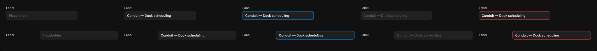

# Input

> Figma « Kuartz — Carte système » (`wvr98llwHnMufQ88qUp4Ih`) › 🎨 Design System › Components — Forms — nœud `327:352` (COMPONENT_SET, 10 variantes, cadre 2344×203)

## Rôle

Champ texte. Propriétés : Label, Value, Placeholder (état empty), Helper (compteur « 42 / 60 » ou message d'erreur), Show label, Show helper, Show icon, Icon.

## Propriétés

| Propriété | Type | Défaut | Valeurs / préférences |
|---|---|---|---|
| `Label` | TEXT | `Label` |  |
| `Show label` | BOOLEAN | `true` |  |
| `Value` | TEXT | `Conduit — Dock scheduling` |  |
| `Placeholder` | TEXT | `Placeholder` |  |
| `Helper` | TEXT | `Shown in browser tabs and search results.` |  |
| `Show helper` | BOOLEAN | `false` |  |
| `Show icon` | BOOLEAN | `false` |  |
| `Icon` | INSTANCE_SWAP | `Icon/search` | préférées : toutes les icônes Icon/* (73/75) sauf Icon/open, Icon/claude |
| `state` | VARIANT | `empty` | `empty`, `filled`, `focused`, `disabled`, `error` |
| `layout` | VARIANT | `stacked` | `stacked`, `inline` |

## Variantes et états

- `state` : empty, filled, focused, disabled, error (défaut : empty)
- `layout` : stacked, inline (défaut : stacked)

Variantes présentes (10) : `state=empty, layout=stacked` · `state=filled, layout=stacked` · `state=focused, layout=stacked` · `state=disabled, layout=stacked` · `state=error, layout=stacked` · `state=empty, layout=inline` · `state=filled, layout=inline` · `state=focused, layout=inline` · `state=disabled, layout=inline` · `state=error, layout=inline`

## Anatomie — variante par défaut `state=empty, layout=stacked`

- **COMPONENT** `state=empty, layout=stacked` — taille: 280×55 · dim: W fixed / H hug · layout: V gap 6{space/6} pad 0 align min/min strokes-in-layout · clip: oui · modes: Icon color=default
  - **FRAME** `label-wrap` — taille: 32×15 · dim: W hug / H hug · layout: V gap 0 pad 0 align min/min strokes-in-layout · clip: oui · refs: visible←Show label
    - **TEXT** `label` — taille: 32×15 · dim: W hug / H hug · fond: #cccccc {text/secondary} · texte: "Label" · style: Body Small · textopt: resize width_and_height · refs: characters←Label
  - **FRAME** `control` — taille: 280×34 · dim: W fill / H hug · layout: V gap 6{space/6} pad 0 align min/min strokes-in-layout · clip: oui
    - **FRAME** `input-box` — taille: 280×34 · dim: W fill / H hug · layout: H gap 8{space/8} pad 8{space/8} 10{space/10} align min/center strokes-in-layout · rayon: 8{radius/md} · fond: #1f1f1f {bg/input} · contour: #252525 {border/default} · 1px inside · clip: oui
      - **INSTANCE** `icon` — taille: 16×16 · visible: masqué · dim: W fixed / H fixed · instance: Icon/search {size=18} · refs: visible←Show icon, mainComponent←Icon
      - **TEXT** `placeholder` — taille: 258×16 · dim: W fill / H hug · fond: #666666 {text/muted} · texte: "Placeholder" · style: Body · textopt: resize height, ellipsis max 1 lignes · refs: characters←Placeholder
    - **TEXT** `helper` — taille: 280×15 · visible: masqué · dim: W fixed / H fixed · fond: #666666 {text/muted} · texte: "Shown in browser tabs and search results." · style: Body Small · textopt: resize height · refs: visible←Show helper, characters←Helper

## Différences des autres variantes

Chaque variante est comparée à une variante de référence (la variante par défaut, ou la même combinaison avec une seule propriété ramenée à sa valeur par défaut — de préférence l'état). Clé = chemin du calque depuis la racine ; seules les propriétés qui changent sont listées (`+` calque ajouté, `−` calque absent).

### `state=filled, layout=stacked`

- + `/control/input-box/value` (**TEXT**) — taille: 258×16 · dim: W fill / H hug · fond: #ffffff {text/primary} · texte: "Conduit — Dock scheduling" · style: Body · textopt: resize height, ellipsis max 1 lignes · refs: characters←Value
- − `/control/input-box/placeholder` absent

### `state=focused, layout=stacked`

- ~ `/control/input-box` — contour: #0099ff {border/focus} · 1px inside
- + `/control/input-box/value` (**TEXT**) — taille: 258×16 · dim: W fill / H hug · fond: #ffffff {text/primary} · texte: "Conduit — Dock scheduling" · style: Body · textopt: resize height, ellipsis max 1 lignes · refs: characters←Value
- − `/control/input-box/placeholder` absent

### `state=disabled, layout=stacked`

- ~ `(racine)` — modes: Icon color=disabled
- ~ `/control/input-box` — fond: #212121 {bg/subtle}
- + `/control/input-box/value` (**TEXT**) — taille: 258×16 · dim: W fill / H hug · fond: #555555 {text/disabled} · texte: "Conduit — Dock scheduling" · style: Body · textopt: resize height, ellipsis max 1 lignes · refs: characters←Value
- − `/control/input-box/placeholder` absent

### `state=error, layout=stacked`

- ~ `/control/input-box` — contour: #ee4444 {interactive/danger} · 1px inside
- + `/control/input-box/value` (**TEXT**) — taille: 258×16 · dim: W fill / H hug · fond: #ffffff {text/primary} · texte: "Conduit — Dock scheduling" · style: Body · textopt: resize height, ellipsis max 1 lignes · refs: characters←Value
- ~ `/control/helper` — fond: #ee4444 {interactive/danger}
- − `/control/input-box/placeholder` absent

### `state=empty, layout=inline`

- ~ `(racine)` — taille: 440×34 · layout: H gap 12{space/12} pad 0 align min/min strokes-in-layout
- ~ `/label-wrap` — taille: 120×23 · dim: W fixed / H hug · layout: V gap 0 pad 8{space/8} 0 0 0 align min/min strokes-in-layout
- ~ `/control` — taille: 308×34
- ~ `/control/input-box` — taille: 308×34
- ~ `/control/input-box/placeholder` — taille: 286×16
- ~ `/control/helper` — taille: 308×15

### `state=filled, layout=inline` — réf. `state=empty, layout=inline`

- + `/control/input-box/value` (**TEXT**) — taille: 286×16 · dim: W fill / H hug · fond: #ffffff {text/primary} · texte: "Conduit — Dock scheduling" · style: Body · textopt: resize height, ellipsis max 1 lignes · refs: characters←Value
- − `/control/input-box/placeholder` absent

### `state=focused, layout=inline` — réf. `state=empty, layout=inline`

- ~ `/control/input-box` — contour: #0099ff {border/focus} · 1px inside
- + `/control/input-box/value` (**TEXT**) — taille: 286×16 · dim: W fill / H hug · fond: #ffffff {text/primary} · texte: "Conduit — Dock scheduling" · style: Body · textopt: resize height, ellipsis max 1 lignes · refs: characters←Value
- − `/control/input-box/placeholder` absent

### `state=disabled, layout=inline` — réf. `state=empty, layout=inline`

- ~ `(racine)` — modes: Icon color=disabled
- ~ `/control/input-box` — fond: #212121 {bg/subtle}
- + `/control/input-box/value` (**TEXT**) — taille: 286×16 · dim: W fill / H hug · fond: #555555 {text/disabled} · texte: "Conduit — Dock scheduling" · style: Body · textopt: resize height, ellipsis max 1 lignes · refs: characters←Value
- − `/control/input-box/placeholder` absent

### `state=error, layout=inline` — réf. `state=empty, layout=inline`

- ~ `/control/input-box` — contour: #ee4444 {interactive/danger} · 1px inside
- + `/control/input-box/value` (**TEXT**) — taille: 286×16 · dim: W fill / H hug · fond: #ffffff {text/primary} · texte: "Conduit — Dock scheduling" · style: Body · textopt: resize height, ellipsis max 1 lignes · refs: characters←Value
- ~ `/control/helper` — fond: #ee4444 {interactive/danger}
- − `/control/input-box/placeholder` absent

## Tokens et ressources utilisés

- Variables : `bg/input`, `bg/subtle`, `border/default`, `border/focus`, `interactive/danger`, `radius/md`, `space/10`, `space/12`, `space/6`, `space/8`, `text/disabled`, `text/muted`, `text/primary`, `text/secondary`
- Styles de texte : Body Small, Body
- Effets : —
- Icônes : Icon/search
- Composants imbriqués : —

## Capture

