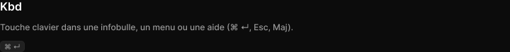

# Kbd

> Figma « Kuartz — Carte système » (`wvr98llwHnMufQ88qUp4Ih`) › 🎨 Design System › Components — Feedback — nœud `323:181` (COMPONENT, cadre 35×16)

## Rôle

Touche clavier. Propriété Label.

## Propriétés

| Propriété | Type | Défaut | Valeurs / préférences |
|---|---|---|---|
| `Label` | TEXT | `⌘ ↵` |  |

## Anatomie — composant

- **COMPONENT** `Kbd` — taille: 35×16 · dim: W hug / H hug · layout: H gap 0 pad 1 5 align center/center strokes-in-layout · minmax: minWidth 18 · rayon: 5{radius/sm} · fond: #212121 {bg/subtle} · contour: #252525 {border/default} · 1px inside · clip: oui
  - **TEXT** `label` — taille: 23×12 · dim: W hug / H hug · fond: #999999 {text/tertiary} · texte: "⌘ ↵" · style: Caption · textopt: resize width_and_height · refs: characters←Label

## Tokens et ressources utilisés

- Variables : `bg/subtle`, `border/default`, `radius/sm`, `text/tertiary`
- Styles de texte : Caption
- Effets : —
- Icônes : —
- Composants imbriqués : —

## Capture

_Capture du cadre de documentation `group/Kbd` (`323:176`, 720×74 px : titre, description et composant entier). La capture du composant seul (35×16 px) pesait 564 octets (< 5 Ko), rendu 1× identique._
