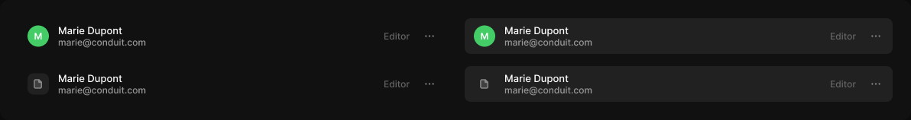

# List item

> Figma « Kuartz — Carte système » (`wvr98llwHnMufQ88qUp4Ih`) › 🎨 Design System › Components — Data display — nœud `337:1064` (COMPONENT_SET, 4 variantes, cadre 1192×158)

## Rôle

Ligne de liste (560 px, étirable). Propriétés : Title, Subtitle, Meta, Show subtitle, Show meta, Show tag (exposé), Show action, Icon.

## Propriétés

| Propriété | Type | Défaut | Valeurs / préférences |
|---|---|---|---|
| `Title` | TEXT | `Marie Dupont` |  |
| `Subtitle` | TEXT | `marie@conduit.com` |  |
| `Meta` | TEXT | `Editor` |  |
| `Show subtitle` | BOOLEAN | `true` |  |
| `Show meta` | BOOLEAN | `true` |  |
| `Show tag` | BOOLEAN | `false` |  |
| `Show action` | BOOLEAN | `true` |  |
| `Icon` | INSTANCE_SWAP | `Icon/page` | préférées : toutes les icônes Icon/* (73/75) sauf Icon/open, Icon/claude |
| `leading` | VARIANT | `avatar` | `avatar`, `icon` |
| `state` | VARIANT | `default` | `default`, `hover` |

## Variantes et états

- `leading` : avatar, icon (défaut : avatar)
- `state` : default, hover (défaut : default)

Variantes présentes (4) : `leading=avatar, state=default` · `leading=avatar, state=hover` · `leading=icon, state=default` · `leading=icon, state=hover`

## Anatomie — variante par défaut `leading=avatar, state=default`

- **COMPONENT** `leading=avatar, state=default` — taille: 560×47 · dim: W fixed / H hug · layout: H gap 12{space/12} pad 8{space/8} 8{space/8} 8{space/8} 12{space/12} align min/center strokes-in-layout · rayon: 8{radius/md} · clip: oui · modes: Icon color=default
  - **INSTANCE** `avatar` — taille: 28×28 · dim: W fixed / H fixed · layout: H gap 0 pad 0 align center/center strokes-in-layout · rayon: 999{radius/full} · fond: #44cc66 {interactive/success} · clip: oui · instance: Avatar {size=28, tone=green} · props: Initials="M" · textes: "M"
  - **FRAME** `text` — taille: 414×31 · dim: W fill / H hug · layout: V gap 0 pad 0 align min/min strokes-in-layout · clip: oui
    - **TEXT** `title` — taille: 414×16 · dim: W fill / H hug · fond: #ffffff {text/primary} · texte: "Marie Dupont" · style: Body · textopt: resize height · refs: characters←Title
    - **TEXT** `subtitle` — taille: 414×15 · dim: W fill / H hug · fond: #999999 {text/tertiary} · texte: "marie@conduit.com" · style: Body Small · textopt: resize height · refs: visible←Show subtitle, characters←Subtitle
  - **INSTANCE** `tag` — taille: 53×16 · visible: masqué · dim: W hug / H hug · layout: H gap 4{space/4} pad 2{space/2} 6{space/6} align min/center strokes-in-layout · rayon: 5{radius/sm} · fond: #ffffff 8% {bg/tint/neutral} · instance: Tag {tone=neutral} · props: Icon="Icon/close", Show icon=false, Show dot=false, Label="Content" · modes: Icon color=default · refs: visible←Show tag
  - **TEXT** `meta` — taille: 34×15 · dim: W hug / H hug · fond: #666666 {text/muted} · texte: "Editor" · style: Body Small · textopt: resize width_and_height · refs: visible←Show meta, characters←Meta
  - **INSTANCE** `action` — taille: 28×28 · dim: W fixed / H fixed · layout: H gap 0 pad 0 align center/center strokes-in-layout · rayon: 8{radius/md} · clip: oui · instance: Icon button {style=ghost, state=default, size=small} · props: Icon="Icon/more" · modes: Icon color=default · refs: visible←Show action

## Différences des autres variantes

Chaque variante est comparée à une variante de référence (la variante par défaut, ou la même combinaison avec une seule propriété ramenée à sa valeur par défaut — de préférence l'état). Clé = chemin du calque depuis la racine ; seules les propriétés qui changent sont listées (`+` calque ajouté, `−` calque absent).

### `leading=avatar, state=hover`

- ~ `(racine)` — fond: #212121 {bg/subtle}

### `leading=icon, state=default`

- + `/icon-wrap` (**FRAME**) — taille: 28×28 · dim: W fixed / H fixed · layout: H gap 0 pad 0 align center/center strokes-in-layout · rayon: 8{radius/md} · fond: #212121 {bg/subtle} · clip: oui
- + `/icon-wrap/icon` (**INSTANCE**) — taille: 16×16 · dim: W fixed / H fixed · instance: Icon/page {size=18} · refs: mainComponent←Icon
- − `/avatar` absent

### `leading=icon, state=hover` — réf. `leading=icon, state=default`

- ~ `(racine)` — fond: #212121 {bg/subtle}
- ~ `/tag` — textes: "Content"

## Tokens et ressources utilisés

- Variables : `bg/subtle`, `bg/tint/neutral`, `interactive/success`, `radius/full`, `radius/md`, `radius/sm`, `space/12`, `space/2`, `space/4`, `space/6`, `space/8`, `text/muted`, `text/primary`, `text/tertiary`
- Styles de texte : Body, Body Small
- Effets : —
- Icônes : Icon/close, Icon/more, Icon/page
- Composants imbriqués : Avatar, Icon button, Tag

## Capture

