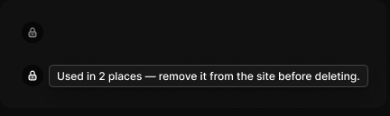

# Lock badge

> Figma « Kuartz — Carte système » (`wvr98llwHnMufQ88qUp4Ih`) › 🎨 Design System › Components — Data display — nœud `453:1923` (COMPONENT_SET, 2 variantes, cadre 428×120)

## Rôle

Pastille cadenas 24 px (fond bg/scrim) sur une image quand une action est bloquée. Au survol (state=hover, prototype While hovering) : info-bulle avec l'explication (Tooltip › Label).

## Propriétés

| Propriété | Type | Défaut | Valeurs / préférences |
|---|---|---|---|
| `state` | VARIANT | `default` | `default`, `hover` |

## Variantes et états

- `state` : default, hover (défaut : default)

Variantes présentes (2) : `state=default` · `state=hover`

## Anatomie — variante par défaut `state=default`

- **COMPONENT** `state=default` — taille: 24×24 · rayon: 12 · fond: #000000 60% {bg/scrim} · modes: Icon color=default
  - **INSTANCE** `icon` — taille: 12×12 · pos: x 6 y 6 (min/min) · instance: Icon/lock {size=12}
  - **INSTANCE** `tooltip` — taille: 354×25 · visible: masqué · dim: W hug / H hug · pos: x 30 y 0 (min/min) · layout: H gap 8{space/8} pad 4{space/4} 8{space/8} align min/center strokes-in-layout · rayon: 5{radius/sm} · fond: #181818 {bg/elevated} · contour: #444444 {border/strong} · 1px inside · effet: style Elevation/Popover · clip: oui · instance: Tooltip · props: Label="Used in 2 places — remove it from the site before deleting.", Show shortcut=false

## Différences des autres variantes

Chaque variante est comparée à une variante de référence (la variante par défaut, ou la même combinaison avec une seule propriété ramenée à sa valeur par défaut — de préférence l'état). Clé = chemin du calque depuis la racine ; seules les propriétés qui changent sont listées (`+` calque ajouté, `−` calque absent).

### `state=hover`

- ~ `(racine)` — modes: Icon color=active
- ~ `/tooltip` — visible: (aucun) · props: Show shortcut=false, Label="Used in 2 places — remove it from the site before deleting." · textes: "Used in 2 places — remove it from the si"

## Tokens et ressources utilisés

- Variables : `bg/elevated`, `bg/scrim`, `border/strong`, `radius/sm`, `space/4`, `space/8`
- Styles de texte : —
- Effets : Elevation/Popover
- Icônes : Icon/lock
- Composants imbriqués : Tooltip

## Capture

