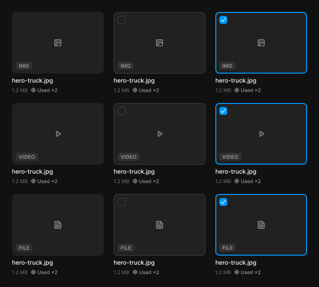

# Media card

> Figma « Kuartz — Carte système » (`wvr98llwHnMufQ88qUp4Ih`) › 🎨 Design System › Components — Data display — nœud `337:1453` (COMPONENT_SET, 9 variantes, cadre 640×577)

## Rôle

Carte média 184 px. Remplacer la vignette par l'image. Propriétés : Name, Size, Usage (« Used ×2 » ou « Unused »).

## Propriétés

| Propriété | Type | Défaut | Valeurs / préférences |
|---|---|---|---|
| `Name` | TEXT | `hero-truck.jpg` |  |
| `Size` | TEXT | `1.2 MB` |  |
| `Usage` | TEXT | `Used ×2` |  |
| `type` | VARIANT | `image` | `image`, `video`, `file` |
| `state` | VARIANT | `default` | `default`, `hover`, `selected` |

## Variantes et états

- `type` : image, video, file (défaut : image)
- `state` : default, hover, selected (défaut : default)

Variantes présentes (9) : `type=image, state=default` · `type=image, state=hover` · `type=image, state=selected` · `type=video, state=default` · `type=video, state=hover` · `type=video, state=selected` · `type=file, state=default` · `type=file, state=hover` · `type=file, state=selected`

## Anatomie — variante par défaut `type=image, state=default`

- **COMPONENT** `type=image, state=default` — taille: 184×163 · dim: W fixed / H hug · layout: V gap 6{space/6} pad 0 align min/min strokes-in-layout · clip: oui · modes: Icon color=default
  - **FRAME** `thumbnail` — taille: 184×124 · dim: W fill / H fixed · rayon: 8{radius/md} · fond: #212121 {bg/subtle} · clip: oui
    - **INSTANCE** `type-icon` — taille: 18×18 · pos: x 83 y 53 (min/min) · instance: Icon/image {size=18}
    - **INSTANCE** `checkbox` — taille: 16×16 · visible: masqué · dim: W hug / H hug · pos: x 8 y 8 (min/min) · layout: H gap 8{space/8} pad 0 align min/center strokes-in-layout · clip: oui · instance: Checkbox {state=unchecked} · props: Label="Checkbox label", Show label=false
    - **INSTANCE** `type-tag` — taille: 32×16 · dim: W hug / H hug · pos: x 8 y 100 (min/min) · layout: H gap 4{space/4} pad 2{space/2} 6{space/6} align min/center strokes-in-layout · rayon: 5{radius/sm} · fond: #ffffff 8% {bg/tint/neutral} · instance: Tag {tone=neutral} · props: Icon="Icon/close", Show icon=false, Show dot=false, Label="IMG" · textes: "IMG" · modes: Icon color=default
  - **TEXT** `name` — taille: 184×15 · dim: W fill / H hug · fond: #ffffff {text/primary} · texte: "hero-truck.jpg" · style: Body Small · textopt: resize height, ellipsis max 1 lignes · refs: characters←Name
  - **FRAME** `meta` — taille: 92×12 · dim: W hug / H hug · layout: H gap 6{space/6} pad 0 align min/center strokes-in-layout · clip: oui
    - **TEXT** `size` — taille: 32×12 · dim: W hug / H hug · fond: #666666 {text/muted} · texte: "1.2 MB" · style: Caption · textopt: resize width_and_height · refs: characters←Size
    - **FRAME** `usage` — taille: 54×12 · dim: W hug / H hug · layout: H gap 3 pad 0 align min/center strokes-in-layout · clip: oui
      - **INSTANCE** `icon` — taille: 10×10 · dim: W fixed / H fixed · instance: Icon/locate {size=12}
      - **TEXT** `usage-label` — taille: 41×12 · dim: W hug / H hug · fond: #999999 {text/tertiary} · texte: "Used ×2" · style: Caption · textopt: resize width_and_height · refs: characters←Usage

## Différences des autres variantes

Chaque variante est comparée à une variante de référence (la variante par défaut, ou la même combinaison avec une seule propriété ramenée à sa valeur par défaut — de préférence l'état). Clé = chemin du calque depuis la racine ; seules les propriétés qui changent sont listées (`+` calque ajouté, `−` calque absent).

### `type=image, state=hover`

- ~ `/thumbnail` — contour: #444444 {border/strong} · 1px inside
- ~ `/thumbnail/checkbox` — visible: (aucun) · props: Show label=false, Label="Checkbox label"

### `type=image, state=selected`

- ~ `/thumbnail` — contour: #0099ff {border/focus} · 2px inside
- ~ `/thumbnail/checkbox` — visible: (aucun) · instance: Checkbox {state=checked} · props: Show label=false, Label="Checkbox label"

### `type=video, state=default`

- ~ `/thumbnail/type-icon` — instance: Icon/play {size=18}
- ~ `/thumbnail/type-tag` — taille: 44×16 · props: Icon="Icon/close", Show icon=false, Show dot=false, Label="VIDEO" · textes: "VIDEO"

### `type=video, state=hover` — réf. `type=video, state=default`

- ~ `/thumbnail` — contour: #444444 {border/strong} · 1px inside
- ~ `/thumbnail/checkbox` — visible: (aucun) · props: Show label=false, Label="Checkbox label"

### `type=video, state=selected` — réf. `type=video, state=default`

- ~ `/thumbnail` — contour: #0099ff {border/focus} · 2px inside
- ~ `/thumbnail/checkbox` — visible: (aucun) · instance: Checkbox {state=checked} · props: Show label=false, Label="Checkbox label"

### `type=file, state=default`

- ~ `/thumbnail/type-icon` — instance: Icon/file {size=18}
- ~ `/thumbnail/type-tag` — taille: 33×16 · props: Icon="Icon/close", Show icon=false, Show dot=false, Label="FILE" · textes: "FILE"

### `type=file, state=hover` — réf. `type=file, state=default`

- ~ `/thumbnail` — contour: #444444 {border/strong} · 1px inside
- ~ `/thumbnail/checkbox` — visible: (aucun) · props: Show label=false, Label="Checkbox label"

### `type=file, state=selected` — réf. `type=file, state=default`

- ~ `/thumbnail` — contour: #0099ff {border/focus} · 2px inside
- ~ `/thumbnail/checkbox` — visible: (aucun) · instance: Checkbox {state=checked} · props: Show label=false, Label="Checkbox label"

## Tokens et ressources utilisés

- Variables : `bg/subtle`, `bg/tint/neutral`, `border/focus`, `border/strong`, `radius/md`, `radius/sm`, `space/2`, `space/4`, `space/6`, `space/8`, `text/muted`, `text/primary`, `text/tertiary`
- Styles de texte : Body Small, Caption
- Effets : —
- Icônes : Icon/close, Icon/file, Icon/image, Icon/locate, Icon/play
- Composants imbriqués : Checkbox, Tag

## Capture

