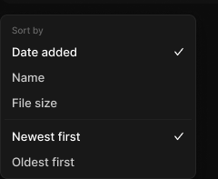

# Menu

> Figma « Kuartz — Carte système » (`wvr98llwHnMufQ88qUp4Ih`) › 🎨 Design System › Components — Navigation — nœud `332:656` (COMPONENT, cadre 216×181)

## Rôle

Menu flottant (ombre Elevation/Popover). Éléments exposés : masquer, renommer ou changer l’état depuis le panneau.

## Propriétés

_Aucune propriété._

## Anatomie — composant

- **COMPONENT** `Menu` — taille: 216×181 · dim: W fixed / H hug · layout: V gap 0 pad 4{space/4} align min/min strokes-in-layout · rayon: 8{radius/md} · fond: #181818 {bg/elevated} · contour: #252525 {border/default} · 1px inside · effet: style Elevation/Popover · clip: oui
  - **FRAME** `section-label` — taille: 206×22 · dim: W fill / H hug · layout: H gap 0 pad 6{space/6} 8{space/8} 4{space/4} 8{space/8} align min/center strokes-in-layout · clip: oui
    - **TEXT** `label` — taille: 35×12 · dim: W hug / H hug · fond: #666666 {text/muted} · texte: "Sort by" · style: Caption · textopt: resize width_and_height
  - **INSTANCE** `item 1` — taille: 206×28 · dim: W fill / H fixed · layout: H gap 8{space/8} pad 0 8{space/8} align min/center strokes-in-layout · rayon: 5{radius/sm} · clip: oui · instance: Menu item {state=selected} · props: Icon="Icon/calendar", Show shortcut=false, Show icon=false, Label="Date added" · textes: "Date added" · modes: Icon color=active
  - **INSTANCE** `item 2` — taille: 206×28 · dim: W fill / H fixed · layout: H gap 8{space/8} pad 0 8{space/8} align min/center strokes-in-layout · rayon: 5{radius/sm} · clip: oui · instance: Menu item {state=default} · props: Icon="Icon/calendar", Show shortcut=false, Show icon=false, Label="Name" · textes: "Name" · modes: Icon color=default
  - **INSTANCE** `item 3` — taille: 206×28 · dim: W fill / H fixed · layout: H gap 8{space/8} pad 0 8{space/8} align min/center strokes-in-layout · rayon: 5{radius/sm} · clip: oui · instance: Menu item {state=default} · props: Icon="Icon/calendar", Show shortcut=false, Show icon=false, Label="File size" · textes: "File size" · modes: Icon color=default
  - **FRAME** `divider` — taille: 206×9 · dim: W fill / H hug · layout: H gap 0 pad 4{space/4} 0 align min/center strokes-in-layout · clip: oui
    - **RECTANGLE** `line` — taille: 206×1 · dim: W fill / H fixed · fond: #212121 {border/subtle}
  - **INSTANCE** `item 4` — taille: 206×28 · dim: W fill / H fixed · layout: H gap 8{space/8} pad 0 8{space/8} align min/center strokes-in-layout · rayon: 5{radius/sm} · clip: oui · instance: Menu item {state=selected} · props: Icon="Icon/calendar", Show shortcut=false, Show icon=false, Label="Newest first" · textes: "Newest first" · modes: Icon color=active
  - **INSTANCE** `item 5` — taille: 206×28 · dim: W fill / H fixed · layout: H gap 8{space/8} pad 0 8{space/8} align min/center strokes-in-layout · rayon: 5{radius/sm} · clip: oui · instance: Menu item {state=default} · props: Icon="Icon/calendar", Show shortcut=false, Show icon=false, Label="Oldest first" · textes: "Oldest first" · modes: Icon color=default

## Tokens et ressources utilisés

- Variables : `bg/elevated`, `border/default`, `border/subtle`, `radius/md`, `radius/sm`, `space/4`, `space/6`, `space/8`, `text/muted`
- Styles de texte : Caption
- Effets : Elevation/Popover
- Icônes : Icon/calendar
- Composants imbriqués : Menu item

## Capture

