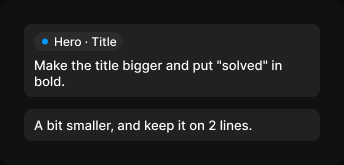

# Message

> Figma « Kuartz — Carte système » (`wvr98llwHnMufQ88qUp4Ih`) › 🎨 Design System › Components — AI editor — nœud `339:1339` (COMPONENT_SET, 2 variantes, cadre 344×165)

## Rôle

Message de l’utilisateur dans le fil. Modifier le texte directement ; les éléments sont des Element chip.

## Propriétés

| Propriété | Type | Défaut | Valeurs / préférences |
|---|---|---|---|
| `type` | VARIANT | `request` | `request`, `adjustment` |

## Variantes et états

- `type` : request, adjustment (défaut : request)

Variantes présentes (2) : `type=request` · `type=adjustment`

## Anatomie — variante par défaut `type=request`

- **COMPONENT** `type=request` — taille: 296×73 · dim: W fixed / H hug · layout: V gap 6{space/6} pad 8{space/8} 10{space/10} align min/min strokes-in-layout · rayon: 8{radius/md} · fond: #212121 {bg/subtle} · clip: oui
  - **INSTANCE** `element` — taille: 89×19 · dim: W hug / H hug · layout: H gap 6{space/6} pad 2{space/2} 6{space/6} 2{space/2} 8{space/8} align min/center strokes-in-layout · rayon: 999{radius/full} · fond: #2b2b2b {bg/input-hover} · clip: oui · instance: Element chip · props: Show remove=false, Label="Hero · Title" · textes: "Hero · Title" · modes: Icon color=default
  - **TEXT** `text` — taille: 276×32 · dim: W fill / H hug · fond: #ffffff {text/primary} · texte: "Make the title bigger and put \"solved\" in bold." · style: Body · textopt: resize height

## Différences des autres variantes

Chaque variante est comparée à une variante de référence (la variante par défaut, ou la même combinaison avec une seule propriété ramenée à sa valeur par défaut — de préférence l'état). Clé = chemin du calque depuis la racine ; seules les propriétés qui changent sont listées (`+` calque ajouté, `−` calque absent).

### `type=adjustment`

- ~ `(racine)` — taille: 296×32
- ~ `/text` — taille: 276×16 · texte: "A bit smaller, and keep it on 2 lines."
- − `/element` absent

## Tokens et ressources utilisés

- Variables : `bg/input-hover`, `bg/subtle`, `radius/full`, `radius/md`, `space/10`, `space/2`, `space/6`, `space/8`, `text/primary`
- Styles de texte : Body
- Effets : —
- Icônes : —
- Composants imbriqués : Element chip

## Capture

