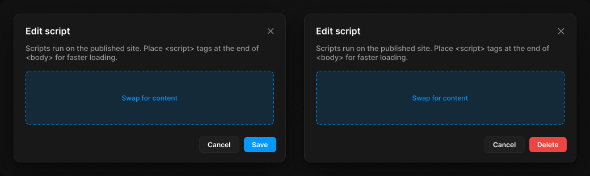

# Modal

> Figma « Kuartz — Carte système » (`wvr98llwHnMufQ88qUp4Ih`) › 🎨 Design System › Components — Overlays — nœud `336:820` (COMPONENT_SET, 2 variantes, cadre 1040×311)

## Rôle

Fenêtre modale 480 px (ombre Elevation/Modal), posée sur un Scrim. Propriétés : Title, Description, Show description, Show content (slot à échanger), Show footer.

## Propriétés

| Propriété | Type | Défaut | Valeurs / préférences |
|---|---|---|---|
| `Title` | TEXT | `Edit script` |  |
| `Description` | TEXT | `Scripts run on the published site. Place <script> tags at the end of <body> for faster loading.` |  |
| `Show description` | BOOLEAN | `true` |  |
| `Show content` | BOOLEAN | `true` |  |
| `Show footer` | BOOLEAN | `true` |  |
| `type` | VARIANT | `default` | `default`, `destructive` |

## Variantes et états

- `type` : default, destructive (défaut : default)

Variantes présentes (2) : `type=default` · `type=destructive`

## Anatomie — variante par défaut `type=default`

- **COMPONENT** `type=default` — taille: 480×263 · dim: W fixed / H hug · layout: V gap 0 pad 0 align min/min strokes-in-layout · rayon: 12{radius/lg} · fond: #181818 {bg/elevated} · contour: #252525 {border/default} · 1px inside · effet: style Elevation/Modal · clip: oui · modes: Icon color=default
  - **FRAME** `header` — taille: 478×48 · dim: W fill / H hug · layout: H gap 8{space/8} pad 16{space/16} 12{space/12} 4{space/4} 20{space/20} align min/center strokes-in-layout · clip: oui
    - **TEXT** `title` — taille: 410×19 · dim: W fill / H hug · fond: #ffffff {text/primary} · texte: "Edit script" · style: Heading 4 · textopt: resize height · refs: characters←Title
    - **INSTANCE** `icon-button` — taille: 28×28 · dim: W fixed / H fixed · layout: H gap 0 pad 0 align center/center strokes-in-layout · rayon: 8{radius/md} · clip: oui · instance: Icon button {style=ghost, state=default, size=small} · props: Icon="Icon/close" · modes: Icon color=default
  - **FRAME** `body` — taille: 478×156 · dim: W fill / H hug · layout: V gap 16{space/16} pad 4{space/4} 20{space/20} 8{space/8} 20{space/20} align min/min strokes-in-layout · clip: oui
    - **TEXT** `description` — taille: 438×32 · dim: W fill / H hug · fond: #999999 {text/tertiary} · texte: "Scripts run on the published site. Place <script> tags at the end of <body> for faster loa…" · style: Body · textopt: resize height · refs: visible←Show description, characters←Description
    - **INSTANCE** `slot` — taille: 438×96 · dim: W fill / H fixed · layout: V gap 0 pad 0 align center/center strokes-in-layout · rayon: 8{radius/md} · fond: #0099ff 14% {bg/tint/info} · contour: #0099ff {border/focus} · 1px inside dash 4,4 · clip: oui · instance: .Slot · textes: "Swap for content" · refs: visible←Show content
  - **FRAME** `footer` — taille: 478×57 · dim: W fill / H hug · layout: H gap 8{space/8} pad 12{space/12} 16{space/16} 16{space/16} 20{space/20} align max/center strokes-in-layout · clip: oui · refs: visible←Show footer
    - **INSTANCE** `cancel` — taille: 71×29 · dim: W hug / H hug · layout: H gap 6{space/6} pad 6{space/6} 14 align center/center strokes-in-layout · rayon: 6 · fond: #1f1f1f {bg/input} · contour: #252525 {border/default} · 1px inside · instance: Button {variant=secondary, state=default, size=small} · props: Icon left="Icon/plus", Show icon left=false, Icon right="Icon/chevron-down", Show icon right=false, Label="Cancel" · textes: "Cancel" · modes: Icon color=active
    - **INSTANCE** `confirm` — taille: 57×27 · dim: W hug / H hug · layout: H gap 6{space/6} pad 6{space/6} 14 align center/center strokes-in-layout · rayon: 6 · fond: #0099ff {interactive/primary} · instance: Button {variant=primary, state=default, size=small} · props: Icon left="Icon/plus", Icon right="Icon/chevron-down", Show icon right=false, Show icon left=false, Label="Save" · textes: "Save" · modes: Icon color=on-accent

## Différences des autres variantes

Chaque variante est comparée à une variante de référence (la variante par défaut, ou la même combinaison avec une seule propriété ramenée à sa valeur par défaut — de préférence l'état). Clé = chemin du calque depuis la racine ; seules les propriétés qui changent sont listées (`+` calque ajouté, `−` calque absent).

### `type=destructive`

- ~ `/footer/confirm` — taille: 66×27 · fond: #ee4444 {interactive/danger} · instance: Button {variant=danger, state=default, size=small} · props: Icon right="Icon/chevron-down", Icon left="Icon/plus", Show icon right=false, Show icon left=false, Label="Delete" · textes: "Delete"

## Tokens et ressources utilisés

- Variables : `bg/elevated`, `bg/input`, `bg/tint/info`, `border/default`, `border/focus`, `interactive/danger`, `interactive/primary`, `radius/lg`, `radius/md`, `space/12`, `space/16`, `space/20`, `space/4`, `space/6`, `space/8`, `text/primary`, `text/tertiary`
- Styles de texte : Heading 4, Body
- Effets : Elevation/Modal
- Icônes : Icon/chevron-down, Icon/close, Icon/plus
- Composants imbriqués : .Slot, Button, Icon button

## Capture

