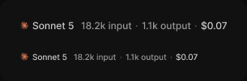

# Model usage

> Figma « Kuartz — Carte système » (`wvr98llwHnMufQ88qUp4Ih`) › 🎨 Design System › Components — AI editor — nœud `427:1565` (COMPONENT_SET, 2 variantes, cadre 305×100)

## Rôle

Modèle (logo Claude en couleur de marque) + tokens input / output + coût. Propriétés : Model, Input, Output, Cost, Show model, Show usage. size=small (Caption) pour les en-têtes et lignes, default (Body Small) pour Usage.

## Propriétés

| Propriété | Type | Défaut | Valeurs / préférences |
|---|---|---|---|
| `Model` | TEXT | `Sonnet 5` |  |
| `Input` | TEXT | `18.2k input` |  |
| `Output` | TEXT | `1.1k output` |  |
| `Cost` | TEXT | `$0.07` |  |
| `Show model` | BOOLEAN | `true` |  |
| `Show usage` | BOOLEAN | `true` |  |
| `size` | VARIANT | `default` | `default`, `small` |

## Variantes et états

- `size` : default, small (défaut : default)

Variantes présentes (2) : `size=default` · `size=small`

## Anatomie — variante par défaut `size=default`

- **COMPONENT** `size=default` — taille: 257×15 · dim: W hug / H hug · layout: H gap 8{space/8} pad 0 align min/center strokes-in-layout · modes: Icon color=claude
  - **FRAME** `model` — taille: 68×15 · dim: W hug / H hug · layout: H gap 4{space/4} pad 0 align min/center strokes-in-layout · refs: visible←Show model
    - **INSTANCE** `mark` — taille: 12×12 · dim: W fixed / H fixed · instance: Icon/claude {size=12}
    - **TEXT** `name` — taille: 52×15 · dim: W hug / H hug · fond: #cccccc {text/secondary} · texte: "Sonnet 5" · style: Body Small · textopt: resize width_and_height · refs: characters←Model
  - **FRAME** `usage` — taille: 181×15 · dim: W hug / H hug · layout: H gap 4{space/4} pad 0 align min/center strokes-in-layout · refs: visible←Show usage
    - **TEXT** `input` — taille: 63×15 · dim: W hug / H hug · fond: #999999 {text/tertiary} · texte: "18.2k input" · style: Body Small · textopt: resize width_and_height · refs: characters←Input
    - **TEXT** `sep` — taille: 4×15 · dim: W hug / H hug · fond: #666666 {text/muted} · texte: "·" · style: Body Small · textopt: resize width_and_height
    - **TEXT** `output` — taille: 61×15 · dim: W hug / H hug · fond: #999999 {text/tertiary} · texte: "1.1k output" · style: Body Small · textopt: resize width_and_height · refs: characters←Output
    - **TEXT** `sep` — taille: 4×15 · dim: W hug / H hug · fond: #666666 {text/muted} · texte: "·" · style: Body Small · textopt: resize width_and_height
    - **TEXT** `cost` — taille: 33×15 · dim: W hug / H hug · fond: #cccccc {text/secondary} · texte: "$0.07" · style: Body Small · textopt: resize width_and_height · refs: characters←Cost

## Différences des autres variantes

Chaque variante est comparée à une variante de référence (la variante par défaut, ou la même combinaison avec une seule propriété ramenée à sa valeur par défaut — de préférence l'état). Clé = chemin du calque depuis la racine ; seules les propriétés qui changent sont listées (`+` calque ajouté, `−` calque absent).

### `size=small`

- ~ `(racine)` — taille: 221×12
- ~ `/model` — taille: 59×12
- ~ `/model/name` — taille: 43×12 · style: Caption
- ~ `/usage` — taille: 154×12
- ~ `/usage/input` — taille: 53×12 · style: Caption
- ~ `/usage/sep[1]` — taille: 3×12 · style: Caption
- ~ `/usage/output` — taille: 51×12 · style: Caption
- ~ `/usage/sep[2]` — taille: 3×12 · style: Caption
- ~ `/usage/cost` — taille: 28×12 · style: Caption

## Tokens et ressources utilisés

- Variables : `space/4`, `space/8`, `text/muted`, `text/secondary`, `text/tertiary`
- Styles de texte : Body Small, Caption
- Effets : —
- Icônes : Icon/claude
- Composants imbriqués : —

## Capture

