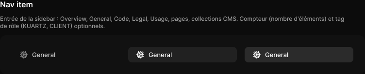

# Nav item

> Figma « Kuartz — Carte système » (`wvr98llwHnMufQ88qUp4Ih`) › 🎨 Design System › Components — Navigation — nœud `332:431` (COMPONENT_SET, 3 variantes, cadre 752×80)

## Rôle

Entrée de sidebar (224 × 32). Propriétés : Label, Icon, Show icon, Count, Show count, Show tag (tag exposé : changer libellé et couleur). Show chevron : chevron dans la marge de gauche (x −8) pour une page qui se déplie, par exemple une page listing CMS et sa page article.

## Propriétés

| Propriété | Type | Défaut | Valeurs / préférences |
|---|---|---|---|
| `Label` | TEXT | `General` |  |
| `Show icon` | BOOLEAN | `true` |  |
| `Icon` | INSTANCE_SWAP | `Icon/settings` | préférées : toutes les icônes Icon/* (73/75) sauf Icon/open, Icon/claude |
| `Count` | TEXT | `12` |  |
| `Show count` | BOOLEAN | `false` |  |
| `Show tag` | BOOLEAN | `false` |  |
| `Show chevron` | BOOLEAN | `false` |  |
| `state` | VARIANT | `default` | `default`, `hover`, `active` |

## Variantes et états

- `state` : default, hover, active (défaut : default)

Variantes présentes (3) : `state=default` · `state=hover` · `state=active`

## Anatomie — variante par défaut `state=default`

- **COMPONENT** `state=default` — taille: 224×32 · dim: W fixed / H fixed · layout: H gap 8{space/8} pad 0 8{space/8} 0 16 align min/center strokes-in-layout · rayon: 8{radius/md} · modes: Icon color=default
  - **INSTANCE** `icon` — taille: 18×18 · dim: W fixed / H fixed · instance: Icon/settings {size=18} · refs: visible←Show icon, mainComponent←Icon
  - **TEXT** `label` — taille: 174×16 · dim: W fill / H hug · fond: #cccccc {text/secondary} · texte: "General" · style: Body · textopt: resize height · refs: characters←Label
  - **TEXT** `count` — taille: 14×15 · visible: masqué · dim: W fixed / H fixed · fond: #666666 {text/muted} · texte: "12" · style: Body Small · textopt: resize width_and_height · refs: visible←Show count, characters←Count
  - **INSTANCE** `tag` — taille: 33×16 · visible: masqué · dim: W hug / H hug · layout: H gap 4{space/4} pad 2{space/2} 6{space/6} align min/center strokes-in-layout · rayon: 5{radius/sm} · fond: #0099ff 14% {bg/tint/info} · instance: Tag {tone=info} · props: Icon="Icon/close", Show icon=false, Show dot=false, Label="KUARTZ" · textes: "KUARTZ" · modes: Icon color=primary · refs: visible←Show tag
  - **INSTANCE** `chevron` — taille: 10×10 · visible: masqué · pos: absolue x 3 y 11 (min/min) · instance: Icon/chevron-down {size=12} · refs: visible←Show chevron

## Différences des autres variantes

Chaque variante est comparée à une variante de référence (la variante par défaut, ou la même combinaison avec une seule propriété ramenée à sa valeur par défaut — de préférence l'état). Clé = chemin du calque depuis la racine ; seules les propriétés qui changent sont listées (`+` calque ajouté, `−` calque absent).

### `state=hover`

- ~ `(racine)` — modes: Icon color=active · fond: #212121 {bg/subtle}
- ~ `/label` — fond: #ffffff {text/primary}
- ~ `/tag` — textes: (aucun)

### `state=active`

- ~ `(racine)` — modes: Icon color=active · fond: #2b2b2b {bg/input-hover}
- ~ `/label` — fond: #ffffff {text/primary}

## Tokens et ressources utilisés

- Variables : `bg/input-hover`, `bg/subtle`, `bg/tint/info`, `radius/md`, `radius/sm`, `space/2`, `space/4`, `space/6`, `space/8`, `text/muted`, `text/primary`, `text/secondary`
- Styles de texte : Body, Body Small
- Effets : —
- Icônes : Icon/chevron-down, Icon/close, Icon/settings
- Composants imbriqués : Tag

## Capture

_Capture du cadre de documentation `group/Nav item` (`332:345`, 752×153 px : titre, description et composant entier). La capture du composant seul (752×80 px) pesait 4483 octets (< 5 Ko), rendu 1× identique._
