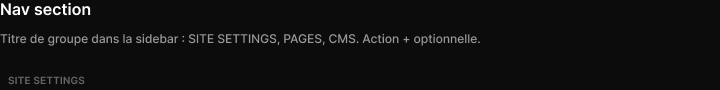

# Nav section

> Figma « Kuartz — Carte système » (`wvr98llwHnMufQ88qUp4Ih`) › 🎨 Design System › Components — Navigation — nœud `332:443` (COMPONENT, cadre 224×32)

## Rôle

Titre de section de sidebar (capitales). Propriétés : Label, Show action.

## Propriétés

| Propriété | Type | Défaut | Valeurs / préférences |
|---|---|---|---|
| `Label` | TEXT | `SITE SETTINGS` |  |
| `Show action` | BOOLEAN | `false` |  |

## Anatomie — composant

- **COMPONENT** `Nav section` — taille: 224×32 · dim: W fixed / H hug · layout: H gap 8{space/8} pad 16{space/16} 8{space/8} 4{space/4} 8{space/8} align min/center strokes-in-layout · clip: oui · modes: Icon color=default
  - **TEXT** `label` — taille: 208×12 · dim: W fill / H hug · fond: #666666 {text/muted} · texte: "SITE SETTINGS" · style: Label Small · textopt: resize height · refs: characters←Label
  - **INSTANCE** `icon-button` — taille: 20×20 · visible: masqué · dim: W fixed / H fixed · layout: H gap 0 pad 0 align center/center strokes-in-layout · rayon: 5{radius/sm} · clip: oui · instance: Icon button {style=ghost, state=default, size=xsmall} · props: Icon="Icon/plus" · modes: Icon color=default · refs: visible←Show action

## Tokens et ressources utilisés

- Variables : `radius/sm`, `space/16`, `space/4`, `space/8`, `text/muted`
- Styles de texte : Label Small
- Effets : —
- Icônes : Icon/plus
- Composants imbriqués : Icon button

## Capture

_Capture du cadre de documentation `group/Nav section` (`332:432`, 720×90 px : titre, description et composant entier). La capture du composant seul (224×32 px) pesait 1096 octets (< 5 Ko), rendu 1× identique._
