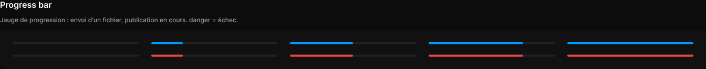

# Progress bar

> Figma « Kuartz — Carte système » (`wvr98llwHnMufQ88qUp4Ih`) › 🎨 Design System › Components — Feedback — nœud `323:235` (COMPONENT_SET, 10 variantes, cadre 1344×76)

## Rôle

Jauge 240 px : étirer l'instance, le remplissage suit la proportion. value en variantes (0, 25, 50, 75, 100). danger = échec (envoi ou publication).

## Propriétés

| Propriété | Type | Défaut | Valeurs / préférences |
|---|---|---|---|
| `tone` | VARIANT | `primary` | `primary`, `danger` |
| `value` | VARIANT | `0` | `0`, `25`, `50`, `75`, `100` |

## Variantes et états

- `tone` : primary, danger (défaut : primary)
- `value` : 0, 25, 50, 75, 100 (défaut : 0)

Variantes présentes (10) : `tone=primary, value=0` · `tone=primary, value=25` · `tone=primary, value=50` · `tone=primary, value=75` · `tone=primary, value=100` · `tone=danger, value=0` · `tone=danger, value=25` · `tone=danger, value=50` · `tone=danger, value=75` · `tone=danger, value=100`

## Anatomie — variante par défaut `tone=primary, value=0`

- **COMPONENT** `tone=primary, value=0` — taille: 240×4 · rayon: 999{radius/full} · fond: #212121 {bg/subtle} · clip: oui

## Différences des autres variantes

Chaque variante est comparée à une variante de référence (la variante par défaut, ou la même combinaison avec une seule propriété ramenée à sa valeur par défaut — de préférence l'état). Clé = chemin du calque depuis la racine ; seules les propriétés qui changent sont listées (`+` calque ajouté, `−` calque absent).

### `tone=primary, value=25`

- + `/fill` (**RECTANGLE**) — taille: 60×4 · pos: x 0 y 0 (scale/stretch) · rayon: 999{radius/full} · fond: #0099ff {interactive/primary}

### `tone=primary, value=50`

- + `/fill` (**RECTANGLE**) — taille: 120×4 · pos: x 0 y 0 (scale/stretch) · rayon: 999{radius/full} · fond: #0099ff {interactive/primary}

### `tone=primary, value=75`

- + `/fill` (**RECTANGLE**) — taille: 180×4 · pos: x 0 y 0 (scale/stretch) · rayon: 999{radius/full} · fond: #0099ff {interactive/primary}

### `tone=primary, value=100`

- + `/fill` (**RECTANGLE**) — taille: 240×4 · pos: x 0 y 0 (scale/stretch) · rayon: 999{radius/full} · fond: #0099ff {interactive/primary}

### `tone=danger, value=0`

- (identique à la référence hors valeurs de variante)

### `tone=danger, value=25` — réf. `tone=primary, value=25`

- ~ `/fill` — fond: #ee4444 {interactive/danger}

### `tone=danger, value=50` — réf. `tone=primary, value=50`

- ~ `/fill` — fond: #ee4444 {interactive/danger}

### `tone=danger, value=75` — réf. `tone=primary, value=75`

- ~ `/fill` — fond: #ee4444 {interactive/danger}

### `tone=danger, value=100` — réf. `tone=primary, value=100`

- ~ `/fill` — fond: #ee4444 {interactive/danger}

## Tokens et ressources utilisés

- Variables : `bg/subtle`, `interactive/danger`, `interactive/primary`, `radius/full`
- Styles de texte : —
- Effets : —
- Icônes : —
- Composants imbriqués : —

## Capture

_Capture du cadre de documentation `group/Progress bar` (`323:190`, 1344×134 px : titre, description et composant entier). La capture du composant seul (1344×76 px) pesait 1451 octets (< 5 Ko), rendu 1× identique._
