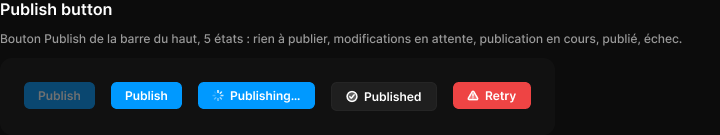

# Publish button

> Figma « Kuartz — Carte système » (`wvr98llwHnMufQ88qUp4Ih`) › 🎨 Design System › Components — Feedback — nœud `323:503` (COMPONENT_SET, 5 variantes, cadre 555×77)

## Rôle

idle : tout est publié (désactivé) · pending : modifications en attente · publishing : en cours (le code déclenche un build Vercel) · published : confirmation 3 s · error : rien n'a changé, réessayer.

## Propriétés

| Propriété | Type | Défaut | Valeurs / préférences |
|---|---|---|---|
| `state` | VARIANT | `idle` | `idle`, `pending`, `publishing`, `published`, `error` |

## Variantes et états

- `state` : idle, pending, publishing, published, error (défaut : idle)

Variantes présentes (5) : `state=idle` · `state=pending` · `state=publishing` · `state=published` · `state=error`

## Anatomie — variante par défaut `state=idle`

- **COMPONENT** `state=idle` — taille: 71×27 · dim: W hug / H hug · layout: H gap 0 pad 0 align min/center strokes-in-layout · clip: oui
  - **INSTANCE** `button` — taille: 71×27 · dim: W hug / H hug · layout: H gap 6{space/6} pad 6{space/6} 14 align center/center strokes-in-layout · rayon: 6 · fond: #0099ff {interactive/primary} · opacite: 0.4 · instance: Button {variant=primary, state=disabled, size=small} · props: Icon right="Icon/chevron-down", Icon left="Icon/plus", Show icon right=false, Show icon left=false, Label="Publish" · textes: "Publish" · modes: Icon color=on-accent

## Différences des autres variantes

Chaque variante est comparée à une variante de référence (la variante par défaut, ou la même combinaison avec une seule propriété ramenée à sa valeur par défaut — de préférence l'état). Clé = chemin du calque depuis la racine ; seules les propriétés qui changent sont listées (`+` calque ajouté, `−` calque absent).

### `state=pending`

- ~ `/button` — opacite: (aucun) · instance: Button {variant=primary, state=default, size=small} · props: Icon left="Icon/plus", Icon right="Icon/chevron-down", Show icon right=false, Show icon left=false, Label="Publish"

### `state=publishing`

- ~ `(racine)` — taille: 117×27
- ~ `/button` — taille: 117×27 · opacite: (aucun) · instance: Button {variant=primary, state=default, size=small} · props: Icon left="Icon/loader", Icon right="Icon/chevron-down", Show icon right=false, Show icon left=true, Label="Publishing…" · textes: "Publishing…"

### `state=published`

- ~ `(racine)` — taille: 106×29
- ~ `/button` — taille: 106×29 · fond: #1f1f1f {bg/input} · opacite: (aucun) · instance: Button {variant=secondary, state=default, size=small} · props: Icon left="Icon/success", Show icon left=true, Icon right="Icon/chevron-down", Show icon right=false, Label="Published" · textes: "Published" · modes: Icon color=active · contour: #252525 {border/default} · 1px inside

### `state=error`

- ~ `(racine)` — taille: 78×27
- ~ `/button` — taille: 78×27 · fond: #ee4444 {interactive/danger} · opacite: (aucun) · instance: Button {variant=danger, state=default, size=small} · props: Show icon right=false, Icon right="Icon/chevron-down", Icon left="Icon/warning", Show icon left=true, Label="Retry" · textes: "Retry"

## Tokens et ressources utilisés

- Variables : `bg/input`, `border/default`, `interactive/danger`, `interactive/primary`, `space/6`
- Styles de texte : —
- Effets : —
- Icônes : Icon/chevron-down, Icon/loader, Icon/plus, Icon/success, Icon/warning
- Composants imbriqués : Button

## Capture

_Capture du cadre de documentation `group/Publish button` (`323:433`, 720×135 px : titre, description et composant entier). La capture du composant seul (555×77 px) pesait 5080 octets (< 5 Ko), rendu 1× identique._
