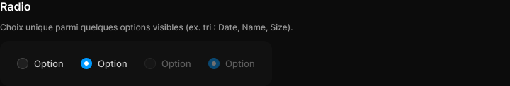

# Radio

> Figma « Kuartz — Carte système » (`wvr98llwHnMufQ88qUp4Ih`) › 🎨 Design System › Components — Forms — nœud `330:305` (COMPONENT_SET, 4 variantes, cadre 384×64)

## Rôle

Bouton radio 16 px. Propriétés : Label, Show label.

## Propriétés

| Propriété | Type | Défaut | Valeurs / préférences |
|---|---|---|---|
| `Label` | TEXT | `Option` |  |
| `Show label` | BOOLEAN | `true` |  |
| `state` | VARIANT | `unselected` | `unselected`, `selected`, `disabled-unselected`, `disabled-selected` |

## Variantes et états

- `state` : unselected, selected, disabled-unselected, disabled-selected (défaut : unselected)

Variantes présentes (4) : `state=unselected` · `state=selected` · `state=disabled-unselected` · `state=disabled-selected`

## Anatomie — variante par défaut `state=unselected`

- **COMPONENT** `state=unselected` — taille: 66×16 · dim: W hug / H hug · layout: H gap 8{space/8} pad 0 align min/center strokes-in-layout · clip: oui
  - **FRAME** `circle` — taille: 16×16 · dim: W fixed / H fixed · layout: H gap 0 pad 0 align center/center strokes-in-layout · rayon: 999{radius/full} · fond: #1f1f1f {bg/input} · contour: #444444 {border/strong} · 1px inside · clip: oui
  - **TEXT** `label` — taille: 42×16 · dim: W hug / H hug · fond: #cccccc {text/secondary} · texte: "Option" · style: Body · textopt: resize width_and_height · refs: visible←Show label, characters←Label

## Différences des autres variantes

Chaque variante est comparée à une variante de référence (la variante par défaut, ou la même combinaison avec une seule propriété ramenée à sa valeur par défaut — de préférence l'état). Clé = chemin du calque depuis la racine ; seules les propriétés qui changent sont listées (`+` calque ajouté, `−` calque absent).

### `state=selected`

- ~ `/circle` — fond: #0099ff {interactive/primary} · contour: (aucun)
- + `/circle/inner` (**ELLIPSE**) — taille: 6×6 · dim: W fixed / H fixed · fond: #ffffff {text/on-accent}

### `state=disabled-unselected`

- ~ `(racine)` — opacite: 0.4

### `state=disabled-selected`

- ~ `(racine)` — opacite: 0.4
- ~ `/circle` — fond: #0099ff {interactive/primary} · contour: (aucun)
- + `/circle/inner` (**ELLIPSE**) — taille: 6×6 · dim: W fixed / H fixed · fond: #ffffff {text/on-accent}

## Tokens et ressources utilisés

- Variables : `bg/input`, `border/strong`, `interactive/primary`, `radius/full`, `space/8`, `text/on-accent`, `text/secondary`
- Styles de texte : Body
- Effets : —
- Icônes : —
- Composants imbriqués : —

## Capture

_Capture du cadre de documentation `group/Radio` (`330:284`, 720×122 px : titre, description et composant entier). La capture du composant seul (384×64 px) pesait 3249 octets (< 5 Ko), rendu 1× identique._
