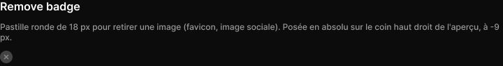

# Remove badge

> Figma « Kuartz — Carte système » (`wvr98llwHnMufQ88qUp4Ih`) › 🎨 Design System › Components — Forms — nœud `410:1547` (COMPONENT, cadre 18×18)

## Rôle

Pastille de suppression d'une image : 18 px, fond bg/strong, croix icon/default, deux ombres légères. Se pose sur le coin haut droit d'un aperçu (x = largeur − 9, y = −9).

## Propriétés

_Aucune propriété._

## Anatomie — composant

- **COMPONENT** `Remove badge` — taille: 18×18 · rayon: 999{radius/full} · fond: #444444 {bg/strong} · effet: drop_shadow 0 0.5 0 0 #0000001a + drop_shadow 0 1 3 0 #00000033
  - **VECTOR** `x` — taille: 5×5 · pos: x 6.5 y 6.5 (center/center) · contour: #888888 {icon/default} · 1.5px center cap round
  - **VECTOR** `x` — taille: 5×5 · pos: x 6.5 y 6.5 (center/center) · contour: #888888 {icon/default} · 1.5px center cap round

## Tokens et ressources utilisés

- Variables : `bg/strong`, `icon/default`, `radius/full`
- Styles de texte : —
- Effets : —
- Icônes : —
- Composants imbriqués : —

## Capture

_Capture du cadre de documentation `group/Remove badge` (`410:1544`, 720×95 px : titre, description et composant entier). La capture du composant seul (21×24 px) pesait 530 octets (< 5 Ko), rendu 1× identique._
