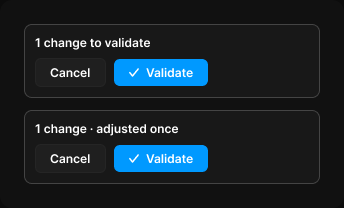

# Review card

> Figma « Kuartz — Carte système » (`wvr98llwHnMufQ88qUp4Ih`) › 🎨 Design System › Components — AI editor — nœud `339:1458` (COMPONENT_SET, 2 variantes, cadre 344×208)

## Rôle

Carte de validation. Cancel annule la demande et ses ajustements ; Validate ajoute la modification à Publish.

## Propriétés

| Propriété | Type | Défaut | Valeurs / préférences |
|---|---|---|---|
| `state` | VARIANT | `pending` | `pending`, `adjusted` |

## Variantes et états

- `state` : pending, adjusted (défaut : pending)

Variantes présentes (2) : `state=pending` · `state=adjusted`

## Anatomie — variante par défaut `state=pending`

- **COMPONENT** `state=pending` — taille: 296×74 · dim: W fixed / H hug · layout: V gap 8{space/8} pad 10{space/10} align min/min strokes-in-layout · rayon: 8{radius/md} · fond: #181818 {bg/elevated} · contour: #444444 {border/strong} · 1px inside · clip: oui
  - **TEXT** `title` — taille: 274×15 · dim: W fill / H hug · fond: #ffffff {text/primary} · texte: "1 change to validate" · style: Label · textopt: resize height
  - **FRAME** `actions` — taille: 173×29 · dim: W hug / H hug · layout: H gap 8{space/8} pad 0 align min/center strokes-in-layout · clip: oui
    - **INSTANCE** `cancel` — taille: 71×29 · dim: W hug / H hug · layout: H gap 6{space/6} pad 6{space/6} 14 align center/center strokes-in-layout · rayon: 6 · fond: #1f1f1f {bg/input} · contour: #252525 {border/default} · 1px inside · instance: Button {variant=secondary, state=default, size=small} · props: Icon left="Icon/plus", Show icon left=false, Icon right="Icon/chevron-down", Show icon right=false, Label="Cancel" · textes: "Cancel" · modes: Icon color=active
    - **INSTANCE** `validate` — taille: 94×27 · dim: W hug / H hug · layout: H gap 6{space/6} pad 6{space/6} 14 align center/center strokes-in-layout · rayon: 6 · fond: #0099ff {interactive/primary} · instance: Button {variant=primary, state=default, size=small} · props: Icon left="Icon/check", Icon right="Icon/chevron-down", Show icon right=false, Show icon left=true, Label="Validate" · textes: "Validate" · modes: Icon color=on-accent

## Différences des autres variantes

Chaque variante est comparée à une variante de référence (la variante par défaut, ou la même combinaison avec une seule propriété ramenée à sa valeur par défaut — de préférence l'état). Clé = chemin du calque depuis la racine ; seules les propriétés qui changent sont listées (`+` calque ajouté, `−` calque absent).

### `state=adjusted`

- ~ `/title` — texte: "1 change · adjusted once"

## Tokens et ressources utilisés

- Variables : `bg/elevated`, `bg/input`, `border/default`, `border/strong`, `interactive/primary`, `radius/md`, `space/10`, `space/6`, `space/8`, `text/primary`
- Styles de texte : Label
- Effets : —
- Icônes : Icon/check, Icon/chevron-down, Icon/plus
- Composants imbriqués : Button

## Capture

