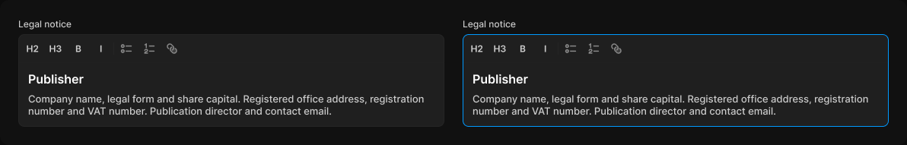

# Rich text field

> Figma « Kuartz — Carte système » (`wvr98llwHnMufQ88qUp4Ih`) › 🎨 Design System › Components — Forms — nœud `330:490` (COMPONENT_SET, 2 variantes, cadre 1192×191)

## Rôle

Éditeur de texte riche (outils : H2, H3, gras, italique, listes, lien). Propriétés : Label.

## Propriétés

| Propriété | Type | Défaut | Valeurs / préférences |
|---|---|---|---|
| `Label` | TEXT | `Legal notice` |  |
| `state` | VARIANT | `default` | `default`, `focused` |

## Variantes et états

- `state` : default, focused (défaut : default)

Variantes présentes (2) : `state=default` · `state=focused`

## Anatomie — variante par défaut `state=default`

- **COMPONENT** `state=default` — taille: 560×143 · dim: W fixed / H hug · layout: V gap 6{space/6} pad 0 align min/min strokes-in-layout · clip: oui
  - **TEXT** `label` — taille: 70×15 · dim: W hug / H hug · fond: #cccccc {text/secondary} · texte: "Legal notice" · style: Body Small · textopt: resize width_and_height · refs: characters←Label
  - **FRAME** `editor` — taille: 560×122 · dim: W fill / H hug · layout: V gap 0 pad 0 align min/min strokes-in-layout · rayon: 8{radius/md} · fond: #1f1f1f {bg/input} · contour: #252525 {border/default} · 1px inside · clip: oui
    - **FRAME** `toolbar` — taille: 558×37 · dim: W fill / H hug · layout: H gap 2{space/2} pad 4{space/4} align min/center strokes-in-layout · contour: #212121 {border/subtle} · 0/0/1/0px inside · clip: oui
      - **FRAME** `tool/H2` — taille: 28×28 · dim: W fixed / H fixed · layout: H gap 0 pad 0 align center/center strokes-in-layout · rayon: 8{radius/md} · clip: oui
        - **TEXT** `glyph` — taille: 17×15 · dim: W hug / H hug · fond: #cccccc {text/secondary} · texte: "H2" · style: Label · textopt: resize width_and_height
      - **FRAME** `tool/H3` — taille: 28×28 · dim: W fixed / H fixed · layout: H gap 0 pad 0 align center/center strokes-in-layout · rayon: 8{radius/md} · clip: oui
        - **TEXT** `glyph` — taille: 17×15 · dim: W hug / H hug · fond: #cccccc {text/secondary} · texte: "H3" · style: Label · textopt: resize width_and_height
      - **FRAME** `tool/B` — taille: 28×28 · dim: W fixed / H fixed · layout: H gap 0 pad 0 align center/center strokes-in-layout · rayon: 8{radius/md} · clip: oui
        - **TEXT** `glyph` — taille: 8×15 · dim: W hug / H hug · fond: #cccccc {text/secondary} · texte: "B" · style: Label · textopt: resize width_and_height
      - **FRAME** `tool/I` — taille: 28×28 · dim: W fixed / H fixed · layout: H gap 0 pad 0 align center/center strokes-in-layout · rayon: 8{radius/md} · clip: oui
        - **TEXT** `glyph` — taille: 4×15 · dim: W hug / H hug · fond: #cccccc {text/secondary} · texte: "I" · style: Label · textopt: resize width_and_height
      - **RECTANGLE** `divider` — taille: 1×16 · dim: W fixed / H fixed · fond: #252525 {border/default}
      - **INSTANCE** `icon-button` — taille: 28×28 · dim: W fixed / H fixed · layout: H gap 0 pad 0 align center/center strokes-in-layout · rayon: 8{radius/md} · clip: oui · instance: Icon button {style=ghost, state=default, size=small} · props: Icon="Icon/list-bullets" · modes: Icon color=default
      - **INSTANCE** `icon-button` — taille: 28×28 · dim: W fixed / H fixed · layout: H gap 0 pad 0 align center/center strokes-in-layout · rayon: 8{radius/md} · clip: oui · instance: Icon button {style=ghost, state=default, size=small} · props: Icon="Icon/list-numbers" · modes: Icon color=default
      - **INSTANCE** `icon-button` — taille: 28×28 · dim: W fixed / H fixed · layout: H gap 0 pad 0 align center/center strokes-in-layout · rayon: 8{radius/md} · clip: oui · instance: Icon button {style=ghost, state=default, size=small} · props: Icon="Icon/link" · modes: Icon color=default
    - **FRAME** `content` — taille: 558×83 · dim: W fill / H hug · layout: V gap 8{space/8} pad 12{space/12} align min/min strokes-in-layout · clip: oui
      - **TEXT** `heading` — taille: 534×19 · dim: W fill / H hug · fond: #ffffff {text/primary} · texte: "Publisher" · style: Heading 4 · textopt: resize height
      - **TEXT** `paragraph` — taille: 534×32 · dim: W fill / H hug · fond: #cccccc {text/secondary} · texte: "Company name, legal form and share capital. Registered office address, registration number…" · style: Body · textopt: resize height

## Différences des autres variantes

Chaque variante est comparée à une variante de référence (la variante par défaut, ou la même combinaison avec une seule propriété ramenée à sa valeur par défaut — de préférence l'état). Clé = chemin du calque depuis la racine ; seules les propriétés qui changent sont listées (`+` calque ajouté, `−` calque absent).

### `state=focused`

- ~ `/editor` — contour: #0099ff {border/focus} · 1px inside

## Tokens et ressources utilisés

- Variables : `bg/input`, `border/default`, `border/focus`, `border/subtle`, `radius/md`, `space/12`, `space/2`, `space/4`, `space/6`, `space/8`, `text/primary`, `text/secondary`
- Styles de texte : Body Small, Label, Heading 4, Body
- Effets : —
- Icônes : Icon/link, Icon/list-bullets, Icon/list-numbers
- Composants imbriqués : Icon button

## Capture

