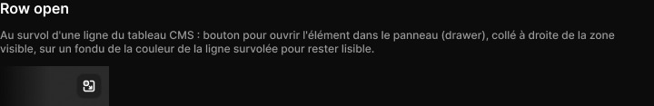

# Row open

> Figma « Kuartz — Carte système » (`wvr98llwHnMufQ88qUp4Ih`) › 🎨 Design System › Components — Data display — nœud `468:2027` (COMPONENT, cadre 120×44)

## Rôle

Bouton « ouvrir dans le panneau » d'une ligne CMS survolée : Icon button secondary (icône open) collé à droite, sur un fondu de la couleur de ligne survolée (#2b2b2b = bg/input-hover), du transparent au plein.

## Propriétés

_Aucune propriété._

## Anatomie — composant

- **COMPONENT** `Row open` — taille: 120×44 · dim: W fixed / H fixed · layout: H gap 0 pad 0 8 0 0 align max/center strokes-in-layout · fond: linear-gradient(#2b2b2b00 0%, #2b2b2b 45%, #2b2b2b 100%) m=[[1,0,0],[0,1,0]]
  - **INSTANCE** `open` — taille: 28×28 · dim: W fixed / H fixed · layout: H gap 0 pad 0 align center/center strokes-in-layout · rayon: 8{radius/md} · fond: #1f1f1f {bg/input} · contour: #252525 {border/default} · 1px inside · clip: oui · instance: Icon button {style=secondary, state=default, size=small} · props: Icon="Icon/open" · modes: Icon color=active

## Tokens et ressources utilisés

- Variables : `bg/input`, `border/default`, `radius/md`
- Styles de texte : —
- Effets : —
- Icônes : Icon/open
- Composants imbriqués : Icon button

## Capture

_Capture du cadre de documentation `group/Row open` (`468:2014`, 720×117 px : titre, description et composant entier). La capture du composant seul (120×44 px) pesait 2585 octets (< 5 Ko), rendu 1× identique._
