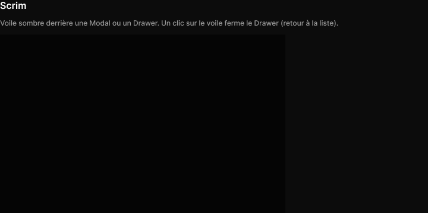

# Scrim

> Figma « Kuartz — Carte système » (`wvr98llwHnMufQ88qUp4Ih`) › 🎨 Design System › Components — Overlays — nœud `336:825` (COMPONENT, cadre 480×300)

## Rôle

Voile bg/scrim (noir 60 %). Étirer à la taille de l’écran.

## Propriétés

_Aucune propriété._

## Anatomie — composant

- **COMPONENT** `Scrim` — taille: 480×300 · fond: #000000 60% {bg/scrim} · clip: oui

## Tokens et ressources utilisés

- Variables : `bg/scrim`
- Styles de texte : —
- Effets : —
- Icônes : —
- Composants imbriqués : —

## Capture

_Capture du cadre de documentation `group/Scrim` (`336:821`, 720×358 px : titre, description et composant entier). La capture du composant seul (480×300 px) pesait 1301 octets (< 5 Ko), rendu 1× identique._
