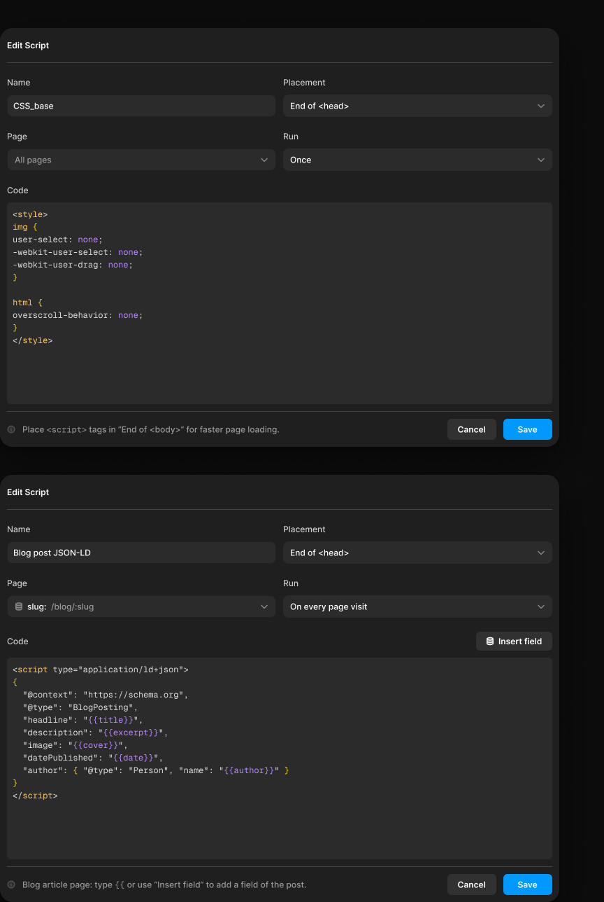

# Script dialog

> Figma « Kuartz — Carte système » (`wvr98llwHnMufQ88qUp4Ih`) › 🎨 Design System › Components — Overlays — nœud `445:1957` (COMPONENT_SET, 2 variantes, cadre 800×1248)

## Rôle

Modale Edit / Add Script (draft). page=all : script sur toutes les pages ou une page. page=cms : script d'une page article CMS (/blog/:slug), les champs de l'article s'insèrent dans le code avec {{champ}} (bouton Insert field).

## Propriétés

| Propriété | Type | Défaut | Valeurs / préférences |
|---|---|---|---|
| `Title` | TEXT | `Edit Script` |  |
| `page` | VARIANT | `all` | `all`, `cms` |

## Variantes et états

- `page` : all, cms (défaut : all)

Variantes présentes (2) : `page=all` · `page=cms`

## Anatomie — variante par défaut `page=all`

- **COMPONENT** `page=all` — taille: 800×598 · dim: W fixed / H hug · layout: V gap 0 pad 0 10 align min/min strokes-in-layout · rayon: 18{radius/xl} · fond: #1f1f1f {bg/input} · effet: style Elevation/Modal
  - **FRAME** `header` — taille: 780×60 · dim: W fill / H hug · layout: V gap 0 pad 0 0 10 0 align min/min strokes-in-layout
    - **FRAME** `header-row` — taille: 780×50 · dim: W fill / H fixed · layout: H gap 0 pad 0 align min/center strokes-in-layout · contour: #444444 {border/strong} · 0/0/1/0px inside
      - **TEXT** `title` — taille: 61×15 · dim: W hug / H hug · fond: #ffffff {text/primary} · texte: "Edit Script" · style: Label · textopt: resize width_and_height · refs: characters←Title
  - **FRAME** `body` — taille: 780×477 · dim: W fill / H hug · layout: V gap 20{space/20} pad 10 0 0 0 align min/min strokes-in-layout
    - **FRAME** `row` — taille: 780×57 · dim: W fill / H hug · layout: H gap 10{space/10} pad 0 align min/min strokes-in-layout
      - **FRAME** `field/name` — taille: 385×57 · dim: W fill / H hug · layout: V gap 10{space/10} pad 0 align min/min strokes-in-layout
        - **TEXT** `label` — taille: 34×15 · dim: W hug / H hug · fond: #cccccc {text/secondary} · texte: "Name" · style: Body Small · textopt: resize width_and_height
        - **FRAME** `input` — taille: 385×32 · dim: W fill / H fixed · layout: H gap auto pad 0 8 align space_between/center strokes-in-layout · rayon: 8{radius/md} · fond: #2b2b2b {bg/input-hover} · contour: #212121 {border/subtle} · 1px inside · clip: oui
          - **TEXT** `value` — taille: 58×15 · dim: W hug / H hug · fond: #ffffff {text/primary} · texte: "CSS_base" · style: Body Small · textopt: resize width_and_height
      - **FRAME** `field/placement` — taille: 385×57 · dim: W fill / H hug · layout: V gap 10{space/10} pad 0 align min/min strokes-in-layout
        - **TEXT** `label` — taille: 61×15 · dim: W hug / H hug · fond: #cccccc {text/secondary} · texte: "Placement" · style: Body Small · textopt: resize width_and_height
        - **FRAME** `select` — taille: 385×32 · dim: W fill / H fixed · layout: H gap auto pad 0 10 align space_between/center strokes-in-layout · rayon: 8{radius/md} · fond: #2b2b2b {bg/input-hover} · clip: oui · modes: Icon color=default
          - **TEXT** `value` — taille: 85×15 · dim: W hug / H hug · fond: #ffffff {text/primary} · texte: "End of <head>" · style: Body Small · textopt: resize width_and_height
          - **INSTANCE** `chevron` — taille: 12×12 · dim: W fixed / H fixed · instance: Icon/chevron-down {size=12}
    - **FRAME** `row` — taille: 780×57 · dim: W fill / H hug · layout: H gap 10{space/10} pad 0 align min/min strokes-in-layout
      - **FRAME** `field/page` — taille: 385×57 · dim: W fill / H hug · layout: V gap 10{space/10} pad 0 align min/min strokes-in-layout
        - **TEXT** `label` — taille: 29×15 · dim: W hug / H hug · fond: #cccccc {text/secondary} · texte: "Page" · style: Body Small · textopt: resize width_and_height
        - **FRAME** `select` — taille: 385×32 · dim: W fill / H fixed · layout: H gap auto pad 0 10 align space_between/center strokes-in-layout · rayon: 8{radius/md} · fond: #2b2b2b {bg/input-hover} · contour: #212121 {border/subtle} · 1px inside · clip: oui · modes: Icon color=default
          - **TEXT** `value` — taille: 53×15 · dim: W hug / H hug · fond: #999999 {text/tertiary} · texte: "All pages" · style: Body Small · textopt: resize width_and_height
          - **INSTANCE** `chevron` — taille: 12×12 · dim: W fixed / H fixed · instance: Icon/chevron-down {size=12}
      - **FRAME** `field/run` — taille: 385×57 · dim: W fill / H hug · layout: V gap 10{space/10} pad 0 align min/min strokes-in-layout
        - **TEXT** `label` — taille: 23×15 · dim: W hug / H hug · fond: #cccccc {text/secondary} · texte: "Run" · style: Body Small · textopt: resize width_and_height
        - **FRAME** `select` — taille: 385×32 · dim: W fill / H fixed · layout: H gap auto pad 0 10 align space_between/center strokes-in-layout · rayon: 8{radius/md} · fond: #2b2b2b {bg/input-hover} · clip: oui · modes: Icon color=default
          - **TEXT** `value` — taille: 31×15 · dim: W hug / H hug · fond: #ffffff {text/primary} · texte: "Once" · style: Body Small · textopt: resize width_and_height
          - **INSTANCE** `chevron` — taille: 12×12 · dim: W fixed / H fixed · instance: Icon/chevron-down {size=12}
    - **FRAME** `field/code` — taille: 780×313 · dim: W fill / H hug · layout: V gap 10{space/10} pad 0 align min/min strokes-in-layout
      - **TEXT** `label` — taille: 31×15 · dim: W hug / H hug · fond: #cccccc {text/secondary} · texte: "Code" · style: Body Small · textopt: resize width_and_height
      - **FRAME** `code-editor` — taille: 780×288 · dim: W fill / H fixed · layout: V gap 0 pad 8 0 0 8 align min/min strokes-in-layout · rayon: 5{radius/sm} · fond: #2b2b2b {bg/input-hover} · clip: oui
        - **TEXT** `code` — taille: 188×198 · dim: W hug / H hug · fond: mixte · texte: "<style>\nimg {\nuser-select: none;\n-webkit-user-select: none;\n-webkit-user-drag: none;\n}\n\nht…" · style: inline Geist Mono Regular 12/18px · textopt: resize width_and_height
  - **FRAME** `footer` — taille: 780×61 · dim: W fill / H hug · layout: V gap 0 pad 10 0 0 0 align min/min strokes-in-layout
    - **FRAME** `footer-row` — taille: 780×51 · dim: W fill / H hug · layout: H gap auto pad 10 0 align space_between/center strokes-in-layout · contour: #444444 {border/strong} · 1/0/0/0px inside
      - **FRAME** `info` — taille: 390×19 · dim: W hug / H hug · layout: H gap 10{space/10} pad 0 align min/center strokes-in-layout · modes: Icon color=disabled
        - **INSTANCE** `icon` — taille: 12×12 · dim: W fixed / H fixed · instance: Icon/info {size=12}
        - **TEXT** `hint` — taille: 368×19 · dim: W hug / H hug · fond: #999999 {text/tertiary} · texte: "Place <script> tags in “End of <body>” for faster page loading." · style: mixte : Body Small «Place » ; Code «<script>» ; Body Small « tags in “End of <bo» · textopt: resize width_and_height
      - **FRAME** `actions` — taille: 150×30 · dim: W hug / H hug · layout: H gap 10{space/10} pad 0 align min/center strokes-in-layout
        - **INSTANCE** `cancel` — taille: 70×30 · dim: W fixed / H fixed · layout: H gap 6{space/6} pad 6{space/6} 14 align center/center strokes-in-layout · rayon: 6 · fond: #ffffff 8% {bg/tint/neutral} · instance: Button {variant=subtle, state=default, size=small} · props: Icon left="Icon/plus", Show icon right=false, Icon right="Icon/chevron-down", Show icon left=false, Label="Cancel" · textes: "Cancel" · modes: Icon color=active
        - **INSTANCE** `save` — taille: 70×30 · dim: W fixed / H fixed · layout: H gap 6{space/6} pad 6{space/6} 14 align center/center strokes-in-layout · rayon: 6 · fond: #0099ff {interactive/primary} · instance: Button {variant=primary, state=default, size=small} · props: Icon left="Icon/plus", Icon right="Icon/chevron-down", Show icon right=false, Show icon left=false, Label="Save" · textes: "Save" · modes: Icon color=on-accent

## Différences des autres variantes

Chaque variante est comparée à une variante de référence (la variante par défaut, ou la même combinaison avec une seule propriété ramenée à sa valeur par défaut — de préférence l'état). Clé = chemin du calque depuis la racine ; seules les propriétés qui changent sont listées (`+` calque ajouté, `−` calque absent).

### `page=cms`  
_Modale Edit / Add Script, 800 px, reprise du draft : en-tête compact (Label) avec trait, champs Name / Placement / Page / Run sur fond bg/input-hover, éditeur de code (Code, 18 px d'interligne, tokens code/*), pied avec astuce et Cancel (Button subtle) / Save (Button primary)._

- ~ `(racine)` — taille: 800×610
- ~ `/body` — taille: 780×489
- ~ `/body/row[1]/field/name/input/value` — taille: 111×15 · texte: "Blog post JSON-LD"
- ~ `/body/row[2]/field/page/select` — layout: H gap 6 pad 0 10 align min/center strokes-in-layout
- + `/body/row[2]/field/page/select/icon` (**INSTANCE**) — taille: 12×12 · dim: W fixed / H fixed · instance: Icon/database {size=12}
- ~ `/body/row[2]/field/page/select/value` — taille: 28×15 · fond: #ffffff {text/primary} · texte: "slug:"
- + `/body/row[2]/field/page/select/route` (**TEXT**) — taille: 62×15 · dim: W hug / H hug · fond: #999999 {text/tertiary} · texte: "/blog/:slug" · style: Body Small · textopt: resize width_and_height
- + `/body/row[2]/field/page/select/spacer` (**FRAME**) — taille: 225×1 · dim: W fill / H fixed · clip: oui
- ~ `/body/row[2]/field/run/select/value` — taille: 111×15 · texte: "On every page visit"
- ~ `/body/field/code` — taille: 780×325
- + `/body/field/code/label-row` (**FRAME**) — taille: 780×27 · dim: W fill / H hug · layout: H gap auto pad 0 align space_between/center strokes-in-layout
- + `/body/field/code/label-row/label` (**TEXT**) — taille: 31×15 · dim: W hug / H hug · fond: #cccccc {text/secondary} · texte: "Code" · style: Body Small · textopt: resize width_and_height
- + `/body/field/code/label-row/insert-field` (**INSTANCE**) — taille: 109×27 · dim: W hug / H hug · layout: H gap 6{space/6} pad 6{space/6} 14 align center/center strokes-in-layout · rayon: 6 · fond: #ffffff 8% {bg/tint/neutral} · instance: Button {variant=subtle, state=default, size=small} · props: Show icon right=false, Icon left="Icon/database", Icon right="Icon/chevron-down", Show icon left=true, Label="Insert field" · textes: "Insert field" · modes: Icon color=active
- ~ `/body/field/code/code-editor/code` — taille: 396×198 · texte: "<script type=\"application/ld+json\">\n{\n  \"@context\": \"https://schema.org\",\n  \"@type\": \"Blog…"
- ~ `/footer/footer-row/info` — taille: 429×19
- ~ `/footer/footer-row/info/hint` — taille: 407×19 · texte: "Blog article page: type {{ or use “Insert field” to add a field of the post." · style: mixte : Body Small «Blog article page: t» ; Code «{{» ; Body Small « or use “Insert fiel»
- − `/body/field/code/label` absent

## Tokens et ressources utilisés

- Variables : `bg/input`, `bg/input-hover`, `bg/tint/neutral`, `border/strong`, `border/subtle`, `interactive/primary`, `radius/md`, `radius/sm`, `radius/xl`, `space/10`, `space/20`, `space/6`, `text/primary`, `text/secondary`, `text/tertiary`
- Styles de texte : Label, Body Small, Code
- Effets : Elevation/Modal
- Icônes : Icon/chevron-down, Icon/database, Icon/info, Icon/plus
- Composants imbriqués : Button

## Capture

