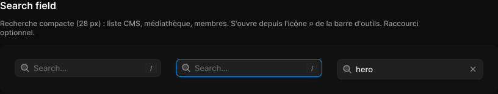

# Search field

> Figma « Kuartz — Carte système » (`wvr98llwHnMufQ88qUp4Ih`) › 🎨 Design System › Components — Forms — nœud `327:554` (COMPONENT_SET, 3 variantes, cadre 816×82)

## Rôle

Recherche 28 px. Propriétés : Value, Placeholder, Show shortcut. state=filled affiche ✕ pour effacer.

## Propriétés

| Propriété | Type | Défaut | Valeurs / préférences |
|---|---|---|---|
| `Value` | TEXT | `hero` |  |
| `Placeholder` | TEXT | `Search…` |  |
| `Show shortcut` | BOOLEAN | `true` |  |
| `state` | VARIANT | `empty` | `empty`, `focused`, `filled` |

## Variantes et états

- `state` : empty, focused, filled (défaut : empty)

Variantes présentes (3) : `state=empty` · `state=focused` · `state=filled`

## Anatomie — variante par défaut `state=empty`

- **COMPONENT** `state=empty` — taille: 240×30 · dim: W fixed / H hug · layout: H gap 6{space/6} pad 6{space/6} 6{space/6} 6{space/6} 8{space/8} align min/center strokes-in-layout · rayon: 8{radius/md} · fond: #1f1f1f {bg/input} · contour: #252525 {border/default} · 1px inside · clip: oui · modes: Icon color=default
  - **INSTANCE** `icon` — taille: 16×16 · dim: W fixed / H fixed · instance: Icon/search {size=18}
  - **TEXT** `placeholder` — taille: 178×16 · dim: W fill / H hug · fond: #666666 {text/muted} · texte: "Search…" · style: Body · textopt: resize height · refs: characters←Placeholder
  - **INSTANCE** `shortcut` — taille: 18×16 · dim: W hug / H hug · layout: H gap 0 pad 1 5 align center/center strokes-in-layout · minmax: minWidth 18 · rayon: 5{radius/sm} · fond: #212121 {bg/subtle} · contour: #252525 {border/default} · 1px inside · clip: oui · instance: Kbd · props: Label="/" · textes: "/" · refs: visible←Show shortcut

## Différences des autres variantes

Chaque variante est comparée à une variante de référence (la variante par défaut, ou la même combinaison avec une seule propriété ramenée à sa valeur par défaut — de préférence l'état). Clé = chemin du calque depuis la racine ; seules les propriétés qui changent sont listées (`+` calque ajouté, `−` calque absent).

### `state=focused`

- ~ `(racine)` — contour: #0099ff {border/focus} · 1px inside

### `state=filled`

- ~ `(racine)` — taille: 240×34
- + `/value` (**TEXT**) — taille: 176×16 · dim: W fill / H hug · fond: #ffffff {text/primary} · texte: "hero" · style: Body · textopt: resize height · refs: characters←Value
- + `/icon-button` (**INSTANCE**) — taille: 20×20 · dim: W fixed / H fixed · layout: H gap 0 pad 0 align center/center strokes-in-layout · rayon: 5{radius/sm} · clip: oui · instance: Icon button {style=ghost, state=default, size=xsmall} · props: Icon="Icon/close" · modes: Icon color=default
- − `/placeholder` absent
- − `/shortcut` absent

## Tokens et ressources utilisés

- Variables : `bg/input`, `bg/subtle`, `border/default`, `border/focus`, `radius/md`, `radius/sm`, `space/6`, `space/8`, `text/muted`, `text/primary`
- Styles de texte : Body
- Effets : —
- Icônes : Icon/close, Icon/search
- Composants imbriqués : Icon button, Kbd

## Capture

_Capture du cadre de documentation `group/Search field` (`327:521`, 816×155 px : titre, description et composant entier). La capture du composant seul (816×82 px) pesait 3807 octets (< 5 Ko), rendu 1× identique._
