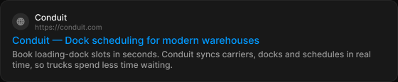

# Search preview

> Figma « Kuartz — Carte système » (`wvr98llwHnMufQ88qUp4Ih`) › 🎨 Design System › Components — Data display — nœud `338:1231` (COMPONENT, cadre 560×116)

## Rôle

Aperçu Google. Propriétés : Site name, URL, Title, Description.

## Propriétés

| Propriété | Type | Défaut | Valeurs / préférences |
|---|---|---|---|
| `Site name` | TEXT | `Conduit` |  |
| `URL` | TEXT | `https://conduit.com` |  |
| `Title` | TEXT | `Conduit — Dock scheduling for modern warehouses` |  |
| `Description` | TEXT | `Book loading-dock slots in seconds. Conduit syncs carriers, docks and schedules in real time, so trucks spend less time waiting.` |  |

## Anatomie — composant

- **COMPONENT** `Search preview` — taille: 560×116 · dim: W fixed / H hug · layout: V gap 4{space/4} pad 16{space/16} align min/min strokes-in-layout · rayon: 12{radius/lg} · fond: #181818 {bg/elevated} · contour: #252525 {border/default} · 1px inside · clip: oui · modes: Icon color=default
  - **FRAME** `site-row` — taille: 127×27 · dim: W hug / H hug · layout: H gap 8{space/8} pad 0 align min/center strokes-in-layout · clip: oui
    - **FRAME** `favicon` — taille: 24×24 · dim: W fixed / H fixed · layout: H gap 0 pad 0 align center/center strokes-in-layout · rayon: 999{radius/full} · fond: #2b2b2b {bg/input-hover} · clip: oui
      - **INSTANCE** `icon` — taille: 12×12 · dim: W fixed / H fixed · instance: Icon/globe {size=12}
    - **FRAME** `site-text` — taille: 95×27 · dim: W hug / H hug · layout: V gap 0 pad 0 align min/min strokes-in-layout · clip: oui
      - **TEXT** `site-name` — taille: 46×15 · dim: W hug / H hug · fond: #ffffff {text/primary} · texte: "Conduit" · style: Body Small · textopt: resize width_and_height · refs: characters←Site name
      - **TEXT** `url` — taille: 95×12 · dim: W hug / H hug · fond: #666666 {text/muted} · texte: "https://conduit.com" · style: Caption · textopt: resize width_and_height · refs: characters←URL
  - **TEXT** `title` — taille: 526×17 · dim: W fill / H hug · fond: #0099ff {text/link} · texte: "Conduit — Dock scheduling for modern warehouses" · style: Body Large · textopt: resize height · refs: characters←Title
  - **TEXT** `description` — taille: 526×30 · dim: W fill / H hug · fond: #999999 {text/tertiary} · texte: "Book loading-dock slots in seconds. Conduit syncs carriers, docks and schedules in real ti…" · style: Body Small · textopt: resize height · refs: characters←Description

## Tokens et ressources utilisés

- Variables : `bg/elevated`, `bg/input-hover`, `border/default`, `radius/full`, `radius/lg`, `space/16`, `space/4`, `space/8`, `text/link`, `text/muted`, `text/primary`, `text/tertiary`
- Styles de texte : Body Small, Caption, Body Large
- Effets : —
- Icônes : Icon/globe
- Composants imbriqués : —

## Capture

