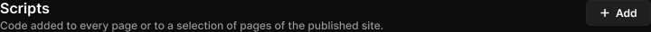

# Section header

> Figma « Kuartz — Carte système » (`wvr98llwHnMufQ88qUp4Ih`) › 🎨 Design System › Components — Navigation — nœud `333:1433` (COMPONENT, cadre 720×36)

## Rôle

Titre de section. Propriétés : Title, Description, Show description, Show action (bouton exposé).

## Propriétés

| Propriété | Type | Défaut | Valeurs / préférences |
|---|---|---|---|
| `Title` | TEXT | `Scripts` |  |
| `Description` | TEXT | `Code added to every page or to a selection of pages of the published site.` |  |
| `Show description` | BOOLEAN | `true` |  |
| `Show action` | BOOLEAN | `true` |  |

## Anatomie — composant

- **COMPONENT** `Section header` — taille: 720×36 · dim: W fixed / H hug · layout: H gap 16{space/16} pad 0 align min/min strokes-in-layout · clip: oui
  - **FRAME** `text` — taille: 632×36 · dim: W fill / H hug · layout: V gap 2{space/2} pad 0 align min/min strokes-in-layout · clip: oui
    - **TEXT** `title` — taille: 632×19 · dim: W fill / H hug · fond: #ffffff {text/primary} · texte: "Scripts" · style: Heading 4 · textopt: resize height · refs: characters←Title
    - **TEXT** `description` — taille: 632×15 · dim: W fill / H hug · fond: #999999 {text/tertiary} · texte: "Code added to every page or to a selection of pages of the published site." · style: Body Small · textopt: resize height · refs: visible←Show description, characters←Description
  - **INSTANCE** `action` — taille: 72×29 · dim: W hug / H hug · layout: H gap 6{space/6} pad 6{space/6} 14 align center/center strokes-in-layout · rayon: 6 · fond: #1f1f1f {bg/input} · contour: #252525 {border/default} · 1px inside · instance: Button {variant=secondary, state=default, size=small} · props: Icon left="Icon/plus", Show icon left=true, Icon right="Icon/chevron-down", Show icon right=false, Label="Add" · textes: "Add" · modes: Icon color=active · refs: visible←Show action

## Tokens et ressources utilisés

- Variables : `bg/input`, `border/default`, `space/16`, `space/2`, `space/6`, `text/primary`, `text/tertiary`
- Styles de texte : Heading 4, Body Small
- Effets : —
- Icônes : Icon/chevron-down, Icon/plus
- Composants imbriqués : Button

## Capture

