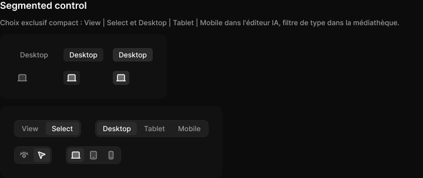

# Segment

> Figma « Kuartz — Carte système » (`wvr98llwHnMufQ88qUp4Ih`) › 🎨 Design System › Components — Navigation — nœud `332:507` (COMPONENT_SET, 6 variantes, cadre 284×111)

## Rôle

Segment (libellé ou icône). Propriétés : Label, Icon.

## Propriétés

| Propriété | Type | Défaut | Valeurs / préférences |
|---|---|---|---|
| `Label` | TEXT | `Desktop` |  |
| `Icon` | INSTANCE_SWAP | `Icon/desktop` | préférées : toutes les icônes Icon/* (73/75) sauf Icon/open, Icon/claude |
| `type` | VARIANT | `label` | `label`, `icon` |
| `state` | VARIANT | `default` | `default`, `hover`, `selected` |

## Variantes et états

- `type` : label, icon (défaut : label)
- `state` : default, hover, selected (défaut : default)

Variantes présentes (6) : `type=label, state=default` · `type=label, state=hover` · `type=label, state=selected` · `type=icon, state=default` · `type=icon, state=hover` · `type=icon, state=selected`

## Anatomie — variante par défaut `type=label, state=default`

- **COMPONENT** `type=label, state=default` — taille: 68×23 · dim: W hug / H hug · layout: H gap 6{space/6} pad 4{space/4} 10{space/10} align center/center strokes-in-layout · rayon: 5{radius/sm} · clip: oui · modes: Icon color=default
  - **TEXT** `label` — taille: 48×15 · dim: W hug / H hug · fond: #999999 {text/tertiary} · texte: "Desktop" · style: Body Small · textopt: resize width_and_height · refs: characters←Label

## Différences des autres variantes

Chaque variante est comparée à une variante de référence (la variante par défaut, ou la même combinaison avec une seule propriété ramenée à sa valeur par défaut — de préférence l'état). Clé = chemin du calque depuis la racine ; seules les propriétés qui changent sont listées (`+` calque ajouté, `−` calque absent).

### `type=label, state=hover`

- ~ `(racine)` — modes: Icon color=active · fond: #212121 {bg/subtle}
- ~ `/label` — fond: #ffffff {text/primary}

### `type=label, state=selected`

- ~ `(racine)` — modes: Icon color=active · fond: #2b2b2b {bg/input-hover}
- ~ `/label` — fond: #ffffff {text/primary}

### `type=icon, state=default`

- ~ `(racine)` — taille: 28×24 · layout: H gap 6{space/6} pad 4{space/4} 6{space/6} align center/center strokes-in-layout
- + `/icon` (**INSTANCE**) — taille: 16×16 · dim: W fixed / H fixed · instance: Icon/desktop {size=18} · refs: mainComponent←Icon
- − `/label` absent

### `type=icon, state=hover` — réf. `type=icon, state=default`

- ~ `(racine)` — modes: Icon color=active · fond: #212121 {bg/subtle}

### `type=icon, state=selected` — réf. `type=icon, state=default`

- ~ `(racine)` — modes: Icon color=active · fond: #2b2b2b {bg/input-hover}

## Tokens et ressources utilisés

- Variables : `bg/input-hover`, `bg/subtle`, `radius/sm`, `space/10`, `space/4`, `space/6`, `text/primary`, `text/tertiary`
- Styles de texte : Body Small
- Effets : —
- Icônes : Icon/desktop
- Composants imbriqués : —

## Capture

_Capture du cadre de documentation `group/Segmented control` (`332:480`, 720×304 px : titre, description et composant entier) — ce cadre contient aussi les composants voisins de la même rubrique. La capture du composant seul (284×111 px) pesait 3799 octets (< 5 Ko), rendu 1× identique._
